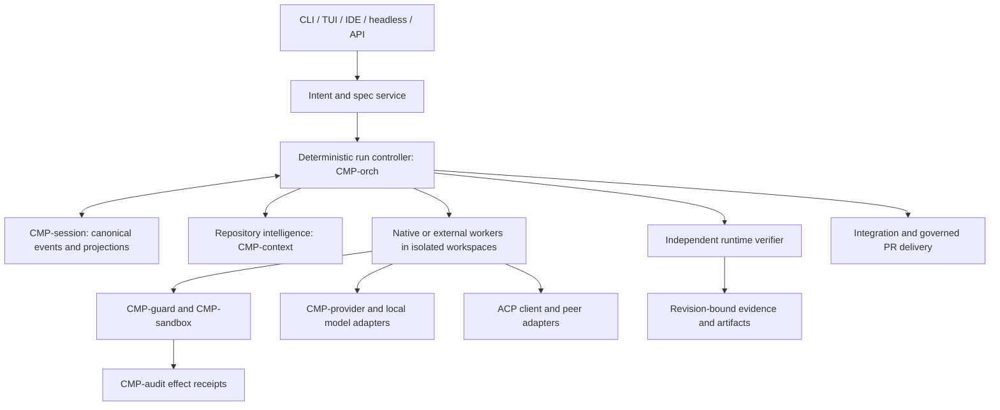

# 25 — Long-horizon control, specification, and delivery

Status: **proposed design, unimplemented unless a traceability row says otherwise**. Priority: verified completion of multi-hour coding work. This document refines `CMP-orch`, `CMP-session`, `CMP-context`, `CMP-provider`, `CMP-acp`, and `CMP-tui`; it does not introduce a second scheduler or permission engine (`DEC-029..031`). The original user request remains available verbatim throughout the run.

## System context and boundaries



**Ownership.** `CMP-orch` owns run/task/attempt decisions and stop policy. `CMP-runner` executes a single bounded turn; its `TurnEndStatus::Completed` means the turn ended, not that the task or run passed. `CMP-session` owns canonical event serialization, append/repair and projections. `CMP-audit` owns effect receipts. `CMP-context` owns repo-map and prompt projection, never task truth. `CMP-provider` owns model transport and usage normalization. `CMP-acp` owns protocol negotiation, never durable task truth. The verifier reads an exact workspace revision and returns typed evidence; it cannot grant tool authority. The runtime verifier is distinct from `ARCH/23`'s release verification process.

## Intent and specification workflow

1. Store `OriginalRequest` bytes, source, timestamp, and digest before interpretation. `/goal set` creates only this inert draft and a `RunGoal`; it performs no model inference, repository scan, tool call, or peer dispatch.
2. On a separate explicit `/goal prepare` action, run one bounded planning attempt under `GoalPreparation`: inspect only the pinned repository revision through read-only discovery, draft requirements with `confirmed | assumption | excluded | proposed_change` status, and produce a specification/task graph/plan proposal. This action may consume its separately reserved planning budget, but cannot write code, start coding workers, or perform external side effects. Ask only consequential questions. An unanswered blocking question leaves the proposal waiting; a reply creates a new preparation/spec digest.
3. Create immutable `SpecVersion` with observable examples, invariants, contracts, acceptance scenarios, negative cases, migration/rollback constraints, and a digest. The user or delegated policy approves consequential user-visible behavior; model output alone never confirms it.
4. Build a task DAG from that version. Each task names inputs, output artifact, affected files or scope, dependencies, acceptance scenarios, verifier method, permission ceiling, retry limit, budget, and owner. Produce a self-contained, human-readable run plan with purpose, repository orientation, milestones, exact commands/expected outcomes, progress, surprises, decisions, and outcome notes.
5. Show the exact spec, success conditions, task graph, repository/base revision, effective policy snapshot and permission boundary, selected model/agent route, total and phase budgets, and verification/recovery reserves. No coding worker, mutating tool, or external peer dispatch occurs while this contract is a draft or a consequential blocking ambiguity remains.
6. `/goal start` opens a review: the controller creates a durable, expiring `GoalApprovalChallenge` that binds the canonical review bundle and exact spec/task-graph/plan/base/route/permission/budget digests to one authenticated operator control session and connection. The UI renders the challenge ID, expiry, and same digest bundle. Only an explicit action in that same trusted control session can confirm it. A raw ACP connection or session identifier is not authentication.
7. Keep the run plan as an inspectable versioned projection, not a second source of task truth. Canonical task/attempt/evidence/decision events remain authoritative; each plan revision names their sequence and spec digest. Plan changes are proposed/recorded, never silently treated as an approved requirement or completion.
8. During implementation, a discovered technical fact may revise the execution plan. A change to confirmed behavior creates a new spec version. The controller marks affected tasks and evidence stale by explicit dependency edges; it never silently rewrites the original request.
9. Evaluate against both the current spec and independently derived scenarios from confirmed intent. `INSUFFICIENT_EVIDENCE` is a first-class result. User acceptance and post-release outcomes are recorded separately from automated verification.

`AGENTS.md`, repository files, tool output, and peer receipts are context with provenance; they cannot approve a requirement, grant a permission, or change a budget. A human edit to a spec is an input to review, not automatically an approved version.

## Logical schema and storage ownership

These are logical records. `CMP-session` and `CMP-orch` assign versioned event types and
projection migrations; `CMP-artifact` owns immutable scoped bytes and reference leases
(`ARCH/28`). `controller/events/` is the canonical, bounded `SupervisorControlStream`
owned by `CMP-orch`. Under one cross-process admission lock, it sequences
`RunAdmissionIntent/Granted/Settled`, `WorkAdmissionIntent/Granted/Settled`, and
`MaintenanceIntent/Granted/Settled`. It owns only global admission decisions and
fences, never task/run completion truth. Each `runs/<run_id>/events/` stream remains
canonical for its Run, Task, Attempt, and evidence-control truth; per-Thread logs use
the same framing for turns/model messages and link to the run by IDs and causation
(`ARCH/07`). A run admission event references the exact initial per-run stream head;
a work admission event references the Thread/turn or attempt execution. Unresolved
intents block conflicting admission until the referenced stream or failed launch is
reconciled. The maintenance permit event references the update operation and install
identity. Each stream has a monotonic owner-local sequence and digest link; sealed
segment ranges chain to their predecessor. Artifact references and event bytes are
durably committed in their canonical owners before projections advance. A run is
never reconstructed from a worker conversation alone. SQLite is a **rebuildable
projection** over those streams; replay is bounded and streaming, and only committed
events are folded. This is not an atomic transaction across files: admission locks,
stable operation IDs, outboxes, log heads, and reconciliation make uncertainty
explicit. Cross-stream mismatches are incidents, not silently merged. Bytes are
namespace-scoped with digest, size, media type, retention pins, and redaction status;
there is no implicit cross-Run/Thread deduplication. The audit chain is a separate
security record linked by `effect_id`; recovery reconciles it rather than assuming a
cross-file transaction.

Admission protocol under the supervisor lock:

1. Append an idempotent `*AdmissionIntent` with a stable operation ID. While any such
   intent is unresolved, conflicting run/work/maintenance operations fail closed.
2. For activation of a prepared Run, durably commit the activation/reservation result
   and canonical run-stream head (or reconcile the existing draft Run); draft creation
   alone is not run admission. For work admission, durably create the direct-turn/session
   record or worker execution/attempt dispatch record in its canonical owner. Do not
   launch a worker or begin a provider request before this owner record exists.
3. Reconcile that owner record against the intent, then append the matching `Granted`
   event and return its receipt. If the caller disconnects after the grant, retrying
   the same operation ID returns the same result.
4. Hold an active `WorkAdmissionPermit` until its execution is known terminal. A
   timeout, process loss, lease expiry, or missing peer response changes it to
   `UNKNOWN` and continues to block maintenance; only an authoritative observation
   can reconcile it to active or settled.
5. Maintenance first writes an intent that fences new run/work grants, then checks
   all canonical records and active hosts. The initial product contract grants only
   when every Run is terminal and all work permits and effects are settled; otherwise
   it returns `Busy`, settles the failed acquisition, and leaves ordinary admission
   open. It does not pause or migrate active work. The fence is held only after a
   successful grant and remains until helper outcome and the installed digest are
   reconciled; expiry never reopens admission.

The OS-backed lock serializes only each bounded state transition, not an entire model
turn. The durable permit/fence prevents new admissions while an already-granted work
permit represents active work. No read of the SQLite projection can replace a locked
replay/validation of the committed control head. A corrupt/newer-schema head or
unsupported locking/durability backend refuses new work and updates with a typed
recovery/unsupported result.

| Record | Required fields and constraints |
|---|---|
| `SupervisorControlEvent` | `{control_seq, event_id, kind: enum(RUN_ADMISSION_INTENT, RUN_ADMISSION_GRANTED, RUN_ADMISSION_SETTLED, WORK_ADMISSION_INTENT, WORK_ADMISSION_GRANTED, WORK_ADMISSION_SETTLED, MAINTENANCE_INTENT, MAINTENANCE_GRANTED, MAINTENANCE_SETTLED), operation_id, permit_id?, outcome?, run_id?, run_stream_head?, thread_id?, turn_id?, execution_id?, attempt_id?, update_operation_id?, install_id?, base_binary_digest?, owner_epoch, actor_ref?, causation_id?, payload_digest}`. Append under one cross-process admission lock before acknowledging the control decision. The stream sequences competing run/work/maintenance admissions; per-run streams still own run/task/attempt truth. Pending/unknown operations block conflicting admissions until reconciled. |
| `WorkAdmissionPermit` | `{permit_id, operation_id, kind: enum(DIRECT_TURN, WORKER_EXECUTION), run_id?, thread_id, turn_id?, execution_id, attempt_id?, canonical_owner_ref, grant_control_seq, owner_epoch, state: enum(ACTIVE, UNKNOWN, SETTLED), outcome?, observation_ref?, created_at, settled_at?}`. A permit is a reference to a committed grant, not a transferable authority token. It remains open across disconnects and timeouts; `UNKNOWN` blocks maintenance until a reconciled host/session receipt proves terminal settlement. |
| `Run` | `run_id`, `original_request_ref`, `project_id`, `repository_set_id`, `repository_members[]`, `workspace_id?`, `base_commit?`, `integration_commits[]`, `spec_digest`, `active_plan_digest?`, `status`, `state_reason`, `policy_digest`, `config_digest`, `owner_epoch`, `budget_id`, `created_at`, `updated_at`. `repository_members[]` pins one canonical `repo_id`, canonical root identity, base revision, workspace, and integration status per repository. `workspace_id`/`base_commit` are legacy single-repository convenience fields only and MUST agree with the single member when present. Each Task names its affected repository member IDs and per-member workspace/base revision. Cross-repository work integrates and verifies per repository; it is a journaled saga, not an atomic multi-repository commit. A partial integration is reported explicitly and never rolled back or declared complete as a unit without a reviewed compensation plan. |
| `OriginalRequest` | `request_id`, `run_id`, `source_surface`, scoped `ArtifactRef payload_ref`, `payload_digest`, `received_at`, `actor_ref`, `control_session_ref`. Exact request bytes are immutable and retained with their source; normalized intent never replaces them. |
| `GoalDraftReceipt` | `delivery_id`, `run_id`, `goal_id`, `input_digest`, `base_commit`, `pointer_revision`, `event_seq`. Returned by inert `/goal set`; idempotent for the same delivery/payload. It proves draft persistence only and never proves planning or approval. |
| `OperatorControlSession` | `control_session_id`, `principal_ref`, `principal_kind: USER_OPERATOR | WORKER | PEER | PLUGIN | SYSTEM`, `surface`, `connection_ref`, `authentication: IN_PROCESS_TRUSTED_UI | LOCAL_PEER_CREDENTIALS | VERIFIED_CONNECTOR | NONE`, `authenticated_subject?`, `ingress_policy_digest?`, `scopes[]`, `capability_hash?`, `issued_at`, `expires_at`, `revoked_at?`. The controller derives principal and authentication context from the authenticated ingress; request fields cannot supply or upgrade them. `NONE` can support non-privileged interaction but never operator approval. ACP connection/session binding prevents cross-connection replay; by itself it does not authenticate a user. Operator control capability is short-lived, scope-bound, held only by trusted TUI/CLI/approved ACP connector processes, and never enters model/tool context or child environments. |
| `MutationCapability` (ephemeral) | `capability_id`, `principal_ref`, `control_session_id`, `principal_kind`, `scope`, `run_id`, `owner_epoch`, `expected_seq`, `delivery_id`, `expires_at`, `nonce`, `authn_context_digest`, `mac`. Constructed/validated only by `CMP-orch` ingress; sealed in-process type, never stored in plaintext, prompt, environment, config, or child IPC. A retry with the same delivery ID/payload is idempotent; a reused ID with changed payload conflicts. Durable events retain only capability ID/hash and authn-context digest. |
| `RunGoal` | `goal_id`, `run_id`, `objective_ref`, `outcome`, `success_conditions[]`, `verification_surface[]`, `constraints[]`, `scope[]`, `iteration_policy`, `blocked_stop_condition`, `lifecycle`, `budget_id`, `spec_digest`, `created_by`, `created_at`, `updated_at`. Goal is run-scoped, versioned, user-controlled, and never thread/session-scoped or global memory. `lifecycle = DRAFT | ACTIVE | PAUSED | BLOCKED | BUDGET_LIMITED | STOPPED | CANCELLED | COMPLETE`; `COMPLETE` requires current evidence, while budget/blocker states never imply success. Clearing a UI selection does not alter this lifecycle. |
| `GoalPreparation` | `preparation_id`, `delivery_id` (idempotency key), `run_id`, `goal_id`, `input_digest`, `base_commit`, `planner_route`, `planning_budget_id`, `reservation_ids[]`, `state: QUEUED | RUNNING | WAITING_FOR_INPUT | READY_FOR_REVIEW | FAILED | CANCELLED | UNKNOWN`, `spec_digest?`, `task_graph_digest?`, `plan_digest?`, `context_digest?`, `provider_request_id?`, `failure_ref?`, `created_at`, `updated_at`. Preparation is read-only with respect to the workspace, consumes only its bounded planning allowance, and cannot launch coding workers or external side effects. Duplicate deliveries with the same payload return the same receipt; changed payload under a reused ID conflicts. `UNKNOWN` covers a crash after an inference request may have been accepted but before its result/usage receipt is durable; reconcile provider status if supported, otherwise retain conservative usage and require a new explicit preparation delivery. |
| `GoalApprovalChallenge` | `challenge_id`, `review_delivery_id` (idempotency key), `request_digest`, `run_id`, `goal_id`, `review_bundle_digest`, `spec_digest`, `task_graph_digest`, `plan_digest`, `base_commit`, `route_digest`, `policy_digest`, `permission_digest`, `budget_digest`, `surface`, `control_session_id`, `connection_ref`, `state: PENDING | ACCEPTED | DECLINED | CANCELLED | EXPIRED | INVALIDATED | CONSUMED`, `response: ACCEPT | DECLINE | CANCEL?`, `expires_at`, `response_delivery_id?`, `response_digest?`, `created_at`, `updated_at`. Persisted before rendering; binds the exact bundle shown to a particular trusted operator channel/connection. At most one unconsumed challenge may exist per goal; opening a newer review invalidates a still-pending challenge and is rejected while a start intent is already accepted/in progress. Reuse of `review_delivery_id` with a different request digest conflicts. A still-pending challenge is invalidated by material plan/policy/workspace/budget change, extra input, disconnect, expiry, or session change. Once the response is durably `ACCEPT`ed, disconnect does not revoke that already-recorded authorization; the same intent is reconciled, and any later material change blocks activation and requires a new review. |
| `GoalApprovalReceipt` | `receipt_id`, `challenge_id`, `run_id`, `goal_id`, `review_bundle_digest`, `spec_digest`, `task_graph_digest`, `plan_digest`, `base_commit`, `route_digest`, `policy_digest`, `permission_digest`, `budget_digest`, `operator_principal_ref`, `control_session_id`, `authentication_context_digest`, `surface`, `method: TUI_CONFIRM | CLI_CONFIRM | ACP_ELICITATION | ACP_TYPED_RECEIPT`, `client_session_id?`, `connection_ref`, `payload_digest`, `created_at`, `consumed_by_start_delivery_id?`, `expires_at`. One-shot, exact-challenge/digest-bound evidence from a trusted, authenticated operator ingress. ACP approval is enabled only for a configured trusted connector that can present the confirmation to the operator; ACP itself does not attest that a human viewed or clicked UI. The principal is assigned by the authenticated client/control channel, never read from model text, config, shell args, peer messages, or worker claims. |
| `GoalStartIntent` | `delivery_id` (unique idempotency key), `response_digest`, `challenge_id`, `run_id`, `goal_id`, `approval_receipt_id`, the approved review/spec/task-graph/plan/base/route/policy/permission/budget digests, `state: VALIDATING | RESERVED | UNKNOWN | CANCEL_REQUESTED | COMMITTED | REJECTED | CANCELLED`, `reservation_ids[]`, `reason?`, `created_at`, `updated_at`. At most one nonterminal start intent exists per goal. A stale/changed digest is rejected. Recovery reconciles pending reservation(s) against the activation event; dispatch requires a durable `GoalActivated` event and matching committed intent. Same delivery ID/payload returns the recorded result; changed payload conflicts. `CANCEL_REQUESTED` fences activation immediately; `CANCELLED` is terminal only after all reservations are confirmed released. |
| `DispatchOutbox` | `outbox_id`, `source_event_id`, `run_id`, `task_id`, `attempt_id`, `execution_id`, `launch_id`, `workspace_id`, `owner_epoch`, `idempotency_key`, `state: PENDING | CLAIMED | ACKNOWLEDGED | UNKNOWN | CANCELLED`, `claim_owner_token?`, `claim_epoch?`, `lease_until?`, `worker_receipt_ref?`, `created_at`, `updated_at`. Created only from committed `GoalActivated`/eligible task-claim events; unique on `(source_event_id, task_id, attempt_id, execution_id, launch_id)` and `idempotency_key`. Redelivery reuses the same attempt ID. A CLAIMED lease may be reacquired only by a higher fencing epoch after exact-launch reconciliation; lease expiry alone never returns it to PENDING. If the supervisor cannot establish whether launch occurred, state stays `UNKNOWN` and no replacement attempt launches until process/workspace reconciliation completes. |
| `ActiveGoalPointer` | `control_session_id`, `run_id`, `goal_id`, `revision`, `source_event_seq`, `updated_at`. A projection over `GoalPointerSelected` and `GoalPointerCleared` events; clear carries the expected pointer revision and is rejected on mismatch. Absence means no currently selected goal in that authenticated operator control session. Clearing removes only this pointer. The run-owned `RunGoal`, run/task lifecycle, attempts, budget, and Thread history remain addressable by ID and unchanged. |
| `ControlIntent` | `control_id`, `delivery_id`, `run_id?`, `target_kind?: RUN | TASK | ATTEMPT`, `target_id?`, `input_digest`, `source_surface`, `principal_ref`, `classification: CONTROL | NORMAL | AMBIGUOUS`, `requested_action: PAUSE | RESUME | CANCEL | STOP?`, `confidence_class`, `fence_seq?`, `decision_ref?`, `created_at`. A recognized control is committed to the priority lane before any model continuation. A cancel intent is executable only after its target kind and ID resolve to the same run under controller lookup; ambiguous/missing/foreign targets create a pause fence and clarification request, never a guessed broad cancellation. |
| `IntentItem` | `item_id`, `run_id`, `kind`, `text_ref`, `source_ref`, `confirmation_actor`, `impact`, `status`, `supersedes`. A model inference cannot be `confirmed`. |
| `SpecVersion` | `spec_id`, `run_id`, `parent_digest`, `digest`, `requirements[]`, `examples[]`, `invariants[]`, `exclusions[]`, `state: PROPOSED | APPROVED | SUPERSEDED`, `approver?`, `approved_at?`. Proposal is immutable by digest; approval binds to the exact digest and cannot be inferred from planner output. A clarification or material revision produces a child digest and invalidates any unused receipt for an ancestor digest. |
| `ExecutionPlan` | `plan_id`, `run_id`, `plan_revision`, `spec_digest`, `source_event_seq`, `purpose`, `repository_orientation_ref`, `milestones[]`, `exact_steps[]`, `expected_outcomes[]`, `progress_refs[]`, `surprise_refs[]`, `decision_refs[]`, `retrospective_ref?`, `content_digest`, `created_at`, `author`. Versioned human-readable projection; never overrides canonical task/evidence state or spec approval. |
| `Task` | `task_id`, `run_id`, `spec_digest`, `title`, `inputs[]`, `output_contract`, `acceptance_ids[]`, `deps[]`, `state`, `priority`, `write_scope`, `permission_ceiling`, `budget_id`, `attempt_limit`, `repository_member_ids[]`, `workspace_bindings[]`, `evidence_ids[]`. Each workspace binding carries its member ID, workspace ID, base revision, and fence epoch. `deps` must be acyclic. |
| `Attempt` | `attempt_id`, `task_id`, `strategy_id`, `model_route`, `repository_revisions[]`, `workspace_bindings[]`, `environment_digest`, `execution_limit`, `state`, `started_at`, `ended_at`, `failure_fingerprint`, `usage_status`. Attempts are append-only; retries create a new ID. One attempt may own several Threads; an individual Thread binds to at most one current Attempt. `execution_limit` is a finite immutable ceiling bounded by parent budgets. |
| `NativeLaunchReceipt` | `launch_id`, `execution_id`, `run_id`, `task_id`, `attempt_id`, `thread_id?`, `workspace_id`, `owner_epoch`, `pid_or_platform_handle_ref?`, `state: PREPARED | SPAWNED | EXITED | UNKNOWN`, `exit_status?`, `created_at`, `updated_at`. Minimal Horizon-owned launch receipt for a native local process; live process tracking uses an OS-observable handle and a drop-released in-process slot/fence where the host permits it. Do not persist peer capability/usage/cursor fields on this common path. A crash between durable prepare and process receipt may still be `UNKNOWN` and must reconcile before relaunch; this design does not claim that all native uncertainty disappears. |
| `ExternalExecutionBinding` | `execution_id`, `attempt_id`, `adapter_kind`, `adapter_build_digest`, `capability_snapshot_id`, `external_execution_ref?`, `external_session_id?`, `event_cursor?`, `usage_observation_ids[]`, `state: ACTIVE | TERMINAL | UNKNOWN`, `last_observed_at?`, `reconciliation_ref?`. Persist only for external executions whose liveness, resume, usage, or completion cannot be observed from a local OS process handle. Unknown stays explicit; adapter capability negotiation controls which fields are meaningful. |
| `AttemptProgress` | `attempt_id`, `revision`, `items[]`, `source_tool_call_id`, `event_seq`, `updated_at`. A bounded, controller-validated projection of `todowrite` updates for worker continuity only; it cannot change task/run status, acceptance criteria, budget, permission, or evidence and never substitutes for verifier evidence. |
| `ExternalAttempt` | `attempt_id`, `peer_identity`, `adapter_kind`, `adapter_build_digest`, `peer_software_version?`, `peer_version_status: OBSERVED | UNKNOWN`, `protocol_version`, `capabilities_digest`, `external_session_id?`, `event_cursor?`, `event_source_identity?`, `event_auth_context_digest?`, `last_event_id?`, `last_event_seq?`, `resume_mode`, `opaque_children`, `workspace_id`, `scope_digest`, `cancel_state`, `last_heartbeat`, `usage_provenance`. Auth/source/version fields are controller-derived observations, never values trusted from a peer payload. `UNKNOWN` peer version is retained honestly; reconnect must renegotiate required capabilities and may not reuse stale claims. Never infer unsupported fields. |

| `InputReceipt` | `delivery_id`, `run_id`, `thread_id`, `payload_digest`, `lane`, `admitted_seq`, `result`, `promoted_seq?`, `expires_at?`, `actor`, `origin: USER | CONTROLLER | AGENT_MESSAGE`, `source_ref?`, `created_at`. Same ID/digest is idempotent; same ID/different digest is a conflict. Receipts and pending input survive compaction. For `AGENT_MESSAGE`, `source_ref` binds the Run message ID and body digest; the Thread stream stores a reference, not a second canonical message body (`ARCH/32`). |
| `AgentMessage` | `message_id`, `post_delivery_id`, `run_id`, authenticated `sender`, explicit `recipient_thread_ids[]`, optional `task_id` and `reply_to`, bounded UTF-8 body and digest, `posted_seq`, timestamp. Canonical `AgentMessagePosted` event in the Run stream; same post delivery ID/digest is idempotent, while each recipient has a separate `delivery_id`/receipt. Message text is untrusted and cannot alter intent, authority, Task, evidence, or completion (`ARCH/32`). |
| `MessageDelivery` | `message_id`, `recipient_thread_id`, stable `delivery_id`, state, Thread `InputReceipt` reference, Run transition sequence, typed failure. Canonical Run projection/events reconcile with the recipient Thread receipt after a crash. No implicit wake; no status claims that a recipient read or understood the message (`ARCH/32`). |
| `PermissionBridge` | `bridge_id`, `run_id`, `root_thread_id`, `child_attempt_id`, `child_thread_id?`, `request_id`, authenticated `principal_ref`, `control_session_id`, exact `connection_ref`, `requester_identity`, `display_digest`, `action_digest`, `resource_digest`, `guard_policy_digest`, `revision_vector`, `cancel_generation`, `expires_at`, `state: PENDING | ALLOWED | DENIED | CANCELLED | EXPIRED | STALE`, `decision_ref?`. One terminal answer; same-connection response only; connection close durably invalidates pending challenges before teardown; parent policy reauthorization is mandatory. The stored display digest binds approval to the exact canonical review content presented to the operator, while the resource digest/revision vector bind execution to the current world. |
| `RequestLane` | `lane_id`, `class`, `capacity`, `queue_limit`, `request_deadline`, `active_count`, `expired_count`, `last_progress_seq`. Interactive cancel/permission/control are isolated from catalog/history and bulk event streams. |
| `ToolBatch` | `batch_id`, `run_id`, `task_id`, `attempt_id`, `provider_response_id?`, `response_digest`, `calls[{call_ordinal, call_id, effect_id?, settlement_class?}]`, `call_count`, `argument_bytes`, `retained_response_bytes`, `limits_digest`, `state`, `rejection_reason?`, `usage_observation_id?`. `state = COLLECTING | ADMITTED | SUSPENDED_FOR_INPUT | REJECTED | SETTLING | SETTLED`; no call dispatch before `ADMITTED`. Over-cap/malformed/duplicate-ID response is rejected whole. If one valid question call is mixed with siblings, persist `SUSPENDED_FOR_INPUT`, dispatch no siblings, then settle suppressed calls with `not_run_question_boundary` after the answer. More than one question call or any malformed question rejects the whole unstarted batch. Safe non-question calls may finish concurrently only where no question/control boundary is present; model-visible results are projected in `call_ordinal` order while canonical Run events retain actual completion order (`ARCH/10`). |
| `ProgressSignature` | `signature_id`, `run_id`, `task_id?`, `spec_digest`, `task_graph_digest`, `workspace_digest`, `evidence_digest`, `external_cursor_digest`, `failure_fingerprint?`, `strategy_digest`, `batch_digest?`, `result_class`, `created_at`. Canonical digest excludes model prose, heartbeats, repeated reads, and call count; repeated signatures increment a durable no-progress counter. |
| `StopDecision` | `CONTINUE | CHANGE_STRATEGY | WAIT | PAUSE | STOP | COMPLETE`, plus `reason`, `signature_ref?`, `next_action_ref?`, and `state_revision`. It is emitted by the existing controller only; `COMPLETE` requires all required tasks to have current independent PASS evidence on the integrated revision. |
| `WaitCondition` | `wait_id`, `run_id`, `task_id?`, `kind: TIMER | USER | APPROVAL | EXTERNAL_EVENT | RESOURCE`, `due_at?`, `source_ref?`, `source_cursor?`, `deadline?`, `state: ARMED | FIRED | EXPIRED | CANCELLED`, `wake_event_id?`, `poll_policy_ref?`. No model inference while only waiting; external polling is a separately authorized/budgeted task. |
| `RunMaintenance` | `maintenance_id`, `run_id`, `kind: CHECKPOINT_COMPACT | INDEX_REBUILD | ANALYTICS_ROLLUP | NONCRITICAL_CLEANUP`, `source_event_seq`, `source_revision`, `state: PENDING | RUNNING | COMPLETE | FAILED | DEFERRED`, `deadline?`, `artifact_refs[]`, `failure_ref?`, `created_at`, `updated_at`. It is outside the foreground completion transaction and cannot change task/run verification. If no supervised owner remains, optional work is marked `DEFERRED`, not silently awaited. |
| `EventCursor` | `run_id`, `client_id`, `last_acked_seq`, `snapshot_seq`, `gap_state`, `expires_at`. Client events replay from durable sequence; a retention gap requires a fresh snapshot, never silent continuity. |
| `LogSegmentSeal` | `owner_kind: SESSION | RUN`, `owner_id`, `segment_id`, `first_seq`, `last_seq`, `event_count`, `encoded_bytes`, first/last event digests, predecessor and segment digests, schema version. Immutable after seal; no gaps or overlaps. Shared with `ARCH/07`. |
| `CommittedLogHead` | `owner_kind`, `owner_id`, `generation`, `committed_seq`, `committed_event_digest`, `committed_segment_digest`, `durability_profile`, `updated_at`. The high-water mark for acknowledged events; missing/corrupt content at or before it blocks replay/completion. |
| `EventStorageReservation` | `reservation_id`, `budget_id`, `owner_kind/id`, `attempt_id?`, `max_bytes`, `protected_control_bytes`, `state: HELD | RECONCILING | SETTLED | RELEASED`, `expires_at`. Held before work that can emit durable state; stable ID survives retry/restart and does not double-spend. |
| `PhysicalStorageReserve` | `reserve_id`, `run_id`, `filesystem_identity`, `backend_profile_digest`, `allocated_bytes`, `allocation_method`, `state: VERIFIED | CONSUMED | REPLENISH_REQUIRED | UNKNOWN | RELEASED`, `allocation_receipt_ref`, `fence_epoch`. It proves the protected control/recovery bytes were physically allocated before activation; a budget counter alone never satisfies this record. |
| `Workspace` | `workspace_id`, `repo_id`, `path`, `base_commit`, `head_commit`, `dirty_digest`, `writer_epoch`, `lease_until`, `status`, `cleanup_state`. A lease alone is insufficient; every write checks fencing epoch. |
| `WorkspaceBinding` | `provider_id`, `workspace_id`, `repository_member_id`, `base_revision`, `current_snapshot`, `fence_epoch`, `lease_ref`, `state`. This is the portable managed reference; Git `path`/commit fields are adapter details and do not define the orchestration contract. |
| `ExecutionEnvironmentSnapshot` | `snapshot_id`, `spec_digest`, `host_type`, `os_family`, `architecture`, `runtime_versions`, `toolchain_digests`, `environment_digest`, `observed_at`, `unknown_fields[]`. It records observed identity, not confinement or reproducibility proof. |
| `RunTrigger` | `trigger_id`, `kind: MANUAL | SCHEDULE | WEBHOOK | CI_EVENT | GIT_EVENT | IDE | API | PARENT_RUN`, `authenticated_origin_ref?`, `event_id?`, `source_revision?`, `received_at`, `payload_digest`, `admission_receipt`. Trigger provenance never bypasses spec review, Guard, or run admission. |
| `IntegrationCandidate` | `candidate_id`, `task_id`, `workspace_binding`, `base_revision`, `proposed_snapshot`, `changed_paths[]`, `worker_receipt_ref`, `state: READY | CONFLICT | INTEGRATED | REJECTED | UNKNOWN`. Integration order is stable by approved graph order then task ID; overlapping paths require explicit policy/review. Integrated revisions require fresh verification. |
| `RepositoryMember` | `repo_member_id`, `run_id`, `repo_id`, canonical root identity, `base_commit`, `workspace_id`, `head_commit?`, `integration_state`, `verification_state`, `fence_epoch`. Tasks and evidence reference exact affected members and per-member revisions. |
| `Budget` | `budget_id`, `parent_id?`, ceilings for money (`amount`, `currency`, `rate_snapshot?`), tokens/time/tool calls/worker-execution launches/output/event-log bytes/artifact bytes/concurrency, `reserved`, `spent`, `unknown_usage`, `verification_reserve`, `recovery_reserve`, `control_reserve`. Event-log and artifact sub-budgets are separately reserved so payloads cannot consume settlement capacity. `BudgetReservation` rows have stable IDs and idempotency digests. Unlike currencies are never added. |
| `BudgetReservation` | `reservation_id`, `operation_id`, `budget_id`, `parent_chain[]`, `resource_kind`, `amount`, `state: HELD | SETTLED | RELEASED | UNKNOWN`, `observed_actual?`, `created_at`, `settled_at?`. One transaction checks/increments every ancestor ceiling and child ceiling before dispatch; see the normative admission algorithm below. |
| `EffectIntent` | `effect_id`, `attempt_id`, `kind`, `canonical_resource_digest`, `idempotency_key?`, `authorization_ref`, `workspace_base`, `state`, `audit_prepare_ref`, `terminal_receipt_ref`, `reconciliation`. One stable ID from prepare through outcome. |
| `Evidence` | `evidence_id`, `task_id`, `spec_digest`, `repository_revisions[]`, `workspace_digests[]`, `scenario_ids[]`, `producer`, `environment_digest`, `artifact_refs[]`, `verdict`, `limitations`, `created_at`. `verdict = PASS | FAIL | INSUFFICIENT_EVIDENCE`; only current `PASS` for every required member/revision unlocks a dependency. |
| `ArtifactPin` | `pin_id`, `run_id`, `artifact_ref`, `owner_kind`, `owner_id`, `owner_revision`, `retention_class`, `state: PINNED | RELEASE_PENDING | RELEASED`, `event_seq`. A canonical run event owns each cross-record pin; the projection alone never retains or frees bytes. |
| `Decision` | `decision_id`, `question`, `alternatives[]`, `answer`, `actor`, `evidence_refs[]`, `affected_ids[]`, `supersedes`. User and model decisions are distinguishable. |
| `Delivery` | `delivery_id`, `base_commit`, `head_commit`, `diff_digest`, `review_ids[]`, `ci_status`, `pr_remote_id?`, `release_status`, `external_effect_ids[]`. PR create/comment/merge/deploy are distinct effects. |

`run_id`, `goal_id`, `control_id`, `maintenance_id`, `task_id`, `attempt_id`, `execution_id`, `effect_id`, and `evidence_id` are globally unique and never reused. Every event has `schema_version`, aggregate ID, monotonic sequence, actor, causation ID, correlation ID, payload digest, previous event digest, and event digest. A projection rebuild must reproduce the same rows from the same committed log bytes. A stored newer event version is refused before partial replay. On bundle export, include the source revision, committed log head and seals, artifact manifest, required redaction/anchor level, and environment assumptions; a copied session log alone is not a portable run.

In the HorizonCode target model, `Thread` is the canonical conversation aggregate
(turns/items plus parent-child lineage). It is not a task, an attempt, or proof of a
live process. `WorkerExecution` records each live process/peer incarnation. `Session`
is reserved for an external protocol's session handle and is stored as a binding on
the HorizonCode Thread/Attempt; it is never a second local conversation ID. The task
dependency DAG and worker Thread tree are independent relations and must not be
derived from one another. This avoids equating OpenCode's Task-tool resume key (a child
Session ID at pinned commit `083ed266e`) with HorizonCode's durable Task ID.

`WorkerExecution.state` normally follows `PREPARED → LAUNCHING → RUNNING → SETTLING → FINISHED | FAILED | CANCELLED`; uncertainty at any nonterminal point transitions to `UNKNOWN`. `UNKNOWN` is nonterminal: only a durable reconciliation event backed
by an authoritative host/peer observation may move it to `RUNNING`, `SETTLING`, or a
terminal state. If no source can establish the outcome, it stays `UNKNOWN` and
requires review; elapsed time alone cannot resolve it. `FINISHED` means the process/peer
execution has a terminal receipt; it does not mean the Attempt or Task passed. A
lease expiry or heartbeat timeout marks the execution `UNKNOWN`, not dead. The
supervisor commits a stable launch intent before spawn and reconciles its launch receipt, process/adapter
handle, workspace revision, last durable event, usage observations, and pending
effects after restart. Only a proven terminal process outcome can settle
`FINISHED`/`FAILED`/`CANCELLED`; it cannot settle Attempt success or Task PASS. If the
adapter cannot query/resume the prior execution, the result stays `UNKNOWN`; no
duplicate worker is launched against the same writable workspace until fencing and
effect reconciliation finish. An Attempt can own multiple sequential executions
for infrastructure recovery, but only one may hold its active writer fence at a
time. A relaunch reserves budget and obeys the durable retry/no-progress policy.

The run-event package is `runs/<run_id>/events/head.json`, one bounded active
`segment-<first-seq>.open`, immutable `segment-<first-seq>.sealed` files, and seal
records. Segment record/byte ceilings, total run event ceiling, per-action reservation,
replay batch, and emergency control/recovery reserve are finite generated settings
(`run.log.*`). SQLite offsets and UI snapshots are rebuildable only from a verified
head/chain. Rotation does not prune. No active run history can be discarded to free
space; quota pressure fences dispatch early, reconciles pending effects, records the
resource state from its protected reserve, and returns `WAITING`/`STOPPED` with the
last durable commit and remaining capacity. A multi-hour run requires the
`run_durable` filesystem profile; if its fsync/atomic publication guarantees are not
supported and accepted on that backend, the run cannot activate. Settings cannot
weaken the profile after activation.

Before `GoalActivated`, `CMP-artifact`/the storage backend must physically allocate
the configured control/recovery reserve on the same filesystem or enforce an
equivalent accepted hard reservation. It records the backend identity/method and
verifies the allocation receipt after restart. Sparse files, a successful free-space
query, or an internal counter do not prove physical reservation. Workers cannot open
or consume the reserve. When the primary event area reaches its fence, only the
controller may use this preallocated capacity for cancellation, effect settlement,
terminal state, and bounded handoff records; it then marks the reserve
`REPLENISH_REQUIRED` and pauses further dispatch until capacity is safely restored.
If the platform cannot prove this behavior under ENOSPC, it refuses the multi-hour
profile instead of claiming it can always persist a stop.

External lifecycle hooks, CLI transcript changes, and peer status events are
observations, not controller commands. Before updating a `WorkerExecution`, an
adapter must bind an event to the authenticated adapter/process identity, exact
`launch_id`, workspace, current owner fence, and a monotonic source cursor or stable
event ID where available. Reject duplicate, stale, cross-workspace, or superseded
events; bound payload/rate and retain missing or unauthenticated signals as
`UNKNOWN`. A transcript path is an untrusted file reference: resolve it with
descriptor-based no-follow/open-under-root semantics (or the platform's equivalent
reparse-point-safe handle checks) and revalidate file identity before each read. If a
platform cannot provide the required containment, refuse transcript access rather
than falling back to lexical prefix checks. Only explicitly user-visible content may
enter HorizonCode history/search. None of these observations may transition
Attempt/Task to success or pass evidence.

### Interface contracts and transaction boundaries

```rust
trait RunController {
    fn submit_intent(&self, auth: MutationContext, request: OriginalRequest) -> Result<RunId, ControlError>;
    fn set_goal_draft(&self, auth: MutationContext, request: OriginalRequest) -> Result<GoalDraftReceipt, ControlError>;
    fn prepare_goal(&self, auth: MutationContext, request: GoalPreparationRequest) -> Result<PreparationId, ControlError>;
    fn clarify_goal(&self, auth: MutationContext, answer: ClarificationInput) -> Result<ClarificationReceipt, ControlError>;
    fn open_goal_start_review(&self, auth: MutationContext, request: GoalReviewRequest) -> Result<GoalApprovalChallenge, ControlError>;
    fn confirm_goal_start(&self, auth: MutationContext, response: GoalConfirmation) -> Result<GoalStartResult, ControlError>;
    fn request_pause(&self, auth: MutationContext, run: RunId) -> Result<ControlReceipt, ControlError>;
    fn request_resume(&self, auth: MutationContext, run: RunId) -> Result<ControlReceipt, ControlError>;
    fn stop_now(&self, auth: MutationContext, run: RunId) -> Result<ControlReceipt, ControlError>;
    fn request_cancel(&self, auth: MutationContext, target: CancelTarget, delivery_id: DeliveryId) -> Result<CancelReceipt, ControlError>;
    fn goal_start_status(&self, auth: ReadContext, run: RunId, goal: GoalId) -> Result<Option<GoalStartIntent>, ControlError>;
    fn clear_goal_pointer(&self, auth: MutationContext, expected_revision: u64) -> Result<(), ControlError>;
    fn admit_input(&self, auth: MutationContext, input: InputEnvelope) -> Result<InputReceipt, ControlError>;
    fn post_agent_message(&self, auth: MutationContext, request: AgentMessageRequest) -> Result<MessageReceipt, ControlError>;
    fn list_agent_messages(&self, auth: ReadContext, run: RunId, filter: MessageFilter,
                           cursor: Option<EventSeq>) -> Result<MessagePage, ControlError>;
    fn agent_message_status(&self, auth: ReadContext, delivery_id: DeliveryId)
                           -> Result<MessageDeliveryStatus, ControlError>;
    fn acknowledge_agent_message(&self, auth: MutationContext, message_id: MessageId)
                                -> Result<AckReceipt, ControlError>;
    fn approve_spec(&self, auth: MutationContext, expected_parent: Digest, spec: SpecDraft)
                    -> Result<SpecDigest, ControlError>;
    fn claim_ready(&self, auth: MutationContext) -> Result<Option<Claim>, ControlError>;
    fn record_attempt(&self, auth: MutationContext, claim: Claim, event: AttemptEvent)
                      -> Result<AttemptState, ControlError>;
    fn submit_evidence(&self, auth: MutationContext, task: TaskId, evidence: EvidenceDraft)
                       -> Result<TaskState, ControlError>;
    fn route_permission(&self, auth: MutationContext, request: ChildPermissionRequest)
                        -> Result<PermissionBridgeId, ControlError>;
    fn attach(&self, auth: ReadContext, run: RunId,
              cursor: Option<EventSeq>) -> Result<SnapshotAndReplay, ControlError>;
    fn decide_next(&self, run: RunId) -> Result<StopDecision, ControlError>;
    fn recover(&self, auth: MutationContext)
               -> Result<RecoveryPlan, ControlError>;
}

trait RuntimeVerifier {
    fn verify(&self, subject: VerifiedSubject, scenarios: &[ScenarioId],
              permit: VerificationPermit) -> Result<VerificationResult, VerifyError>;
}

// Issued only by CMP-orch; opaque, one-use, and bound to run/task/attempt,
// spec digest, verifier class, exact subject revision, and reserved budget.
struct VerificationPermit { /* private fields */ }

trait ExecutionHost {
    // Only a committed dispatch-outbox entry plus current workspace fence can launch.
    fn launch(&self, request: LaunchRequest) -> Result<LaunchReceipt, HostError>;
    fn inspect(&self, execution: ExecutionId) -> Result<ExecutionObservation, HostError>;
    fn request_cancel(&self, execution: ExecutionId, cancel_id: CancelId)
                     -> Result<CancelObservation, HostError>;
    fn events(&self, execution: ExecutionId, after: Option<ExecutionCursor>)
             -> Result<EventPage<ExecutionEvent>, HostError>;
}
```

`claim_ready` derives the worker profile/identity from the authenticated
`MutationContext`; callers do not submit a `WorkerIdentity` or concurrency
`Capacity`. Capacity is computed by the scheduler from host limits, run/task
reservations, active leases, and policy. If a transport supplies a worker label,
the ingress validates it against the authenticated principal and allowed profile
set before invoking this interface. `attach` is always authenticated and
membership-scoped at ingress, even when the underlying replay reader is a pure
read function. A `VerificationPermit` is minted and consumed by the controller;
worker/evaluator callers cannot construct or reuse a generic budget reservation
to bypass verification class or task/spec binding.

`LaunchRequest` carries `launch_id`, `execution_id`, run/task/attempt/Thread IDs, an
optional external adapter Session ID, profile and negotiated-capability digests,
workspace ID/base/fencing epoch, bounded write scope, approved budget reservation,
secret references (never secret values),
and the adapter's requested operation. It carries no operator credential or
controller socket. The host validates the run-store dispatch receipt and current
fence before spawn; it cannot create tasks, approve permissions, change budgets, or
mark evidence. A child receives only a narrow execution capability and cannot read
the controller's state/credential channel.

`LaunchReceipt = LAUNCHED | ALREADY_LAUNCHED | NOT_LAUNCHED | UNKNOWN` with the
stable launch ID, observed process/peer handle, host identity, time, and evidence
reference. `NOT_LAUNCHED` requires authoritative proof that no process/peer action
occurred; timeout, connection loss, process disappearance, or missing telemetry is
`UNKNOWN`. `ExecutionObservation = ACTIVE | FINISHED | FAILED | CANCELLED |
NOT_FOUND_PROVEN | UNKNOWN`; `NOT_FOUND_PROVEN` is valid only when the host/adapter
can establish it for the exact launch ID. A capability snapshot that does not expose
query/resume, cancellation, events, or usage makes those fields unsupported or
unknown, never synthesized. The event page has a durable cursor for committed
events and separately labeled ephemeral progress; an event gap requires replay or a
fresh status snapshot. Cancel receipts report request delivery only; the controller
waits for a terminal observation and effect reconciliation before settling state.

The dispatch/recovery transaction is:

1. In one run-stream commit, write `WorkerExecution(PREPARED)` and one outbox row
   keyed by `(source_event_id, task_id)` and `launch_id`; reserve the attempt's
   execution count and resources.
2. `CMP-execution-host` claims that outbox row under a lease carrying a unique
   owner token and monotonic fencing epoch, validates the current
   workspace fence and capability snapshot, then launches once. Repeated requests
   with the same `launch_id` return the prior durable receipt; if a crash leaves the
   host unable to prove whether spawn occurred, it reports `UNKNOWN` and must not
   spawn a second worker under that ID until host/process reconciliation resolves it.
3. The run controller commits `LAUNCHED` receipt and the new state, then consumes
   ordered execution events. If the host returns or recovery observes `UNKNOWN`, it
   persists that state and does not create a replacement writer.
4. After controller restart, reconcile the outbox, host process table/adapter query,
   workspace diff, durable cursor, usage and prepared effects. Resume the same
   execution only when the negotiated capability supports it; otherwise settle or
   keep `UNKNOWN` and require review before retry.

An expired claim is not permission to launch again. Recovery first compares the
claim's owner token/epoch with the current owner, then asks the execution host to
reconcile the exact `launch_id`. A claim may return to dispatchable `PENDING` only with
an authoritative `NOT_LAUNCHED` receipt proving no process/peer action occurred; a
missing receipt, timeout, host restart, or possible side effect becomes `UNKNOWN`.
If spawn happened but the receipt/event publication was interrupted, recovery adopts
the existing process/peer handle and republishes the same receipt under the same
launch ID. This closes the claim-before-launch and launch-before-publication crash
windows without turning a retry into a second writer. A lease timeout alone proves
neither that the old owner stopped nor that spawn did not happen; fencing rejects
stale-owner writes, while OS/adapter reconciliation settles execution reality.

This host boundary is a target design, not an implementation claim. Local process
supervision and each peer adapter need separate acceptance records because PID
identity, remote handles, idempotency, and recovery guarantees differ by platform and
protocol.

Goal control payload contracts:

| Type | Fields / behavior |
|---|---|
| `GoalPreparationRequest` | `delivery_id`, `run_id`, `goal_id`, `input_digest`, `base_commit`, optional user-selected `planner_route_ref`. The controller validates the base/route and computes/reserves the effective planning budget; callers cannot submit a budget ceiling or write capability. |
| `ClarificationInput` | `delivery_id`, `run_id`, `goal_id`, `question_id`, `prior_spec_digest`, `answer_text`. The input is persisted verbatim as a clarification receipt; no inference occurs until another explicit prepare request. |
| `ClarificationReceipt` | `delivery_id`, `run_id`, `input_receipt_id`, `superseded_challenge_ids[]`, `requires_prepare: true`, `event_seq`. This records new user input only; it does not claim a refreshed specification exists. |
| `AgentQuestionState` | The canonical `QuestionRequest`/`QuestionAnswer` schemas in `ARCH/10`, plus `requester_thread_id`, waiting tool-call identity, delivery attempt, and owner sequence. `CMP-session` owns the durable request/answer events for the HorizonCode Thread; managed Runs store a `QuestionLinked` reference and enter condition-driven `WAITING` while required input is open. The Run stream does not duplicate answer text. Only the requesting call waits; unrelated dependency-safe Tasks may continue. |
| `GoalReviewRequest` | `delivery_id`, `run_id`, `goal_id`. The controller canonicalizes the request and computes its request digest, selects current versions, revalidates open questions/freshness/limits, persists the challenge and canonical review bundle, then returns both for rendering. Client-supplied digests cannot replace controller-computed digests. Replayed delivery ID with a changed canonical request digest conflicts. |
| `GoalConfirmation` | `delivery_id`, `challenge_id`, `response: ACCEPT | DECLINE | CANCEL`, `review_bundle_digest`. It contains no actor, principal, scope, trust flag, or free-form approval assertion. The receiving control context must match the challenge's authenticated session/connection. `delivery_id` is unique within the run; controller-computed `response_digest` binds all payload fields, so changed-payload replay conflicts. |
| `GoalStartResult` | `ACTIVATED(GoalStartReceipt) | RECONCILING(GoalStartIntent) | DECLINED | CANCELLED`. A `GoalStartReceipt` contains `delivery_id`, `run_id`, `goal_id`, `activation_event_seq`, `reservation_ids[]`, and `created_at`; it is returned only after durable activation commit. `RECONCILING` reports durable accepted-but-not-yet-activated state and MUST NOT render as running; clients query the intent by run/goal and subscribe to events. Failure to reserve returns a typed `BudgetExceeded`/precondition error, invalidates the intent, and dispatches nothing; after a material resource/policy change, the user must open and confirm a fresh review. |
| `CancelTarget` | Tagged union `RUN(run_id) | TASK(task_id) | ATTEMPT(attempt_id)`. IDs are globally unique; the controller resolves each target's owning run/task and rejects missing, ambiguous, foreign, or inconsistent ancestry before recording a cancellation event. The operator context must carry the matching `run:cancel`, `task:cancel`, or `attempt:cancel` scope. |
| `CancelRequest` | `cancel_id`, `delivery_id`, `principal_ref`, `auth_context_digest`, `payload_digest`, `run_id`, `target_kind`, `target_id`, `request_event_seq`, `target_fence_seq?`, `state: REQUESTED | RECONCILING | CANCELLED | ALREADY_TERMINAL`, `terminal_event_seq?`, `reason?`, `created_at`, `updated_at`. Persisted in the event log and rebuildable projection before acknowledgement; unique on `(principal_ref, delivery_id)`, same payload is idempotent and changed payload conflicts. |
| `CancelReceipt` | `delivery_id`, `run_id`, `target_kind: RUN | TASK | ATTEMPT`, `target_id`, `state: REQUESTED | RECONCILING | CANCELLED | ALREADY_TERMINAL`, `event_seq`, `reason?`. `CANCELLED` is returned only when the target is fenced and all in-flight attempts/effects/child processes in that target's scope are terminal or reconciled; unknown state remains `RECONCILING`. |

`open_goal_start_review` creates `GoalApprovalChallenge` and never dispatches. The
single explicit `confirm_goal_start` action performs challenge validation, receipt
creation, reservation, and activation admission. This is a recoverable commit protocol,
not a cross-store atomic transaction. The UI does not ask for a second confirmation
after the receipt is minted. The receipt is durable before activation, consumed by one
`GoalStartIntent`, and never replayed as a new approval. Same confirmation
`delivery_id` and payload returns its prior outcome; same ID with changed payload is
a conflict.

```mermaid
sequenceDiagram
  actor U as Operator
  participant UI as TUI/CLI/Trusted ACP connector
  participant I as Authenticated control ingress
  participant C as Run controller
  participant S as Durable event store
  participant Q as Scheduler
  U->>UI: /goal start <run-id>
  UI->>I: open review request
  I->>C: authenticated scoped context + request
  C->>C: Revalidate current spec/plan/base/route/policy/budgets
  C->>S: Persist GoalApprovalChallenge + review bundle digest
  C-->>UI: Render exact review bundle and expiry
  U->>UI: Explicit accept/decline
  UI->>I: challenge ID + response + bundle digest
  I->>C: authenticated context bound to original connection
  C->>C: Validate challenge, identity, digests, freshness, reserves
  alt Accepted and current
    C->>S: Append accepted confirmation + receipt + GoalStartIntent
    C->>S: Reserve budgets with stable idempotency keys
    C->>C: Recheck freshness and policy
    C->>S: Append GoalActivated commit event with reservation IDs
    S-->>C: Durable activation commit
    C->>Q: Dispatch eligible tasks once
    C-->>UI: GoalStartReceipt
  else Declined, stale, expired, disconnected, or unauthorized
    C->>S: Invalidate/close challenge or reconcile accepted intent; no dispatch
    C-->>UI: Typed non-start result
  end
```

`VerifiedSubject` contains `repo_id`, exact commit plus dirty-tree digest or an
immutable snapshot, `spec_digest`, scenario versions, environment digest and toolchain
versions. A verifier cannot return `PASS` without evidence artifact digests. A
`ControlError` distinguishes `Conflict`, `StaleFence`, `InvalidTransition`,
`DependencyCycle`, `BudgetExceeded`, `UnknownEffect`, `UnsupportedCapability`,
`ExpiredCapability`, `ReplayConflict`, `WrongPrincipal`, `ScopeDenied`, `StorageCorrupt`,
and `PolicyDenied`; callers must not coerce them to a generic retry.
`MutationContext` is an opaque, non-serializable in-process value created only by the
trusted ingress/controller after authentication. It binds the run ID, owner epoch,
expected aggregate sequence, principal reference/kind, authorized scope, control
session, authentication-context digest, expiry, and a one-use request nonce. At an
IPC boundary the server derives identity from OS peer credentials or a verified
connector and validates a short-lived MACed capability; raw caller fields cannot
construct the context. The capability is never given to a worker or serialized into
model context. Persist only the capability ID/hash and auth-context digest in the
audit event, never the bearer secret. `USER_OPERATOR` contexts require non-`NONE`
authentication plus the scope for that specific operation. Worker claims, verifier
contexts, and recovery contexts use distinct scopes and cannot be cast to an operator.
Every mutating method rejects an out-of-date sequence/epoch or wrong scope before any
effect; recovery acquires ownership and increments the epoch before dispatch.
`claim_ready` returns a bounded claim with attempt ID, workspace fence, spec digest,
deadline, permission ceiling and budget reservation; the worker cannot enlarge it.

No controller method accepts a caller-supplied `UserActor`, principal enum, trust
flag, approval boolean, or authentication result. `confirm_goal_start` accepts only
a response to an unexpired challenge on the same authenticated operator
control-session/connection, validates the displayed review bundle digest against the
persisted challenge, and derives the approver from `MutationContext`. On acceptance,
the controller records a one-use `GoalApprovalReceipt` and `GoalStartIntent`, reserves
all required budgets with stable idempotency keys, then appends the activation commit
event before dispatch; the client does not submit an actor or a receipt of its own. A
decline/cancel/failed preflight creates no dispatch and invalidates the
challenge/receipt. `set_goal_draft` has no planner
capability; `prepare_goal` reserves the planning allowance before read-only
discovery/inference; `clarify_goal` records user input and invalidates stale proposals
but requires a new explicit prepare for inference; and `clear_goal_pointer` requires
the expected pointer revision. Method authorization is checked centrally for every call:

| Operation group | Required principal/scope | Additional invariant |
|---|---|---|
| Goal status read | authenticated `USER_OPERATOR` with `goal:read` | Read-only projection/event cursor; worker/peer/plugin contexts cannot inspect approval or start-intent records |
| Intent, goal draft, clarification, spec approval, review opening/confirmation, pointer clear | authenticated `USER_OPERATOR` with the exact operation scope | Current trusted control session; request actor is derived, never supplied |
| Run/task/attempt cancellation | authenticated `USER_OPERATOR` with exact `run:cancel`/`task:cancel`/`attempt:cancel` scope for the resolved target | Controller resolves globally unique IDs, verifies task/attempt ancestry and run membership, then applies only the typed target semantics; a start-intent/activation race is handled only for a run target |
| Goal preparation | authenticated `USER_OPERATOR` with `goal:prepare` | Reserve planning budget before pinned, read-only discovery; no write/peer capability |
| Goal start | authenticated `USER_OPERATOR` with `goal:start` | Consume one current, one-shot receipt; durable reservations and activation commit must precede dispatch |
| Task claim and schedule | controller scheduler context | Dependencies, run budget, and workspace fence are rechecked |
| Attempt updates | worker claim context | Claim's attempt/scope/epoch only; cannot self-settle `PASSED` |
| Evidence submission | verifier context | Exact subject revision/spec/scenarios; evidence digest required |
| Recovery | recovery-controller context | Acquire new owner epoch; cannot mint user approval or clear consumed budgets |

**Projection migration order.** Add `operator_control_session`, `run`, `run_goal`, `goal_preparation`, `goal_approval_challenge`, `goal_approval_receipt`, `goal_start_intent`, `active_goal_pointer`, `spec_version`, `execution_plan`, `intent_item`, `task`,
`task_dependency`, `attempt`, `attempt_progress`, `cancel_request`, `external_attempt`, `input_receipt`, `permission_bridge`,
`request_lane`, `event_cursor`, `session_log_head`, `session_log_segment`,
`run_log_head`, `run_log_segment`, `event_storage_reservation`,
`physical_storage_reserve`, `workspace`, `lease`,
`budget`, `reservation`, `dispatch_outbox`, `effect_intent`, `evidence`, `decision`,
`artifact_ref`, and `delivery`
tables with foreign keys, unique IDs, current-state check constraints, and indexes,
including the unique cancel-delivery key and target/run/sequence lookup
on `(run_id,state,priority,task_id)`, `(task_id,attempt_no)`, `(task_id,depends_on)`,
`(workspace_id,fence_epoch)`, and `(effect_id,terminal_kind)`. The event-log schema
version advances first; one migration rebuilds projection tables from the log in a
temporary database, verifies row counts/digests, then swaps the projection atomically.
An interrupted migration leaves the old projection intact and is restartable. Enforce
one pending approval challenge per goal with a partial unique constraint; review-open
idempotency is keyed by `(review_delivery_id, request_digest)` with same-ID/different-
digest rejection; at most one nonterminal start intent exists per goal; confirmation
delivery IDs are unique per run and bind the response digest. Outbox keys and attempt
IDs are unique and stable across scheduler restarts.

**Transition transaction.** Under the run writer lock: validate expected sequence and
fence; check graph/spec/budget invariants; append and `fsync` a versioned transition
event into the bounded active segment; durably advance the committed head; update the
SQLite projection at that sequence; commit; publish a UI update. A step is not
acknowledged before the head is durable. If a crash falls between event append and
head update, preserve the tail as uncommitted and reconcile stable event/effect IDs;
do not fold or truncate it blindly. If the projection leads the head, mark corruption
and refuse dispatch. Audit and external effects are joined by stable IDs and
reconciled after this local transaction; they are never assumed atomic with SQLite.

**Segment rotation and replay.** Before a transition can dispatch a model/tool/effect,
reserve the maximum bounded durable-event bytes its outcome requires and leave the
control/recovery reserve unavailable to ordinary output. If the next event will cross
the segment ceiling, seal and sync the prior segment, publish its immutable seal, open
the next segment, then append. Replay validates segment ranges, digest links, and the
committed head before streaming records in bounded batches into projections. It never
loads the whole run log in memory. Missing/corrupt committed bytes produce
`INSUFFICIENT_EVIDENCE`; active tail/capacity uncertainty keeps the run
`RECONCILING`, `WAITING`, or `STOPPED`, never `COMPLETED`. Event-log quota exhaustion
cannot trigger automatic context/session compaction of canonical records or artifact
deletion. Post-terminal export/archive/retention follows exact owner and evidence
checks in `ARCH/28` and an explicit authorized action.

**Goal preparation transaction.** `GoalPreparation` is keyed by the preparation
`delivery_id`. The preparation budget is reserved before repository discovery or
planner inference. Repository reads are pinned to `base_commit`; preparation has no
write capability to the workspace, cannot dispatch a coding worker or peer, and
cannot create external side effects. Persist input/context/output digests and provider
usage before making a proposal `READY_FOR_REVIEW`. If a crash leaves provider outcome
unknown, reconcile by provider request ID when available; otherwise keep the run
inert, conservatively settle or retain the reservation, and require a new explicitly
budgeted preparation attempt. User clarification creates a new input/preparation and
proposal digest; it never edits an approved spec in place.

**Goal activation commit protocol.** `open_goal_start_review` revalidates the active
proposal and persists `GoalApprovalChallenge`—including the canonical review bundle,
its digest, request digest, review delivery ID, authenticated control-session/connection,
and expiry—before the UI displays it. A partial-unique constraint permits only one
pending challenge per goal; opening a new review invalidates the older challenge. On
explicit confirm, the controller checks current policy, identity/scope, connection,
challenge state, expiry, response and review digests, unresolved questions, graph,
base revision, route, budget, and receipt expiry. It appends a durable
accepted-confirmation event with a one-use `GoalApprovalReceipt` and `GoalStartIntent`,
keyed by confirmation delivery ID. It then reserves run plus mandatory
verification/recovery budgets with
stable reservation IDs/idempotency keys. Only after all reservations are durably
confirmed and a versioned compare-and-swap proves `policy_digest` and `budget_digest`
still equal the reviewed snapshots does it append
`GoalActivated{delivery_id, run_id, goal_id, spec_digest, task_graph_digest,
plan_digest, policy_digest, budget_digest, approval_receipt_id, approver,
reservation_ids[]}`. This event is the
commit point: the receipt/challenge are consumed and intent becomes `COMMITTED` in its
rebuildable projection; only then may the scheduler dispatch through an idempotent
outbox keyed to this activation event. The log append, projection update, reservations,
and process dispatch are not one cross-store transaction.

Recovery reuses the same intent and deterministic reservation IDs. Before
`GoalActivated`, it may finish or safely reject/release incomplete reservations but
must not dispatch. After `GoalActivated`, it rebuilds projections and idempotently
emits the existing outbox item; it must not create another task or attempt. A
reservation with uncertain durability remains `UNKNOWN` and blocks activation until
reconciled. A crash after activation but before the UI response returns the original
receipt by delivery ID. A changed payload under a reused ID conflicts. Decline,
cancel, expiry, disconnect, input while pending, stale bundle, or failed preflight
creates no activation and requires a fresh review. If policy or a required budget
changes between confirmation and activation, the controller invalidates the
challenge/intent and performs only idempotent reservation cleanup; it never silently
widens authority or dispatches from the old review. If the accepted receipt expires
before the activation commit event, recovery rejects that intent, reconciles/releases
its reservations, and requires a new review and explicit confirmation.

**Approval and dispatch event chain.** Persist `GoalReviewOpened` (challenge ID,
review-delivery ID, request/bundle digests, control-session reference, expiry) before
rendering. A trusted response appends exactly one `GoalStartConfirmed`,
`GoalStartDeclined`, or `GoalReviewCancelled` event keyed by its delivery ID and
response digest; only `GoalStartConfirmed` contains the receipt reference and creates
`GoalStartIntent=VALIDATING`. The budget ledger then atomically reserves the full
required set against run and parent ceilings using deterministic reservation IDs and
the reviewed budget revision. Link the ledger's durable receipt back with
`GoalStartReservationsConfirmed`; if the process crashes before that event, query by
the same idempotency key before retrying. No ledger result or an uncertain query maps
to `UNKNOWN`, never to “not reserved.” A cleanly rejected reservation set becomes
`GoalStartRejected` only after every partial reservation is confirmed released. Append
`GoalActivated` only after the linked reservations, unexpired receipt, and policy /
budget revision checks pass. Project the corresponding intent states as
`VALIDATING → RESERVED → COMMITTED`, or `UNKNOWN` until reconciliation, or `REJECTED`
after safe cleanup. A `/cancel` received while an accepted start intent is not yet
activated is serialized under the same run writer lock. If it wins, append
`GoalStartCancelRequested`, move to `CANCEL_REQUESTED`, fence activation, and release
reservations idempotently; only after all releases are confirmed append
`GoalStartCancelled` and mark `CANCELLED`. If reservation/release status is unknown,
keep the intent `CANCEL_REQUESTED` and block activation until reconciliation. If
`GoalActivated` won the lock first, route cancellation through the normal run cancel
fence and reconcile its outbox/in-flight work. A disconnect alone never implies
cancellation. This event chain is authoritative; UI state is derived from it.

After `GoalActivated`, derive a `DispatchOutbox` row per claimed eligible task using a
stable key from activation/claim event ID plus task ID and a single allocated attempt
ID. The supervisor acknowledges only that attempt ID and workspace fence. A crash
after process launch but before acknowledgement requires supervisor/process lookup and
workspace reconciliation by the same attempt ID. If the host cannot establish whether
the process is live or changed the workspace, preserve `UNKNOWN` and block relaunch;
an at-least-once queue delivery must never become at-least-once task execution.

The approval receipt must originate from an explicit UI confirmation in an
authenticated operator control session, a CLI confirmation delivered over its
private operator channel, an ACP agent-to-client form elicitation answered by a
configured trusted interactive connector, or the exact one-use ACP typed receipt
from an authenticated operator-bound client described in `ARCH/15`. ACP is an
optional transport, not proof that a human saw or accepted a prompt; an untrusted or
unauthenticated ACP client can never mint a receipt. If HorizonCode is acting as an
ACP client for a worker, that worker's elicitation remains peer input and cannot
approve the HorizonCode run. A protocol permission response authorizes one governed
effect; it never authorizes goal activation. On any clarification, stale revision, changed route,
permission, budget, or plan, discard the unused receipt and require review again.

Only a request authenticated as `USER_OPERATOR` by its TUI/CLI/ACP control session may
create `GoalApprovalReceipt`. A worker, peer, plugin, or system recovery request is
denied before transition, even if it invokes the same CLI binary or supplies a
well-formed digest bundle. The role is taken from the control session/attempt context,
never from arguments, environment, prompt text, or an ACP agent update. Same-host CLI
access uses the private controller channel; tool children cannot see its socket or
capability. Remote/multi-user ACP must authenticate and map an operator identity
before this surface can mint approval; generic ACP stdio does not establish a
multi-user identity.

**Cross-stream rule.** The run stream records a `TurnLinked` event with HorizonCode
`thread_id` (and an external session binding only where present), turn ID, start/end
Thread sequence, and digest. If a Thread append succeeds but the run link does not,
recovery finds the orphan by run/attempt ID and appends a repair link after verifying
the Thread bytes. If the run link exists but the Thread range is absent or altered,
the task becomes `NEEDS_REVIEW` and cannot pass. A worker Thread close never changes
run completion by itself.

**Effect transaction.** Create a deterministic `effect_id` and idempotency key where
supported; obtain guard decision and frozen confinement profile; durably append the
prepare record (with roots anchored at the configured cadence); execute once; append one terminal
receipt; link session state and artifact digests. If the process dies after effect but
before receipt, recover to `UNKNOWN` and inspect the actual target. A file write
reconciles base/head digests; PR creation queries remote state by idempotency marker;
deployment or migration with no safe probe waits for an operator. An audit append
failure before execution refuses the action; a terminal append failure after a real
effect is an incident and blocks completion rather than pretending the effect never
happened.

## State machines and invariants

**Run:** `DISCOVERING → SPECIFYING → READY → EXECUTING → INTEGRATING → VERIFYING → AWAITING_ACCEPTANCE → COMPLETED`. Active states may transition to `RECOVERING`, condition-driven `WAITING`, user-driven `PAUSED`, hard-bound `STOPPED`, or `CANCELLING → CANCELLED`. A cancellation with unresolved process/effect state remains `CANCELLING` with a `RECONCILING` cancel receipt; it is not terminal. `WAITING` may wake only on its recorded condition; `PAUSED` requires explicit user resume and cannot auto-wake; `STOPPED`, `CANCELLED`, and `COMPLETED` are terminal and distinct. A terminal run may be forked into a new run with provenance, but is never silently reopened. An independent task may continue only when a wait does not block its dependency or shared resource.

**RunGoal:** `DRAFT → ACTIVE → PAUSED | BLOCKED | BUDGET_LIMITED → ACTIVE`; `COMPLETE` is terminal and requires the owning run's current completion evidence. Only a committed `GoalActivated` event can move a draft to `ACTIVE`. Clearing an `ActiveGoalPointer` changes no `RunGoal` or `Run` state.

**GoalApprovalChallenge:** `PENDING → ACCEPTED → CONSUMED`; alternatives are
`DECLINED`, `CANCELLED`, `EXPIRED`, or `INVALIDATED`. `ACCEPTED` means the trusted
operator response and one-use receipt are durable, not that work has started.
Activation requires the separate `GoalActivated` commit event after reservations.
It is bound to one connection and current review-bundle digest. Any
policy/base/route/budget/spec change, extra input, disconnect, or replacement
challenge closes a still-pending challenge. Reconnection before the acceptance event
requires a fresh review. After acceptance, the original intent can be reconciled only
against its original receipt/delivery, unexpired receipt, and current policy, never by
generating a replacement receipt. Expiry before activation rejects the intent and
requires a fresh review.

**GoalStartIntent:** `VALIDATING → RESERVED → COMMITTED`; recoverable uncertainty is
`UNKNOWN` until the reservation-ledger result is reconciled. Validation failure becomes
`REJECTED` only after partial reservations are confirmed released. Explicit user
cancellation before activation is `CANCEL_REQUESTED → CANCELLED`; it fences
`GoalActivated` immediately, while the terminal cancelled state waits for release
confirmation. Only a durable `GoalActivated` event produces `COMMITTED`; cancellation
after that event uses the active run cancellation state machine.

**Cancellation:** `request_cancel` resolves a tagged target and first persists one
idempotent `RunCancelRequested`, `TaskCancelRequested`, or `AttemptCancelRequested`
event plus rebuildable `CancelRequest` projection; it installs that target's fence
before acknowledging it. A `RUN` target fences all new claims;
an accepted but uncommitted goal start is serialized against `GoalActivated` under the
same run writer and its reservations must be released before cancellation is terminal.
A `TASK` target fences future attempts for that task; already-running attempts receive
cooperative cancellation and their effects are reconciled. Its dependent tasks remain
`BLOCKED` with the cancelled dependency recorded; cancellation does not cascade to
independent tasks or silently cancel descendants. An `ATTEMPT` target cancels only that
attempt; after its effects are reconciled, the task returns to `READY` only if retry
policy, budget, and attempt limit permit another attempt, otherwise it remains blocked
or requires review. If the target already completed before the fence commits, return
`ALREADY_TERMINAL` and preserve its verified state. `/cancel` is cooperative; hard
termination is a separate `/stop-now` action. Unsupported peer cancellation, lost
process acknowledgement, or an unknown effect keeps the affected scope in
`RECONCILING` and blocks unsafe retry. Duplicate delivery with the same payload returns
the same receipt; changed payload under the same ID conflicts. No cancellation may
claim success solely because a signal was sent.

**Task:** `BLOCKED → READY → CLAIMED → RUNNING → VERIFYING → PASSED`; other states include `WAITING`, `NEEDS_REVIEW`, `FAILED`, `CANCEL_REQUESTED → CANCELLED`, and `SUPERSEDED`. Any nonterminal task may enter `CANCEL_REQUESTED` under its task fence. `CANCELLED` waits for its in-flight attempts/effects to reconcile. Worker completion moves a task to `VERIFYING`. `PASSED` requires independent `PASS` evidence at the current spec digest and tested integration/workspace commit. A cancelled dependency keeps descendants `BLOCKED` with a durable blocker reason; independent tasks remain eligible. `SUPERSEDED` keeps history after a spec revision.

**Attempt:** Normal progress is `PREPARED → ACTIVE → SETTLING → SUCCEEDED | FAILED | UNKNOWN`; any nonterminal attempt may branch to `CANCEL_REQUESTED → CANCELLED | UNKNOWN`. An `UNKNOWN` external outcome blocks replay until reconciled. `CANCELLED` is terminal only when the supervisor/peer and all effects are reconciled; cancelling one attempt does not cancel its task or create a retry unless controller retry policy permits it. An ACP session is a peer conversation handle bound to the HorizonCode Thread/Attempt; it is not a run or task.

**WorkerExecution:** `PREPARED → LAUNCHING → RUNNING → SETTLING → FINISHED | FAILED | CANCELLED`, with `UNKNOWN` reachable when any transition cannot be established. `UNKNOWN` can leave only through a durable reconciliation event supported by an authoritative host/peer observation; otherwise it remains blocked for review. A controller crash between committed launch intent and process receipt is `UNKNOWN` until the supervisor checks process ownership and workspace/effect state. A heartbeat timeout is not proof of process death. `FINISHED` means the process/peer execution ended with an observed terminal receipt; it does not imply Attempt success or Task PASS. A new execution for the same Attempt requires the old execution to be terminal or fenced and reconciled.

**Verification:** `PENDING → RUNNING → PASS | FAIL | INSUFFICIENT_EVIDENCE | STALE`. Changing the spec digest, tested commit, relevant environment, or integrated diff makes evidence stale; this is a transition with an event, not deletion. Evidence can be re-used only if its exact subject and scenarios remain identical and the verifier records why.

**Hard invariants:** one fenced writer per workspace; no dependency unlock from `SUCCEEDED` alone; no effect executes without guard authorization, selected-tier confinement, and prepared audit intent; no completion from model text; no budget reserve beyond the parent ceiling; cancellation/pause prevents new dispatch and reconciles in-flight effects. No automatic continuation bypasses the durable no-progress decision. Leases use fencing tokens and bounded deadlines with clock/boot identity, revalidated after restart; a restarted worker with a new epoch rejects writes from the old epoch.

## Living execution plan and model handoff

Each non-trivial run has a versioned `ExecutionPlan` artifact rendered as readable
Markdown or an equivalent client view (`DEC-041`). A PROPOSED candidate is created during preparation; its active digest is selected only after the exact spec/task graph/plan approval. The plan is self-contained for a fresh worker: user outcome and
non-goals; repository commit and orientation; relevant paths and dependencies;
milestones linked to task IDs and acceptance scenarios; exact validation commands and
expected outputs; current progress; discoveries/surprises with evidence; technical
decisions and alternatives; known blockers; and the next safe action. It is concise
enough to reload selectively and does not copy full chat history or the whole repo.

After a meaningful event, the controller (or an authorized plan writer) updates the
plan projection from canonical state. A worker may propose a plan revision, but the
controller validates that every milestone links to current task/spec IDs and does not
change approved behavior, permission, budgets, or task completion. The plan records
its `source_event_seq`, spec digest, content digest, writer, and revision; plan writes
are append-versioned and recoverable. A crash between plan rendering and event commit
rebuilds the projection. If the plan digest/source sequence disagrees with the event
log, re-render or flag corruption; do not trust the stale Markdown. Exact shell
commands in a plan are instructions to request an action, not permission to execute
them. A fresh session reads plan + canonical run snapshot + only task-relevant source
references, then verifies the workspace before acting. It never assumes the plan's
last action succeeded merely because the plan says so.

This adopts the useful ExecPlan practice of observable milestones, precise paths,
commands, expected results, progress, discoveries, decisions, and retrospectives, and
Codex's documented pattern of externalizing the objective, constraints, plan, and
status for long runs. Those are public practices/experiments, not a guarantee or a
replacement for durable structured state: [Codex long-horizon experiment](https://developers.openai.com/blog/run-long-horizon-tasks-with-codex),
[Codex ExecPlans](https://github.com/openai/openai-cookbook/blob/main/articles/codex_exec_plans.md).

## Dispatch, resource use, and stop control

At each dispatch boundary, the controller: (1) checks approved spec and graph acyclicity; (2) selects `READY` tasks by stable priority, fair-lane quota, age, and task ID; (3) checks permission and capability requirements; (4) atomically reserves expected attempt cost **plus** mandatory verification and recovery reserve against HorizonCode-owned task/run ceilings and any separately negotiated, enforceable adapter ceiling; (5) claims a fenced workspace; (6) launches a bounded attempt. Provider-account observations from `REQ-PROV-014` are advisory and are not part of this reservation set. Real provider usage is reconciled to the reservation after every response, including failed/fallback responses. Estimated, included-plan, unknown, and actual costs remain distinct and carry currency. Unknown pricing or unavailable currency conversion under a monetary cap blocks dispatch or requires a separately approved token-only policy. A zero-dollar subscription label does not prove zero quota impact. User cancel and permission responses receive reserved service capacity.

**Normative nested reservation algorithm.** A preflight read followed by separate writes
is not atomic and MUST NOT authorize dispatch. In one SQLite transaction under the
configured cross-process writer serialization, validate the stable reservation ID and
payload digest, load the target Budget and every ancestor, then conditionally increment
each relevant counter only if `spent + reserved + unknown_exposure + amount + protected_reserves <= ceiling` (the buckets are disjoint; unknown usage already held in `reserved` is not counted twice).
Insert a matching `BudgetReservation` row for each scope in the same transaction.
Process ancestor budget IDs in stable sorted order. If any conditional update affects
zero rows, roll back the full transaction and return `BudgetExceeded`; an identical
existing reservation returns its prior receipt, while changed payload under the same
ID returns `IdempotencyConflict`. Commit before dispatch. Settlement atomically moves
held units to observed spend, estimated spend, or `unknown_usage`; a possibly executed
operation retains its reservation until reconciliation. `BEGIN IMMEDIATE` is an
implementation candidate, not a cross-filesystem guarantee: prove the selected SQLite
locking/durability mode on each supported filesystem. Codex's pinned
`RolloutBudget::record_usage` instead increments an in-memory root-tree counter after
usage arrives; that contrast supports HorizonCode's pre-dispatch reservation design
but is not evidence about every peer (`research docs/codex.md`).

The deterministic stop controller returns `CONTINUE | CHANGE_STRATEGY | WAIT | PAUSE | STOP | COMPLETE`. It runs before every model/tool/peer dispatch and after each response, task transition, verification, budget, permission, cancellation, or external-status event. Model evaluators may recommend but cannot override it. `COMPLETE` requires every mandatory current criterion to have current `PASS` evidence, integrated diff checks, no unknown effect, and required acceptance. `WAIT` records a condition and performs no inference while idle; `PAUSE` requires user resume; `STOP` is a terminal hard-bound or non-recoverable outcome. When no task is READY, return WAIT with a concrete dependency/resource condition or report a graph defect/deadlock; never return COMPLETE by default.

Ingress is a control boundary. Structured commands (including `/goal pause`, `/pause`,
`/resume`, `/cancel`, and `/stop-now`) are parsed and authorized before normal prompt
admission. Natural-language pause/cancel/stop requests are classified as
`CONTROL | NORMAL | AMBIGUOUS` and persisted as `ControlIntent`. A clear control fences
automatic continuation before it is acknowledged; a negated or quoted discussion is
ordinary content when it can be identified as such. Ambiguous intent or cancel target
fences dispatch and asks the user to clarify. A model cannot decide to ignore or
reinterpret an already persisted fence. `/resume` and `/goal resume` are explicit user
acts and never reset attempt, budget, or no-progress history (`DEC-042`).

Before automatic continuation, write a `ProgressSignature` from the current specification/task graph, revision and dirty-workspace digest, verifier evidence, external cursor, last failure fingerprint, strategy, and tool-batch digest. Meaningful progress is a new verifiable artifact, resolved blocker, changed failure evidence, task/acceptance transition, or a user steer that changes the task/spec. Assistant text saying “continuing,” tool-call volume, heartbeats, repeated reads, and compaction do not count. A repeated signature without meaningful progress increments a counter that survives model/session changes, compaction, adapter replacement, and restart. No model-emitted prose, plan item, reasoning summary, or confidence value may increment, reset, or satisfy a no-progress counter; only controller-validated state/evidence transitions affect it. At the configured finite threshold the controller selects an untried evidence-backed strategy only while its per-strategy and run-level attempt/resource limits allow it. If none exists, the controller may spend a separately reserved re-planning allowance to create a child `SpecVersion` and candidate plan preserving every approved requirement, exclusion, permission ceiling, and acceptance condition. Record its trigger/evidence, invalidate affected plan/evidence approvals, and re-evaluate readiness. Any change to user intent, scope, security posture, or acceptance criteria remains `PROPOSED` and requires operator approval; a controller cannot approve its own changed requirements. If safe re-planning does not fit the remaining budget or preserve the approved contract, enter `PAUSED` with an inspectable reason. `/resume` does not clear consumed attempt/no-progress history; it authorizes reconciliation, then a bounded untried strategy, eligible replan, or work made ready by new user steering/evidence. If none applies, the controller remains paused. Repeating the same unchanged signature and strategy immediately re-pauses.

### Asynchronous evaluation freshness fence

Planning, review, risk assessment, goal completion, and verifier work can finish after
the operator or workspace has changed. Treat every such result as a proposal against
captured state, never as a write capability.

```text
EvaluationSnapshot {
  evaluation_id, run_id?, task_id?, attempt_id?, source_event_seq,
  input_receipt_seq, spec_digest, task_graph_digest, policy_digest,
  workspace_id, workspace_fence_epoch, base_commit, dirty_digest,
  evaluator_kind, route_snapshot_id?, reservation_id,
  created_at, result_digest?, completed_at?, disposition
}
```

Before persisting a result that changes state or allowing it to dispatch work, the
controller reloads the canonical projection and compares every relevant revision.
Changed user input, a cancellation fence, spec/graph/policy digest, workspace
epoch/base/dirty digest, terminal task state, or superseding evaluation makes the
result `STALE`. Store its bounded result/evidence reference for diagnosis, but do not
let it overwrite a newer plan, complete or reopen a task, resume an attempt, or
authorize an effect. Unrelated derived analytics sequence changes do not alone
invalidate it. Re-evaluation is a new bounded action with a fresh reservation.

The commit path is serialized with the authoritative Run writer:
`read snapshot → evaluate → acquire current writer fence → reload and compare → append
result+transition or stale diagnostic`. If the process crashes before append, recovery
sees no accepted result and may retry only under the original bounded reservation and
idempotency ID. If newer input arrives before commit, that input wins. The evaluator
cannot choose which revisions to ignore.

| Condition | Required outcome |
|---|---|
| Relevant revisions match and task remains eligible | Persist result; apply only the allowed transition; re-check permission/budget before dispatch |
| Input/cancel/spec/policy/graph/workspace changed | Persist `STALE` diagnostic; do not overwrite state or dispatch |
| Task became terminal or evidence was superseded | Reject transition; preserve current evidence lineage |
| Current revision cannot load or digest validation fails | Typed `WAITING`/`BLOCKED`; fail closed |
| Reevaluation budget cannot be reserved | Do not invoke evaluator; report budget-limited state |

This fence does not make an LLM completion judgment independent verification.
`CMP-verifier` evidence must still bind to the current integrated revision and approved
specification.

Response admission is a separate loop gate: fully collect one bounded provider response, enforce call-count/argument-byte/retained-byte limits, validate the full batch, and persist `ToolBatch=ADMITTED` before scheduling. Over-cap or malformed output receives `REJECTED` and dispatches zero calls. Record provider-reported generation usage even when the tool batch is rejected; this gate cannot undo or prevent tokens already generated. Once an admitted call begins, reconcile each effect separately; do not pretend multi-tool execution is atomic.

For scheduled waits, persist `WaitCondition` and release the worker. A timer or external event creates an idempotent, sequence-stamped wake after checking the condition and current policy/budget again. No model call, heartbeat prompt, or busy poll runs during the idle interval. User pause has priority over event wake and fences dispatch; cancellation is terminal after in-flight effects are reconciled. External polling uses explicit cadence, permissions, budget, timeout, and stop condition.

Empty assistant output, an empty tool batch, a heartbeat, or a successful deterministic
background job is not progress and cannot independently trigger another model turn.
The scheduler waits on the process/job completion event or a declared external
condition; it does not ask a model to poll a healthy deterministic job. An empty
provider finish may be retried only when the provider adapter classifies it as
transient and a bounded, evidence-changing strategy exists; otherwise report the
empty-turn result and pause.

## Foreground completion and maintenance

`COMPLETED` is committed only after the required task/evidence/audit events and
integration result are durable. The foreground command then returns a completion
receipt promptly. It reports pending non-critical `RunMaintenance` (index rebuild,
analytics rollup, optional checkpoint compaction, cleanup) as `maintenance_pending`;
those items have independent IDs, source event/revision, bounded deadlines, status,
and error receipts. They cannot hold the foreground request silently or change the
verified task result. A supervised controller may drain them after the client exits;
without a live owner they are `DEFERRED`. Durability-critical run, audit, or effect
receipts remain prerequisites to `COMPLETED`; if one is missing, the run stays
nonterminal and the client exposes the wait/recovery state (`DEC-043`).

## Failure and recovery sequences

**Process crash:** acquire the run owner lock and increase the fence epoch; replay canonical events; verify audit chain and projection; inspect worktree commit/dirty digest, child processes, provider requests and external effect IDs; classify each unsettled effect as completed, safely retryable, compensatable, or unknown. Rebuild stale repo context and progress signature. Preserve `PAUSED`, `STOPPED`, cancellation, wait condition, retry counts, and batch rejection across restart. Only then ready unfinished tasks. Never replay PR creation, migration, deployment, or network write solely because the local tool call lacked a result.

**Implementation failure:** preserve diagnostics and diff; determine whether code, environment, requirement, or integration caused failure. Retry locally within the persistent attempt limit if new evidence supports repair. A test that was green in an isolated worktree is re-run after integration because the combined revision is a new subject.

**Planning or intent failure:** suspend dependent tasks, record the contradicted assumption, revise plan or open clarification. A user-visible change requires a new approved `SpecVersion`; affected evidence becomes `STALE`. Preserve the previous spec and decisions for audit.

**Disconnect or cancellation:** persist the external peer capability snapshot and last event cursor. Ask for resume/load only if negotiated and supported; otherwise use a fresh session with a bounded handoff package. Terminate descendants according to the adapter's actual control surface, then reconcile workspace and effects. A heartbeat only proves a live connection, not progress or completion.

**Permission request from a child:** persist the `PermissionBridge` before forwarding. Route to an attached, authorized surface using the root's external ACP Session binding while retaining the child `ThreadId` and requester IDs locally. If routing fails, the client disconnects, or the deadline expires, deny/cancel and settle the child with a receipt. A parent turn may not remain indefinitely blocked on an orphan request.

**Queued user input:** persist a bounded `InputReceipt` before acknowledging acceptance. Duplicate delivery retries return the same receipt. On crash, replay admission/promotion events and preserve pending items. Apply fair service across steer and queued lanes; cap steer batches so new prompts cannot starve. Expired entries receive a visible terminal result; none silently vanish during compaction.

**Tool-call flood:** buffer one response only up to byte caps; do not queue unbounded provider deltas in memory. If the provider cannot be stopped promptly, drain only to a bounded sink and cancel/close the stream. Reject the whole unstarted batch, record response/argument byte counts and usage, block identical replay, and hand off the bounded diagnostic to recovery. Caps must also apply to nested JSON, malformed UTF-8 replacement, duplicate IDs, pathological numeric/string lengths, and aggregate tool output; an individual-call cap alone is insufficient.

**Explicit pause / no-progress circuit break:** write the pause fence before acknowledging control; stop scheduling new work, request cancellation for active model/agent/tool processes, and reconcile calls that may have crossed an external-effect boundary. Persist unresolved effects as `UNKNOWN`; present the user with last confirmed progress and remaining budget. Neither an agent message nor a later heartbeat clears the pause. Resume revalidates state. If the same progress signature remains blocked, it may continue only with a controller-selected, genuinely untried bounded strategy that fits the remaining per-strategy, task, and run budgets, or with new user evidence/steering; explicit `/resume` alone never resets the failure signature, attempt count, or budget.

**Condition-driven wait:** commit the wait record, release run ownership/worker capacity, then wait on a timer/event queue. Duplicate or late wake events are deduplicated by `wake_event_id` and condition version; stale approvals and expired budgets are rechecked. If the process is down at the due time, recovery emits one wake after reconciliation. A host shutdown is displayed as stopped-host/last-seen, not as an active waiter.

**RPC/event backpressure:** use bounded request lanes and event buffers. A deadline or cancellation frees request capacity; control messages cannot wait behind slow catalog/history reads. If a client cannot drain events, retain the durable cursor and report an explicit gap/disconnect, then require snapshot plus ordered replay. Never hide lost events behind a live spinner or grow an unbounded buffer.

**Client detach and reattach:** a run is owned by the controller, not its TUI or IDE
connection. A detached multi-hour run requires a supervised controller process with
an authenticated local control endpoint, durable event cursor, and replayable status
projection. `attach(run_id, after_seq)` first returns a snapshot at a stated sequence,
then ordered events after that sequence; a cursor gap forces a fresh snapshot. A
client disconnect never cancels the run. An explicit cancel is a separately
authorized command and fences new dispatch. A controller process crash follows the
normal recovery protocol; a stopped host cannot make background progress, and the
UI must show the last confirmed event time rather than imply it is working.

## External agents, repository intelligence, and delivery

Adapters declare capabilities independently: progress stream, tool events, usage, cancellation, session load/resume, worktree ownership, permissions, and nested-agent visibility. Pin the HorizonCode adapter build digest and negotiated capability/protocol snapshot to each `WorkerExecution`; record a peer software version only as observed or unknown. Reconnect renegotiates required capabilities. After controller/app upgrade, resume only if the exact adapter build remains available or a versioned compatibility path proves equivalent semantics; otherwise keep the execution `UNKNOWN`/blocked, reconcile effects and workspace ownership, and require an explicit new Attempt for a changed strategy. Do not deserialize old peer events under new schemas by assumption. For an opaque CLI, track process, exit status, bounded output, workspace diff, and HorizonCode-run checks; internal tool use and cost are `unknown`. For ACP, negotiate at runtime and pin protocol/capability snapshot to `ExternalAttempt`. ACP stable wire protocol version is **v1**; schema/SDK release `1.9.1` is a separate package release, not a protocol wire version; v2 remains unstable and feature-gated as of 2026-09-27. The peer cannot inherit broader permissions or directly mark a task passed. A remote peer with its own tools must either work in an isolated externally governed workspace or be treated as an opaque trust boundary with a declared residual.

Repository intelligence retains commit, file digests, parser/index version, ignore rules, symbol locations, semantic edge provenance, and stale marker. Tree-sitter supplies broad syntax; LSP/SCIP supplies semantic edits where available; lexical search and direct reads remain a fallback. A symbol edit applies a versioned workspace edit only after checking every base hash and write scope. A stale index refreshes or refuses the edit. The task-specific package is a small set of source/test references, not a whole-repository prompt. Compaction may summarize prose but never erase durable intent/spec/task/evidence, pause/wait state, input receipts, or recovery counters.

For models that cannot reliably emit structured edit tools, an optional versioned
text-edit parser is selected only after model/template conformance. Parsing and
base-hash preflight precede all writes. A malformed edit produces bounded,
specific diagnostics for a repair attempt; the retry budget is durable and no
partial patch counts as completion. Fast lint or focused tests may feed the next
attempt, but only recorded commands, exits and exact tested revisions contribute
verification evidence. This takes Aider's edit-feedback pattern while preserving
HorizonCode's separate verifier and effect journal (`REQ-PROV-007`).

Research for an unfamiliar API or architectural decision is a bounded task with a
source ledger: URL or repository revision, retrieval time, authoritative status,
claim/excerpt, and affected requirement/decision. Browse current primary sources
when a fact may have changed; label contradictory or inaccessible sources. Search
results and model citations are leads until the referenced source is actually read.
Fetched text is untrusted context and cannot alter run policy (`REQ-RESEARCH-001`).

PR preparation checks intended paths, staged versus unstaged diff, generated files, lockfiles, license/secret exposure, test evidence, review findings, and CI on the exact head commit. PR creation records an idempotency key or searches for an existing PR on retry. Comment, merge, release, and deploy each re-enter guard and audit. Delivery is verified at the integrated revision; a PR URL alone is not completion evidence.

## Operator experience and settings

Every UI client uses one typed settings schema with `value`, effective scope (`user | project | session | managed`), source, validation error, policy lock, and whether change applies immediately, next turn, or after restart. Settings include theme/accent and colour depth, contrast, reduced motion, keyboard map, screen-reader output, layout, model/provider and local endpoint, worker agent/adapter, reasoning level, routing preference, compaction auto/threshold/keep-tail, repo-map budget, approval posture, run/task cost and time ceilings, budget currency and optional view currency, notifications, and evidence retention. Project files may narrow authority but never grant it. Switching model or compaction policy creates a new context epoch and records actual capabilities; it does not mutate old evidence.

The run header displays task state, selected model and worker, active workspace/branch, verified criteria count, pending approvals, elapsed time, tokens and cache classes, spend grouped by source currency/basis and remaining budget. A converted view names its rate snapshot. A drill-down shows attempts, input receipts and queue position, raw-versus-filtered tool output links, test and reviewer evidence, unresolved assumptions, external-agent visibility limits, and recovery action. User-controlled colour palettes never encode state without text or glyphs. Cost and progress are not inferred from a spinner or heartbeat. `ARCH/06` owns layout and key behavior; `ARCH/18` owns effective configuration.

## Acceptance and measurement

### End-to-end workflow matrix

| Workflow | Normal outcome | Failure and recovery contract |
|---|---|---|
| New objective | Original request → clarified spec → task DAG → bounded attempts → integrated verification. | Invalid input is typed before a run is admitted; consequential ambiguity enters `WAITING` with a question, not a guessed requirement. |
| Repository change | Commit-bound context → scoped worktree → guarded edit → diff → independent evidence. | Stale index or changed file hash refreshes/refuses; unauthorized path or missing sandbox denies before effect. |
| Tool or model call | Reserve budget → authorize → execute → record usage/effect → settle. | Timeout/cancel records partial/unknown outcome; transient retry uses persistent allowance; provider failure after content is not silently replayed. |
| Parallel team | Claim independent ready tasks with fenced workspaces → collect receipts → stable integration order. | Concurrent claim collision loses by epoch; overlapping edits create conflict evidence; merged code is reverified. |
| External peer | Negotiate methods → bind external attempt/workspace → stream what is available → inspect diff. | Disconnect retains cursor and `UNKNOWN` internals; resume only if negotiated; hidden nested agents/cost remain unknown. |
| PR delivery | Review exact integrated diff/tests/CI → governed PR effect → record remote ID. | Network failure after create triggers lookup by idempotency marker; missing permission waits; merge/deploy remains a separate authorized effect. |
| Process restart | Lock/epoch → replay Run and Thread streams → reconcile effects/worktree → resume eligible tasks. | Corrupt/newer state refuses safely; unanchored or missing audit receipt is surfaced; no blind replay of migrations/deployments. |
| Resource exhaustion | Controller stops dispatch, retains evidence and resumable state. | Money, tokens, time, quota, disk or process cap produces `STOPPED` or explicit resource `WAITING`, never `COMPLETED`; recovery reserve preserves a final handoff. |
| Child permission | Parent human approves or denies a child tool action. | Missing child mapping, stale policy, duplicate reply, detached UI, or timeout produces typed denial/cancel and releases all waiting capacity. |
| Queue saturation | Inputs receive durable receipts and visible position/status. | Duplicate retry is idempotent; queue cap returns a receipt showing rejection; an expired or canceled item is visible; steer flood cannot starve queued work. |
| Slow client / hung request | Client attaches at a sequence cursor and sees ordered events. | Slow client gets a gap/resnapshot condition; one RPC timeout does not wedge other lanes or hold all event memory. |
| Currency uncertainty | Budgets and analytics show exact original currency and basis. | Mixed-currency totals stay bucketed; missing FX is unknown; no spend is rounded into apparent zero or silently converted. |

For each workflow, acceptance fixtures include invalid input, authorization denial,
network/dependency failure, timeout, cancellation, partial execution, process kill,
concurrent operation and exhaustion. A fixture names the exact platform and tier;
unsupported cases are `skipped_blocked`, not silently passing.

The architecture is a proposal until measured. Compare the same models, repositories, tasks, permissions, and run budgets against a single-agent loop. Record verified completion rate, intent-alignment failures, premature completion, recovery success after process kill, duplicate-work cost, cost/time per verified deliverable, loop frequency, human intervention, and UI comprehension of status/cost. Required scenario families: wrong initial interpretation; crash between effect and receipt; lost ACP connection; duplicate PR creation attempt; parallel worker stale lease; spec revision after code; merge-invalidated tests; unknown local-model tool capability; context compaction after many hours; and budget exhaustion with unverified work. `ARCH/23` owns executed acceptance records and release gates.

## Evidence consulted

Internal source snapshot: `1c7a1c68bab9`, clean at audit start, plus this document-only review diff on 2026-09-27; [review findings](24-ARCHITECTURE-REVIEW.md). Research notes are being moved to `research docs/`. Current primary-source checks include [Cline SDK architecture](https://github.com/cline/cline/blob/main/sdk/ARCHITECTURE.md), [ACP changelog](https://github.com/agentclientprotocol/agent-client-protocol/blob/main/CHANGELOG.md), [OpenCode child permission issue](https://github.com/anomalyco/opencode/issues/48232), [Codex request queue issue](https://github.com/openai/codex/issues/47842), [Reasonix SPEC](https://github.com/esengine/DeepSeek-Reasonix/blob/main-v2/docs/SPEC.md), and [Reasonix billing model](https://github.com/esengine/DeepSeek-Reasonix/blob/main-v2/docs/BILLING.md). These sources support candidate patterns and failure scenarios, not a HorizonCode performance claim.

Workspace recovery enumerates canonical WorkspaceBindings through the owning
WorkspaceProvider; it does not scan arbitrary Git worktree directories as its identity
source. Recovery compares provider/workspace identity, base/current snapshot, fence,
and ExecutionEnvironmentSnapshot before admitting resumed mutation. Missing provider,
stale fence, or material environment drift remains typed and non-runnable until
reconciliation (DEC-083/089, REQ-WORK-001/002).

## Final canonical controller refinements (proposed, DEC-091)

### Reservation linearization and recovery

Run budget rows are checked projections of canonical Run reservation/settlement events.
Under the exclusive writer/fence, validate the current committed head and all ancestor
counters, use one SQLite transaction to check the complete reservation set, append one
bounded Run ReservationSetCommitted event containing all scope deltas and payload
identity, durably advance its head, then advance/commit the checked projection.
Dispatch requires the durable event and matching projection. Failure before the
canonical head commits authorizes nothing; failure after it commits leaves the full
reservation held until replay repairs the projection. This clarifies the preceding
SQLite algorithm: a projection commit alone is never the canonical authorization.

Counters include spent, held and disjoint unknown exposure plus protected reserve.
Settlement records actual overage honestly and fences future dispatch; it cannot
retroactively establish a hard cap on an unbounded provider operation. A required hard
cost/token guarantee demands a conservative bound or refuses the route. Ancestors are
within one Run tree; cross-Run shared reservations need a separately coordinated
canonical owner protocol and must not claim an atomic cross-log SQLite transaction.

### Identity and clock schema corrections

WorkspaceBinding is provider-qualified `{workspace_id, provider_id, provider_version,
base_revision, snapshot_ref, dirty_manifest_digest, generation, fence_epoch}`. Git path/
base_commit/head_commit fields are adapter metadata; their historical convenience
mapping is versioned. WorkerExecution has immutable execution/attempt identity,
launch_id, host_ref, workspace_binding_ref, adapter build, state observations and
receipt refs; only external bindings add peer/capability/cursor fields. Redelivery
reuses the same launch/execution identity; a new incarnation has a new launch ID and
new outbox key even when the task/attempt is unchanged.

Lease records persist deadline plus clock/boot identity and duration, not an orphaned
monotonic number. Restart revalidates expiry and ownership rather than auto-reclaiming
an uncertain process. WAIT may release settled execution slots but retains Run ownership.
Attempt identities are append-only; state changes append events and update projections.
RunGoal mirrors stopped/cancelled outcomes distinctly from COMPLETE.

Direct-turn InputReceipt/ToolBatch/EffectIntent/NativeLaunchReceipt use ThreadId/TurnId/
model_attempt_id and optional Run/Task/Attempt IDs. No fake managed aggregate is minted.
A suspended question may enter the input broker without sibling effect dispatch; it
is not an exception permitting execution of an unadmitted effect batch.
CommittedLogHead uses the full ARCH/07 shape including committed_segment. Legacy
SESSION owner tags remain byte-preserved and normalize to Thread only through migration.

### Progress and plan meaning

ProgressSignature's semantic digest excludes timestamps, IDs, strategy labels,
heartbeats, raw external cursors and changing tool-batch labels. Those fields remain
diagnostic provenance. Counter reset requires a controller-validated meaningful
state/evidence change; transport churn or alternating failures without new actionable
evidence cannot manufacture progress. Repeated-state and strategy fingerprints are
separate diagnostics. Persist counters across every context/model/worker/restart boundary.

A PROPOSED candidate ExecutionPlan exists during preparation; only approval activates
its exact digest as the active plan. A generated plan or todo item never changes task
truth. No-ready-work yields an explained wait or graph-defect review, not success.

### Typed controls and read contexts

Read-only goal_start_status, list_agent_messages and agent_message_status consume an
authenticated ReadContext with scope/cursor, not a one-use MutationContext. They do
not reserve spend or mutate lifecycle. Internal decide_next uses a private scheduler
context; only the controller commits its decision. Public owner methods include:

```text
request_pause(MutationContext, RunId) -> ControlReceipt
request_resume(MutationContext, RunId) -> ControlReceipt
stop_now(MutationContext, RunId) -> ControlReceipt
```

These require exact authenticated run scopes, stable delivery IDs and current fences.
Pause/resume/cancel/stop receipts distinguish requested, reconciling and terminal.
Stop_now retains UNKNOWN external effects; neither peer messages nor process exit can
mark PASS. The shared control registry in ARCH/31 transports these same methods.

## Interaction and integration reconciliation (2026-09-30)

ARCH37 queue edits/branches and strategy rounds use existing RunController. Mandatory Git base fields in older sketches mean WorkspaceProvider-qualified revision bindings, never a kernel Git requirement. Direct-turn managed IDs remain nullable; launch keys/policy/spec/workspace fences bind every managed dispatch. No new completion or scheduler authority is introduced.

Detailed shared contracts: [ARCH/37](37-INTERACTION-AND-FAST-PATH.md) and [ARCH/38](38-LITEPSM-INTEGRATION.md). Status remains proposed; see TODO AX-401..410.

## DeepSeek strategy adaptation (proposed)

Ralph-inspired iteration is an optional versioned strategy under RunController:
each fresh worker receives immutable objective, bounded previous report and a fenced
workspace snapshot. Persist rounds, spend, elapsed time and ProgressSignature across
restarts. Report continue/candidate_complete/blocked; budget exhaustion and worker
failure are distinct. Candidate completion dispatches revision-bound independent
verification, never PASS from evidence strings. Child depth is persisted monotonically
and cannot reset on resume. Stop/cancel flows reconcile every round's effects before
another launch. Workflow templates cannot install a replacement controller or accept
hot policy widening. ARCH37 performance and Code Mode contracts apply.
