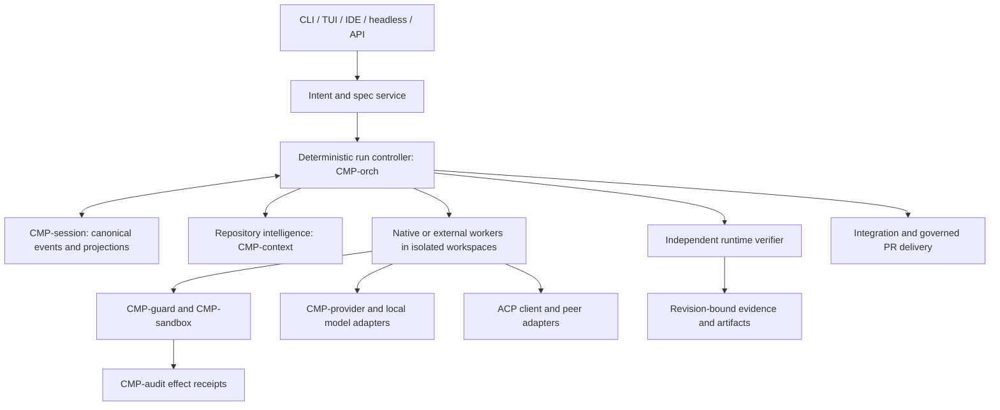

# 25 — Long-horizon control, specification, and delivery

Status: **proposed design, unimplemented unless a traceability row says otherwise**. Priority: verified completion of multi-hour coding work. This document refines `CMP-orch`, `CMP-session`, `CMP-context`, `CMP-provider`, `CMP-acp`, and `CMP-tui`; it does not introduce a second scheduler or permission engine (`DEC-029..031`). The original user request remains available verbatim throughout the run.

## System context and boundaries



**Ownership.** `CMP-orch` owns run/task/attempt decisions and stop policy. `CMP-runner` executes a single bounded turn; its `TurnEndStatus::Completed` means the turn ended, not that the task or run passed. `CMP-session` owns canonical event serialization, append/repair and projections. `CMP-audit` owns effect receipts. `CMP-context` owns repo-map and prompt projection, never task truth. `CMP-provider` owns model transport and usage normalization. `CMP-acp` owns protocol negotiation, never durable task truth. The verifier reads an exact workspace revision and returns typed evidence; it cannot grant tool authority. The runtime verifier is distinct from `ARCH/23`'s release verification process.

## Intent and specification workflow

1. Store `OriginalRequest` bytes, source, timestamp, and digest before interpretation. Discover repository facts at a pinned base revision.
2. Draft requirements with `confirmed | assumption | excluded | proposed_change` status; each has source and impact. Ask only consequential questions. An unanswered question stays visible and may block affected tasks.
3. Create immutable `SpecVersion` with observable examples, invariants, contracts, acceptance scenarios, negative cases, migration/rollback constraints, and a digest. The user or delegated policy approves consequential user-visible behavior.
4. Build a task DAG from that version. Each task names inputs, output artifact, affected files or scope, dependencies, acceptance scenarios, verifier method, permission ceiling, retry limit, budget, and owner.
5. During implementation, a discovered technical fact may revise the plan. A change to confirmed behavior creates a new spec version. The controller marks affected tasks and evidence stale by explicit dependency edges; it never silently rewrites the original request.
6. Evaluate against both the current spec and independently derived scenarios from confirmed intent. `INSUFFICIENT_EVIDENCE` is a first-class result. User acceptance and post-release outcomes are recorded separately from automated verification.

`AGENTS.md`, repository files, tool output, and peer receipts are context with provenance; they cannot approve a requirement, grant a permission, or change a budget. A human edit to a spec is an input to review, not automatically an approved version.

## Logical schema and storage ownership

These are logical records. `CMP-session` must assign versioned event types and a migration for each projection before implementation. `runs/<run_id>/events.jsonl` is the canonical **run/control** stream; existing per-session logs remain canonical for turns and model messages, linked to the run by IDs and causation. A run is never reconstructed from a worker's conversation alone. SQLite is a **rebuildable projection** over those streams; the run event is made durable before its projection update under one writer lock, then replay repairs an interrupted projection. This is a logical transition, not an atomic transaction across files. Cross-stream mismatches are incidents, not silently merged. Large outputs live in a content-addressed artifact store, with digest, size, media type, retention pin, and redaction status. The audit chain is a separate security record linked by `effect_id`; recovery reconciles it rather than assuming a cross-file transaction.

| Record | Required fields and constraints |
|---|---|
| `Run` | `run_id`, `original_request_ref`, `repo_id`, `base_commit`, `integration_commit`, `spec_digest`, `status`, `state_reason`, `policy_digest`, `config_digest`, `owner_epoch`, `budget_id`, `created_at`, `updated_at`. One active owner epoch per run. |
| `IntentItem` | `item_id`, `run_id`, `kind`, `text_ref`, `source_ref`, `confirmation_actor`, `impact`, `status`, `supersedes`. A model inference cannot be `confirmed`. |
| `SpecVersion` | `spec_id`, `run_id`, `parent_digest`, `digest`, `requirements[]`, `examples[]`, `invariants[]`, `exclusions[]`, `approver`, `approved_at`. Immutable after approval. |
| `Task` | `task_id`, `run_id`, `spec_digest`, `title`, `inputs[]`, `output_contract`, `acceptance_ids[]`, `deps[]`, `state`, `priority`, `write_scope`, `permission_ceiling`, `budget_id`, `attempt_limit`, `workspace_id`, `evidence_ids[]`. `deps` must be acyclic. |
| `Attempt` | `attempt_id`, `task_id`, `strategy_id`, `model_route`, `base_commit`, `workspace_id`, `environment_digest`, `state`, `started_at`, `ended_at`, `failure_fingerprint`, `usage_status`. Attempts are append-only; retries create a new ID. |
| `ExternalAttempt` | `attempt_id`, `peer_identity`, `adapter_kind`, `protocol_version`, `capabilities_digest`, `external_session_id?`, `event_cursor?`, `resume_mode`, `opaque_children`, `workspace_id`, `scope_digest`, `cancel_state`, `last_heartbeat`, `usage_provenance`. Never infer unsupported fields. |
| `Workspace` | `workspace_id`, `repo_id`, `path`, `base_commit`, `head_commit`, `dirty_digest`, `writer_epoch`, `lease_until`, `status`, `cleanup_state`. A lease alone is insufficient; every write checks fencing epoch. |
| `Budget` | `budget_id`, `parent_id?`, ceilings for money/tokens/time/tool calls/output/storage/concurrency, `reserved`, `spent`, `unknown_usage`, `verification_reserve`, `recovery_reserve`. Atomic reservation rows prevent concurrent overspend. |
| `EffectIntent` | `effect_id`, `attempt_id`, `kind`, `canonical_resource_digest`, `idempotency_key?`, `authorization_ref`, `workspace_base`, `state`, `audit_prepare_ref`, `terminal_receipt_ref`, `reconciliation`. One stable ID from prepare through outcome. |
| `Evidence` | `evidence_id`, `task_id`, `spec_digest`, `repo_commit`, `workspace_digest`, `scenario_ids[]`, `producer`, `environment_digest`, `artifact_refs[]`, `verdict`, `limitations`, `created_at`. `verdict = PASS | FAIL | INSUFFICIENT_EVIDENCE`; only current `PASS` unlocks a dependency. |
| `Decision` | `decision_id`, `question`, `alternatives[]`, `answer`, `actor`, `evidence_refs[]`, `affected_ids[]`, `supersedes`. User and model decisions are distinguishable. |
| `Delivery` | `delivery_id`, `base_commit`, `head_commit`, `diff_digest`, `review_ids[]`, `ci_status`, `pr_remote_id?`, `release_status`, `external_effect_ids[]`. PR create/comment/merge/deploy are distinct effects. |

`run_id`, `task_id`, `attempt_id`, `effect_id`, and `evidence_id` are globally unique and never reused. Every event has `schema_version`, aggregate ID, monotonic sequence, actor, causation ID, correlation ID, and payload digest. A projection rebuild must reproduce the same rows from the same log bytes. A stored newer event version is refused before partial replay. On bundle export, include the source revision, artifact manifest, required redaction/anchor level, and environment assumptions; a copied session log alone is not a portable run.

### Interface contracts and transaction boundaries

```rust
trait RunController {
    fn submit_intent(&self, request: OriginalRequest) -> Result<RunId, ControlError>;
    fn approve_spec(&self, guard: MutationGuard, expected_parent: Digest, spec: SpecDraft,
                    actor: UserActor) -> Result<SpecDigest, ControlError>;
    fn claim_ready(&self, guard: MutationGuard, worker: WorkerIdentity,
                   capacity: Capacity) -> Result<Option<Claim>, ControlError>;
    fn record_attempt(&self, guard: MutationGuard, claim: Claim, event: AttemptEvent)
                      -> Result<AttemptState, ControlError>;
    fn submit_evidence(&self, guard: MutationGuard, task: TaskId, evidence: EvidenceDraft)
                       -> Result<TaskState, ControlError>;
    fn decide_next(&self, run: RunId) -> Result<StopDecision, ControlError>;
    fn recover(&self, guard: RecoveryGuard)
               -> Result<RecoveryPlan, ControlError>;
}

trait RuntimeVerifier {
    fn verify(&self, subject: VerifiedSubject, scenarios: &[ScenarioId],
              budget: Reservation) -> Result<VerificationResult, VerifyError>;
}
```

`VerifiedSubject` contains `repo_id`, exact commit plus dirty-tree digest or an
immutable snapshot, `spec_digest`, scenario versions, environment digest and toolchain
versions. A verifier cannot return `PASS` without evidence artifact digests. A
`ControlError` distinguishes `Conflict`, `StaleFence`, `InvalidTransition`,
`DependencyCycle`, `BudgetExceeded`, `UnknownEffect`, `UnsupportedCapability`,
`StorageCorrupt`, and `PolicyDenied`; callers must not coerce them to a generic retry.
`MutationGuard` contains run ID, owner epoch and expected aggregate sequence.
`RecoveryGuard` contains run ID, observed epoch and expected aggregate sequence;
recovery acquires ownership and increments the epoch before dispatch. All mutating
methods require the run owner epoch and expected aggregate sequence; an
out-of-date writer gets `Conflict` or `StaleFence` before any effect. `claim_ready`
returns a bounded claim with attempt ID, workspace fence, spec digest, deadline,
permission ceiling and budget reservation; the worker cannot enlarge it.

**Projection migration order.** Add `run`, `spec_version`, `intent_item`, `task`,
`task_dependency`, `attempt`, `external_attempt`, `workspace`, `lease`, `budget`,
`reservation`, `effect_intent`, `evidence`, `decision`, `artifact_ref`, and `delivery`
tables with foreign keys, unique IDs, current-state check constraints, and indexes
on `(run_id,state,priority,task_id)`, `(task_id,attempt_no)`, `(task_id,depends_on)`,
`(workspace_id,fence_epoch)`, and `(effect_id,terminal_kind)`. The event-log schema
version advances first; one migration rebuilds projection tables from the log in a
temporary database, verifies row counts/digests, then swaps the projection atomically.
An interrupted migration leaves the old projection intact and is restartable.

**Transition transaction.** Under the run writer lock: validate expected sequence and
fence; check graph/spec/budget invariants; append and `fsync` a versioned transition
event; update the SQLite projection at that sequence; commit; publish a UI update.
If a crash falls between log append and projection commit, replay applies the event
once by unique event ID. If the projection leads the log, mark corruption and refuse
dispatch. Audit and external effects are joined by stable IDs and reconciled after
this local transaction; they are never assumed atomic with SQLite.

**Cross-stream rule.** The run stream records a `TurnLinked` event with session ID,
turn ID, start/end session sequence, and digest. If a session append succeeds but the
run link does not, recovery finds the orphan by run/attempt ID and appends a repair
link after verifying the session bytes. If the run link exists but the session range
is absent or altered, the task becomes `NEEDS_REVIEW` and cannot pass. A worker
session close never changes run completion by itself.

**Effect transaction.** Create a deterministic `effect_id` and idempotency key where
supported; obtain guard decision and frozen confinement profile; durably append the
prepare record (with roots anchored at the configured cadence); execute once; append one terminal
receipt; link session state and artifact digests. If the process dies after effect but
before receipt, recover to `UNKNOWN` and inspect the actual target. A file write
reconciles base/head digests; PR creation queries remote state by idempotency marker;
deployment or migration with no safe probe waits for an operator. An audit append
failure before execution refuses the action; a terminal append failure after a real
effect is an incident and blocks completion rather than pretending the effect never
happened.

## State machines and invariants

**Run:** `DISCOVERING → SPECIFYING → READY → EXECUTING → INTEGRATING → VERIFYING → AWAITING_ACCEPTANCE → COMPLETED`. From active states the controller may enter `RECOVERING`, `WAITING`, `STOPPED`, or `CANCELLED`, with a persisted reason and resume condition. `COMPLETED` and `STOPPED` are terminal and different. A run may wait while an independent task continues only if its waiting reason does not block that task.

**Task:** `BLOCKED → READY → CLAIMED → RUNNING → VERIFYING → PASSED`; alternate states `WAITING`, `NEEDS_REVIEW`, `FAILED`, `CANCELLED`, `SUPERSEDED`. Worker completion moves a task to `VERIFYING`. `PASSED` requires independent `PASS` evidence at the current spec digest and tested integration/workspace commit. A failed or stale dependency cannot ready a descendant. `SUPERSEDED` keeps history after a spec revision.

**Attempt:** `PREPARED → ACTIVE → SETTLING → SUCCEEDED | FAILED | UNKNOWN | CANCELLED`. An `UNKNOWN` external outcome blocks replay until reconciled. An ACP session is a conversation handle under an attempt, not a run or task.

**Verification:** `PENDING → RUNNING → PASS | FAIL | INSUFFICIENT_EVIDENCE | STALE`. Changing the spec digest, tested commit, relevant environment, or integrated diff makes evidence stale; this is a transition with an event, not deletion. Evidence can be re-used only if its exact subject and scenarios remain identical and the verifier records why.

**Hard invariants:** one fenced writer per workspace; no dependency unlock from `SUCCEEDED` alone; no effect executes without guard authorization, confinement, and prepared audit intent; no completion from model text; no budget reserve beyond the parent ceiling; cancellation prevents new dispatch and reconciles in-flight effects. Leases use monotonic time and fencing tokens; a restarted worker with a new epoch rejects writes from the old epoch.

## Dispatch, resource use, and stop control

At each dispatch boundary, the controller: (1) checks approved spec and graph acyclicity; (2) selects `READY` tasks by stable priority and task ID; (3) checks permission and capability requirements; (4) atomically reserves expected attempt cost **plus** mandatory verification and recovery reserve against task/run/provider quotas; (5) claims a fenced workspace; (6) launches a bounded attempt. Real provider usage is reconciled to the reservation after every response, including failed/fallback responses. Estimated, included-plan, and unknown costs remain distinct. Unknown pricing under a money cap blocks dispatch or requires an explicit token-only policy. A zero-dollar subscription label does not prove zero quota impact.

The stop controller returns `CONTINUE | CHANGE_STRATEGY | PAUSE | STOP | COMPLETE`. It runs before costly actions and after task, verification, budget, permission, cancellation, or external-status events. `COMPLETE` requires every mandatory current criterion to have current `PASS` evidence, integrated diff checks, no unknown effect, and required acceptance. `PAUSE` names a recoverable dependency or user decision. `STOP` names a hard bound or non-recoverable cause. No ready task is `PAUSE` or a graph defect until proved otherwise, never `COMPLETE` by default. A repeated failure fingerprint without new evidence requires a different strategy; the attempt counter persists across new model sessions.

## Failure and recovery sequences

**Process crash:** acquire the run owner lock and increase the fence epoch; replay canonical events; verify audit chain and projection; inspect worktree commit/dirty digest, child processes, provider requests and external effect IDs; classify each unsettled effect as completed, safely retryable, compensatable, or unknown. Rebuild stale repo context. Only then ready unfinished tasks. Never replay PR creation, migration, deployment, or network write solely because the local tool call lacked a result.

**Implementation failure:** preserve diagnostics and diff; determine whether code, environment, requirement, or integration caused failure. Retry locally within the persistent attempt limit if new evidence supports repair. A test that was green in an isolated worktree is re-run after integration because the combined revision is a new subject.

**Planning or intent failure:** suspend dependent tasks, record the contradicted assumption, revise plan or open clarification. A user-visible change requires a new approved `SpecVersion`; affected evidence becomes `STALE`. Preserve the previous spec and decisions for audit.

**Disconnect or cancellation:** persist the external peer capability snapshot and last event cursor. Ask for resume/load only if negotiated and supported; otherwise use a fresh session with a bounded handoff package. Terminate descendants according to the adapter's actual control surface, then reconcile workspace and effects. A heartbeat only proves a live connection, not progress or completion.

**Client detach and reattach:** a run is owned by the controller, not its TUI or IDE
connection. A detached multi-hour run requires a supervised controller process with
an authenticated local control endpoint, durable event cursor, and replayable status
projection. `attach(run_id, after_seq)` first returns a snapshot at a stated sequence,
then ordered events after that sequence; a cursor gap forces a fresh snapshot. A
client disconnect never cancels the run. An explicit cancel is a separately
authorized command and fences new dispatch. A controller process crash follows the
normal recovery protocol; a stopped host cannot make background progress, and the
UI must show the last confirmed event time rather than imply it is working.

## External agents, repository intelligence, and delivery

Adapters declare capabilities independently: progress stream, tool events, usage, cancellation, session load/resume, worktree ownership, permissions, and nested-agent visibility. For an opaque CLI, track process, exit status, bounded output, workspace diff, and HorizonCode-run checks; internal tool use and cost are `unknown`. For ACP, negotiate at runtime and pin protocol/capability snapshot to `ExternalAttempt`. ACP v1.9.1 is the stable observed baseline at 2026-09-27; v2 fields remain feature-gated. The peer cannot inherit broader permissions or directly mark a task passed. A remote peer with its own tools must either work in an isolated externally governed workspace or be treated as an opaque trust boundary with a declared residual.

Repository intelligence retains commit, file digests, parser/index version, ignore rules, symbol locations, semantic edge provenance, and stale marker. Tree-sitter supplies broad syntax; LSP/SCIP supplies semantic edits where available; lexical search and direct reads remain a fallback. A symbol edit applies a versioned workspace edit only after checking every base hash and write scope. A stale index refreshes or refuses the edit. The task-specific package is a small set of source/test references, not a whole-repository prompt. Compaction may summarize prose but never erase the durable intent/spec/task/evidence records.

For models that cannot reliably emit structured edit tools, an optional versioned
text-edit parser is selected only after model/template conformance. Parsing and
base-hash preflight precede all writes. A malformed edit produces bounded,
specific diagnostics for a repair attempt; the retry budget is durable and no
partial patch counts as completion. Fast lint or focused tests may feed the next
attempt, but only recorded commands, exits and exact tested revisions contribute
verification evidence. This takes Aider's edit-feedback pattern while preserving
HorizonCode's separate verifier and effect journal (`REQ-PROV-007`).

Research for an unfamiliar API or architectural decision is a bounded task with a
source ledger: URL or repository revision, retrieval time, authoritative status,
claim/excerpt, and affected requirement/decision. Browse current primary sources
when a fact may have changed; label contradictory or inaccessible sources. Search
results and model citations are leads until the referenced source is actually read.
Fetched text is untrusted context and cannot alter run policy (`REQ-RESEARCH-001`).

PR preparation checks intended paths, staged versus unstaged diff, generated files, lockfiles, license/secret exposure, test evidence, review findings, and CI on the exact head commit. PR creation records an idempotency key or searches for an existing PR on retry. Comment, merge, release, and deploy each re-enter guard and audit. Delivery is verified at the integrated revision; a PR URL alone is not completion evidence.

## Operator experience and settings

Every UI client uses one typed settings schema with `value`, effective scope (`user | project | session | managed`), source, validation error, policy lock, and whether change applies immediately, next turn, or after restart. Settings include theme/accent and colour depth, contrast, reduced motion, keyboard map, screen-reader output, layout, model/provider and local endpoint, worker agent/adapter, reasoning level, routing preference, compaction auto/threshold/keep-tail, repo-map budget, approval posture, run/task cost and time ceilings, cost currency/display mode, notifications, and evidence retention. Project files may narrow authority but never grant it. Switching model or compaction policy creates a new context epoch and records actual capabilities; it does not mutate old evidence.

The run header displays task state, selected model and worker, active workspace/branch, verified criteria count, pending approvals, elapsed time, tokens and cache classes, estimated/actual/unknown spend, and remaining budget. A drill-down shows attempts, raw-versus-filtered tool output links, test and reviewer evidence, unresolved assumptions, external-agent visibility limits, and recovery action. User-controlled colour palettes never encode state without text or glyphs. Cost and progress are not inferred from a spinner or heartbeat. `ARCH/06` owns layout and key behavior; `ARCH/18` owns effective configuration.

## Acceptance and measurement

### End-to-end workflow matrix

| Workflow | Normal outcome | Failure and recovery contract |
|---|---|---|
| New objective | Original request → clarified spec → task DAG → bounded attempts → integrated verification. | Invalid input is typed before a run is admitted; consequential ambiguity enters `WAITING` with a question, not a guessed requirement. |
| Repository change | Commit-bound context → scoped worktree → guarded edit → diff → independent evidence. | Stale index or changed file hash refreshes/refuses; unauthorized path or missing sandbox denies before effect. |
| Tool or model call | Reserve budget → authorize → execute → record usage/effect → settle. | Timeout/cancel records partial/unknown outcome; transient retry uses persistent allowance; provider failure after content is not silently replayed. |
| Parallel team | Claim independent ready tasks with fenced workspaces → collect receipts → stable integration order. | Concurrent claim collision loses by epoch; overlapping edits create conflict evidence; merged code is reverified. |
| External peer | Negotiate methods → bind external attempt/workspace → stream what is available → inspect diff. | Disconnect retains cursor and `UNKNOWN` internals; resume only if negotiated; hidden nested agents/cost remain unknown. |
| PR delivery | Review exact integrated diff/tests/CI → governed PR effect → record remote ID. | Network failure after create triggers lookup by idempotency marker; missing permission waits; merge/deploy remains a separate authorized effect. |
| Process restart | Lock/epoch → replay run and session streams → reconcile effects/worktree → resume eligible tasks. | Corrupt/newer state refuses safely; unanchored or missing audit receipt is surfaced; no blind replay of migrations/deployments. |
| Resource exhaustion | Controller stops dispatch, retains evidence and resumable state. | Money, tokens, time, quota, disk or process cap produces `STOPPED` or explicit resource `WAITING`, never `COMPLETED`; recovery reserve preserves a final handoff. |

For each workflow, acceptance fixtures include invalid input, authorization denial,
network/dependency failure, timeout, cancellation, partial execution, process kill,
concurrent operation and exhaustion. A fixture names the exact platform and tier;
unsupported cases are `skipped_blocked`, not silently passing.

The architecture is a proposal until measured. Compare the same models, repositories, tasks, permissions, and run budgets against a single-agent loop. Record verified completion rate, intent-alignment failures, premature completion, recovery success after process kill, duplicate-work cost, cost/time per verified deliverable, loop frequency, human intervention, and UI comprehension of status/cost. Required scenario families: wrong initial interpretation; crash between effect and receipt; lost ACP connection; duplicate PR creation attempt; parallel worker stale lease; spec revision after code; merge-invalidated tests; unknown local-model tool capability; context compaction after many hours; and budget exhaustion with unverified work. `ARCH/23` owns executed acceptance records and release gates.

## Evidence consulted

Internal source snapshot: `dacca604` plus uncommitted working-tree changes on 2026-09-27; [review and exact findings](24-ARCHITECTURE-REVIEW.md). Research notes in the repository root contain pinned source links for the named coding agents and related tools. External primary sources checked on 2026-09-27: [Anthropic long-running harness](https://www.anthropic.com/engineering/effective-harnesses-for-long-running-agents), [Anthropic planner/generator/evaluator](https://www.anthropic.com/engineering/harness-design-long-running-apps), [ACP changelog](https://github.com/agentclientprotocol/agent-client-protocol/blob/main/CHANGELOG.md), [OpenCode provider implementation](https://github.com/anomalyco/opencode/blob/dev/packages/opencode/src/provider/provider.ts), [models.dev schema and API](https://github.com/anomalyco/models.dev/blob/dev/README.md), [Cline task schema](https://github.com/cline/cline/blob/main/sdk/packages/core/src/tasks/store/task-schema.ts), [Codex app-server protocol](https://github.com/openai/codex/blob/main/codex-rs/app-server-protocol/src/protocol/v2/thread.rs), and [Serena symbol edits](https://github.com/oraios/serena/blob/main/src/serena/tools/symbol_tools.py). These sources support patterns and interfaces, not an HorizonCode performance claim.
