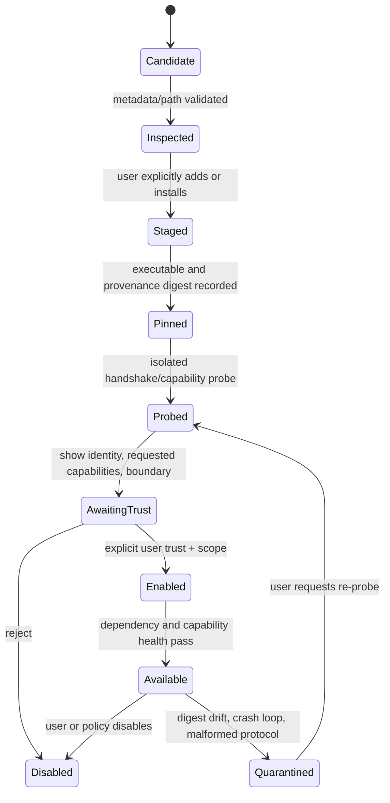

# 27 — Commands, agent profiles, delegation, and operator settings

Status: **target LLD; not implemented unless source status below says otherwise**.
This is the cross-surface contract for user commands, mentions, the Agents panel,
external-agent discovery/installation, per-agent model and resource controls, and
operator preferences. It joins `ARCH/06` UI, `ARCH/10` tools, `ARCH/11` providers,
`ARCH/12` guard, `ARCH/15` protocols, `ARCH/16` orchestration, `ARCH/18` config,
`ARCH/20` analytics, `ARCH/22` security, and `ARCH/25` durable execution. Those owners
remain authoritative for their internal behavior; this document defines the shared
registries and user-facing contracts. MCP servers, skills, plugins, provider adapters,
native workers, and external coding agents are distinct extension types, not one
undifferentiated “plugin”.

## Source baseline and scope

At Git `53a2654` on 2026-09-27 (Rust source unchanged from `1c7a1c68bab9`), the repository has a headless CLI and ACP server,
not the planned interactive TUI or an agent orchestration runtime. Source currently
parses only `/usage` and `/insights [--days N]` in one-shot `-p` prompt mode
(`crates/horizoncode-cli/src/app.rs::parse_slash_command`); an ACP prompt is not parsed
as a slash command. There is no `@` mention resolver, settings UI, agent panel, agent
profile registry, ACP client, agent installer, durable run tree, or shared quota
controller. The actual CLI surfaces are `acp`, `audit verify|replay|census`, and
`analytics stats|export`, plus the options defined in
`crates/horizoncode-cli/src/args.rs`. This distinction is a source fact, not a
statement that the target interface already exists.

The first interactive product contract may keep the terminal-first client, but the
same `CommandService`, `AgentDirectory`, settings API, and `RunController` MUST serve
TUI, headless, and ACP surfaces. UI and protocol adapters do not each invent their
own syntax or state.

## Ownership and module boundaries

| Capability | Owner | Must not own |
|---|---|---|
| Slash command parse, validation, help, completion, dispatch | `CMP-command` (small facade over typed services) | Policy decisions, business state, direct provider/tool calls |
| `@` parse and reference resolution | `CMP-reference` / `CMP-context` | Child launch, permission grant, implicit side effects |
| Agent profile source, provenance, schema and migration | `CMP-config` + `CMP-agent-directory` | ACP wire parsing, child task completion, provider billing truth |
| Agent lookup/install/launch | `CMP-agent-directory` + `CMP-adapter` | Trust decision, policy bypass, task verification |
| Agent task scheduling, parent/child budgets, stop/recovery | `CMP-orch` / `CMP-runner` | UI session lifecycle, provider-specific wire details |
| Provider/model capability and observed usage | `CMP-provider` | Claiming usage hidden inside an opaque peer |
| Quota aggregation, warning evaluation, resource reservation | `CMP-analytics` (facts) + `CMP-orch` (dispatch control) | Fabricating unreported remote usage |
| Settings storage and preference merge | `CMP-config` | Widening guard authority or directly mutating active tasks |
| Theme, command palette, Agents panel, notification rendering | `CMP-tui` | Canonical settings, run/task truth, permission authority |
| Approval posture and effect checks | `CMP-guard` | Theme/notification preferences or agent catalog reputation |
| MCP, skills, plugins, providers | Their own adapters/services; registry metadata is config input | Reusing agent-install trust as blanket extension trust |

No module calls another component's private transport or storage. Extensions supply
versioned manifests and declared capabilities through one adapter registry; the
extension type determines its lifecycle and permission model. A registered tool,
skill, MCP server, UI panel, command, provider, or agent does not thereby become
enabled or trusted.

## User-facing invocation contract

### Surface distinction

The CLI command tree (`horizoncode ...`), in-session slash commands (`/...`), composer
references (`@namespace:value`), key bindings, and ACP methods are different namespaces.
They may invoke the same typed service, but names are not silently aliased across
surfaces. `/settings` is an in-session command in the target interactive client; the
headless CLI equivalent is a documented `config` command/API, not an attempt to open a
terminal panel. ACP clients use negotiated ACP/control methods and do not need to
emulate slash text.

Goal creation, preparation, and activation have the same typed `RunController`
operations on every surface. `session/prompt` is not itself a goal-start approval.
While an ACP **agent server** session is awaiting activation, HorizonCode first emits
the exact review bundle and then, only if the client advertised the ACP form
elicitation capability, may send agent-to-client `elicitation/create` with an
explicit `activate: yes|no` choice. An accepted response mints an approval receipt
only after strict schema validation and binding it to the receiving client
connection, session, authenticated principal, one delivery ID, and every review
digest. The connection/session binding prevents replay; it does not itself
authenticate the client or prove the user saw the UI. Only a configured trusted
interactive connector with a verified identity/control scope can return an operator
receipt. ACP elicitation is optional and capability-negotiated; a tool
`session/request_permission` response is never goal approval.

If the ACP client does not advertise form elicitation, render one exact
`HC-GOAL-START <delivery-id> <spec-digest> <task-graph-digest> <plan-digest>`
receipt for the user to send as the sole text block of the next `session/prompt`.
The ACP ingress parses that exact grammar in the deterministic control lane before
any model dispatch, binds it to the pending review and client/session, and rejects
extra text, stale/reused IDs, changed digests, and unrecognized variants. Any other
prompt while awaiting activation invalidates the preview and returns the run to
draft/clarification; it is not passed to a worker as hidden approval. On disconnect,
cancel, decline, timeout, or malformed response, no activation occurs; reconnect
requires a fresh review and approval bound to the new connection. This fallback uses
standard ACP messages and introduces no custom ACP method. ACP `elicitation/create`
is an agent-to-client request; the client advertises the matching form capability
during initialization. These protocol properties do not establish operator identity
by themselves. Bind approval to an authenticated local peer credential or verified
connector policy; without it, accept the message only as ordinary input, never as
approval. ACP's elicitation RFD records that it was completed and stabilized on
2026-07-22 ([ACP v1 overview](https://github.com/agentclientprotocol/agent-client-protocol/blob/main/docs/protocol/v1/overview.mdx), [ACP elicitation RFD](https://github.com/agentclientprotocol/agent-client-protocol/blob/main/docs/rfds/elicitation.mdx)).

### Operator and worker principals

Every control request carries an `OperatorControlSession` established by the trusted
TUI, standalone user CLI, or configured ACP connector. The controller assigns
`USER_OPERATOR`, `WORKER`, `PEER`, `PLUGIN`, or `SYSTEM`; request arguments and message
text cannot choose this field or elevate a principal. A raw ACP connection/session
ID is a replay-binding value, not authentication; use OS peer credentials for a
trusted local process or verified connector authentication plus an explicit trust
policy. The local control endpoint and
its short-lived capability are held only by the first-party client and excluded from
worker views, prompt context, inherited environment, scratch directories, and peer
protocols. Tool/extension children get attempt-scoped `WORKER` identity and cannot
reach canonical run/session/audit state or invoke state-changing CLI operations, even
when they execute the HorizonCode binary. Start flags alone are not approval.

The CLI equivalent runs in an authenticated operator control session and prompts on
that trusted client channel; piping `--confirm`, placing digest flags in a script, or
launching the CLI from a model-controlled tool does not create an operator receipt.
An ACP agent server may count its connected client as operator ingress only when the
configured connector is authenticated and trusted to present the exact review to the
operator and capture an explicit response. The ACP protocol alone does not prove that
a human saw or clicked its UI, so generic/untrusted clients cannot create operator
receipts. When HorizonCode acts as an ACP client for external workers, a peer's
elicitation, `session/update`, permission response, or worker-produced token is
input/progress only and never approves the HorizonCode run. Remote/multi-user ACP
requires authentication and authorization mapping before it can create operator
receipts; current local scope is same-host control by the configured OS user.

### Target slash-command registry

Every command is declared in `CommandDescriptor`:

```text
CommandDescriptor {
  id, aliases[], summary, argument_schema, owner, availability,
  allowed_surfaces[], effect_class, preview_policy, permission_ref?,
  apply_boundary, result_view, since_schema_version
}
```

`id` is namespaced and stable; aliases cannot shadow built-ins or another active
command. Parse is strict: unknown commands, malformed arguments, stale resource IDs,
unsupported surfaces, and missing capabilities return a typed error with valid
suggestions. They never fall through to a model prompt. Completion and `/help` are
generated from the same validated registry. Each extension command is hidden until
the extension is enabled and contributes only a schema-validated descriptor; command
text cannot inject shell text or bypass the owning service.

This is the proposed built-in interactive command set. Commands with destructive,
external, expensive, or authority-changing effects show a preview and go through the
normal guard/confirmation path. Read commands do not acquire write locks.

| Command | Arguments and behavior | Side-effect boundary |
|---|---|---|
| `/help [topic]` | Show help for commands, settings, references, keys, or a workflow. | Read only |
| `/commands [filter]` | Search available command descriptors with source/availability. | Read only |
| `/settings [section]` | Open settings; optional section focuses a typed group. Edits preview effective value, source, lock, and apply boundary. | Persist preference through `CMP-config`; authority changes remain guarded |
| `/agents [list]` | Open the Agents panel and run/child tree. | Read only |
| `/agents show <profile>` | Show provenance, install path/version, supported capabilities, model control, permissions, limits, and last probe. | Read only |
| `/agents discover [source]` | Search local executable paths or a configured remote catalog; return candidates only. | Network lookup requires opt-in and guard; no install or launch |
| `/agents add <path-or-catalog-id>` | Add a local command path or stage an explicitly selected catalog distribution. Validate path/hash/platform/license/manifest before writing. | Install is a separately guarded effect; not trusted/enabled by add |
| `/agents trust <profile>` | Review/pin origin, executable/content digest, requested access, adapter, and execution boundary. | Explicit user action; auditable |
| `/agents enable|disable <profile>` | Permit/deny future routing under current policy; disabling does not erase history or silently terminate a child. | New attempts only; active child termination uses `/cancel` |
| `/agents probe <profile>` | Launch only the profile's protocol/capability handshake in an empty disposable workspace. | Process/network access guarded; no user task is sent |
| `/agent <profile>` | Select primary agent for a new turn/run. | Session preference; pinned to new turn/run, not retroactive |
| `/model [provider/model [variant]]` | Inspect or select a model for the next run/turn; report actual capability and price/quota provenance. | Validate route; reject missing required capabilities |
| `/providers [list|show <id>]` | Inspect configured provider/endpoint type, auth reference status, model catalog provenance and connectivity state. | Secrets are never revealed; explicit probe is guarded |
| `/run [id]` | Show the run summary or a selected durable run. | Read only |
| `/attach <run-id> [--after-seq <n>]` | Attach this UI client to a live local supervisor, return a snapshot at a stated event sequence, then replay ordered events after that cursor. It never starts or resumes work. A gap forces a fresh snapshot. | Authenticated local control API; read/subscribe only |
| `/tasks [filter]` | Show task DAG, readiness, blockers, owners, attempts, dependencies, and evidence state. | Read only |
| `/goal [show] [run-id]` | Inspect the original request, intended outcome, confirmed constraints, success conditions, unresolved assumptions, and current goal version. | Read only |
| `/goal set <request>` | Persist the exact original request as a new inert run/goal draft and select its pointer in this session. Show only supplied request text, pinned workspace/base, and fields still awaiting preparation; do not invent success conditions. | Pure durable draft write; no model, repository scan/tool, or peer work starts |
| `/goal prepare <run-id>` | Explicitly request a bounded planning attempt: revision-pinned read-only repository discovery, proposed intent/specification, task DAG, verification plan, and review bundle. Show planner model/agent, read scope, cost/time/token ceiling, and no-write/no-peer boundary first. | Reserves the separate planning budget; may run planner/read-only discovery only. Unknown usage is reconciled; no coding worker, mutation, or external side effect starts |
| `/goal clarify <run-id> <answer>` | Answer a persisted blocking clarification. Replaces no confirmed requirement silently; creates a new input/preparation proposal and invalidates older preview/approval receipts. | Durable user input; no inference until a new `/goal prepare` is explicitly requested |
| `/goal start <run-id>` | If a nonterminal start intent exists, show its durable `starting`/`reconciling` status and do not open another review. Otherwise open the final review card for the exact spec/task-graph/plan, base commit, policy snapshot, route, permission boundary, and total/verification/recovery budgets. This persists an expiring `GoalApprovalChallenge` before rendering; only a confirmation in the same authenticated operator control session/connection can accept it. | Explicit digest-bound confirmation; stale/expired/replaced challenge or failed preflight leaves work undispatched. CLI: `horizoncode run start <run-id>` opens the review in an authenticated operator control session; the user confirms the displayed challenge and bundle digest there. Same-delivery/same-payload retry is idempotent; changed payload conflicts. Digest flags or `--confirm` from a worker shell are rejected. Activation is committed after durable idempotent reservations; dispatch comes from an idempotent outbox and uncertain launches are reconciled by attempt ID. A control-plane timeout queries intent status before any retry. |
| `/goal revise <run-id>` | Start a versioned intent/specification revision; show affected tasks/evidence and require confirmation when user-visible behavior changes. | Proposal only until accepted; accepted revisions invalidate affected evidence |
| `/goal pause <run-id>` / `/goal resume <run-id>` | Aliases for the same controller-owned transitions as `/pause` and `/resume`; they neither create a second lifecycle nor issue a new prompt. | Priority control lane; durable intent/fence and effect reconciliation |
| `/goal clear <run-id>` | Remove this goal from the current session's active-goal pointer only for a draft with no attempt, terminal run, or explicitly paused/blocked run. It never changes `RunGoal`, run/task lifecycle, history, or budget; a paused run remains resumable by ID. A running run must first be paused, cancelled, or stopped. | Explicit confirmation; writes a pointer-clear event, never deletes run history or resets budget |
| `/spec [show|history|diff] <run-id>` | Inspect the immutable specification versions and their evidence/decision links. | Read only |
| `/plan [show]` | Show the active approved spec/task plan; planning/replanning itself is initiated by normal user task or explicit revise flow. | Does not approve a spec |
| `/approve <request-id>` / `/deny <request-id>` | Resolve one pending approval after displaying exact requester, action, resource, scope, expiry, and policy. | Bound one-shot decision; audit required |
| `/verify [task-id|run-id]` | Schedule the defined verification suite and show exact revision/commands as results arrive. | Resource reservation; no self-attestation |
| `/review [base..head]` | Inspect a pinned diff and produce findings/evidence; read-only reviewer by default. | Model/provider spend reserved; cannot mark task passed |
| `/diff [run-id|worktree-id]` | Show scoped diff and untracked/staged state. | Read only |
| `/checkpoint [create|list]` | Create/list named recoverable checkpoints with repo and task metadata. | Create writes state/Git ref; guarded and auditable |
| `/checkpoint restore <id>` | Preview code and task-state rewind, affected evidence, and external effects. | Explicit confirmation; never rewinds external systems |
| `/resume <run-id>` | Explicitly authorize the controller to reconcile persisted state and resume only eligible work. A no-progress pause requires an untried bounded strategy or new user evidence/steering; consumed retry and budget counters never reset. | Controller recovery protocol; not “repeat last prompt” |
| `/pause <run-id>` | Fence all new dispatch, request cancellation of in-flight work, reconcile uncertain effects, and preserve a resumable run. | Priority control lane; explicit `/resume` required; pause state survives restart |
| `/cancel run <id>`, `/cancel task <id>`, `/cancel attempt <id>` | Use an explicit target kind; validate its ownership and require matching run/task/attempt cancel scope. Run cancellation fences all new claims and, if a goal start is not committed, races it against `GoalActivated`; task cancellation fences only that task and leaves dependents blocked; attempt cancellation affects only that attempt and allows retry only when policy permits. | Priority cooperative action; show the typed target and `requested`, `reconciling`, `cancelled`, or `already-terminal`; do not cascade task cancellation to descendants or label it terminal before in-flight work/effects reconcile. `/stop-now` is the separate hard-stop action. |
| `/stop-now <run-id>` | Emergency fence and terminate supported active processes/children; reconcile effects and mark hard-stopped. | Priority control lane; cannot undo an effect already committed; unresolved effects remain `UNKNOWN` |
| `/usage [tree|run|task|agent|provider] [id]` | Show observed/estimated/included/unknown tokens, money, quota, time, and warning/cap state. | Read only |
| `/insights [--days N]` | Inspect local aggregate metrics and provenance. | Read only |
| `/context [show|sources]` | Inspect effective context, token estimate/usage, source provenance, compaction epoch, and retrieval pointers. | Read only; does not reveal secrets |
| `/compact [preview]` | Request a budgeted compaction preview, then apply only under current policy. Canonical intent/spec/task/effect/evidence records remain outside the summary. | Resource-consuming; loss report required |
| `/mcp [list|show <id>|enable|disable <id>]` | Inspect/manage MCP servers in the distinct MCP lifecycle. | Enabling a server does not grant every tool; server launch/network is guarded |
| `/skills [list|show <id>|enable|disable <id>]` | Inspect pinned skill metadata and activation state; body loaded on activation only. | Skill content is untrusted; never grants authority |
| `/plugins [list|show <id>|enable|disable <id>]` | Inspect plugin source/hash/license/surfaces and separately enable declared surfaces. | Install and enable are distinct guarded effects |
| `/permissions [show]` | Explain effective permission rules and source/locks; editable policy opens `/settings permissions`. | No one-shot grant by merely viewing |
| `/panels` / `/focus` / `/dock` | Open panel picker, focus workspace, or change layout. | Local UI preference only |
| `/pr [prepare|status]` | Prepare a PR evidence packet or inspect remote status. `/pr create` is a later explicit, confirmed effect. | Network reads/creates governed separately; see `ARCH/25` |
| `/clear` | Clear only the visible transcript projection; durable session/run events remain recoverable. | No data deletion |
| `/quit` | Close client; detached supervised run continues. Offer cancellation separately. | Client lifecycle only |

The registry is versioned. A command is unavailable with a precise reason if its
owner/capability is absent; it must not become a plausible no-op. At the source
baseline in `CURRENT_RUN.md`, no interactive slash-command parser or local attach API
exists; the table is a proposed product contract, not a claim of implementation.
`analytics stats|export` and `audit verify|replay|census` are CLI subcommands, not
aliases in the interactive registry unless explicitly registered later. The CLI attach
equivalents are `horizoncode run start <run-id> --spec-digest <digest>`,
`horizoncode run attach <run-id> --after-seq <n>`, and
`horizoncode run resume <run-id>`. Start, attach, and resume have separate contracts.
Neither remote SSH attach nor
remote hosting is part of this local-supervisor contract.

### Composer references (`@`)

Use explicit, typed namespaces rather than overloading one token for a person, path,
agent, and task:

| Form | Resolution | Effect |
|---|---|---|
| `@agent:<profile-id>` | Visible, enabled agent profile plus adapter capabilities | Contextual routing intent only; starts a child only after parsed task, scope, budget and permission checks, then explicit dispatch |
| `@file:<repo-relative-path>` | Canonical workspace path, current base digest, size/type and access classification | Attach a reference; guard/context decide what may be read |
| `@task:<task-id>` / `@run:<run-id>` | Durable current graph identity and status | Add a reference; stale/foreign IDs produce a picker/error |
| `@symbol:<qualified-name>` | Repo index/LSP result bound to commit and file digests | Attach symbol source locations; stale/missing index prompts refresh or falls back to search |
| `@skill:<skill-id>` | Enabled skill metadata; activation policy and context budget | Explicitly activate instructions, never tools/permissions |

Suggestions are drawn only from visible registries and the current workspace. Typing a
mention never launches an agent or opens a secret-bearing file. The parser requires a
namespace delimiter, preserves unknown `@...` text literally with a non-blocking
diagnostic, and offers a picker when a value is ambiguous or duplicated. Quoted and
escaped literals remain text; paths with spaces can be selected from a picker and are
serialized with an unambiguous token encoding. Mouse, keyboard, screen-reader, paste,
and IME composition use the same parser. A later external identity/issue reference is
added only through a namespaced extension, not by changing `@name` meaning.

## Agent directory, registry, and trust lifecycle

### Discovery decision

Use three sources, kept visibly separate:

1. **Built-in/native** profiles shipped with HorizonCode and versioned with its
   schema.
2. **Local/manual** profiles added by executable path or user-authored config. No
   auto-discovery executes a binary; candidate inspection and explicit Add are
   separate actions.
3. **ACP Registry** as an optional catalog source for ACP agents. The current official
   registry is a curated registry whose entries advertise distributions and whose
   inclusion requires authentication support/CI validation; it is not an ACP wire
   feature and is not a complete discovery of every ACP-speaking executable. It may
   offer metadata and install instructions/distribution descriptors, not trust. A
   future registry may be added only as another provenance-bearing catalog source.

ACP itself provides negotiation, authentication when advertised, session lifecycle,
prompting, progress, cancellation and optional features. It does not define generic
local-agent discovery, install, trust, cost enforcement, task scheduling, or proof of
task correctness. Therefore Add/install is implemented by HorizonCode's package/path
manager, while ACP is used after launch to communicate with a process that supports
the negotiated protocol. Registry download is disabled by default; refresh is an
explicit network action. Catalog bytes are schema-validated and pinned. Installer
acceptance requires selected source/version, platform, license, archive digest, exact
argv, install destination, and requested permissions to be shown before execution.
No registry-supplied shell string runs. Package-manager lifecycle commands are
spawned with argv, environment allowlist, disk/process/time ceilings, and no workspace
access; the resulting executable is independently hash-pinned and manually enabled.

Discovery pipeline:



The model may recommend a profile but cannot install, trust, enable, or widen it. A
project can declare a profile as a candidate but cannot authorize executable launch or
new permissions. A digest/version change creates a new staged profile revision and
requires reinspection, re-probe, and any required reapproval; it does not silently
inherit trust. Removal retains audit/run references and removes only the installation
or future discoverability after confirmation; it cannot rewrite completed records.

### Logical schema

These records belong to `CMP-agent-directory`/`CMP-orch`; their event history belongs
to `ARCH/25`'s canonical run stream and rebuildable projections.

```text
AgentProfile {
  profile_id, revision, display_name, description, role_tags[], mode,
  source_kind: builtin|manual_path|acp_registry|project_candidate,
  source_uri?, source_revision?, source_digest?, license?, provenance_ref,
  adapter_kind: native|acp_stdio|acp_remote|cli_opaque,
  executable_path?, executable_digest?, argv[], cwd_policy, env_secret_refs{},
  package_ref?, package_version?, install_root?, trust_state,
  enabled, requested_capabilities[], approved_capability_scope[],
  model_policy: inherit|fixed|peer_managed,
  model_ref?, adapter_model_control: profile|session_option|none|unknown,
  capability_snapshot_ref?, profile_limits, created_at, updated_at
}

AgentCapabilitySnapshot {
  snapshot_id, profile_id, profile_revision, protocol_name?, wire_version?,
  sdk_or_schema_release?, negotiated_features[], rejected_features[],
  auth_methods[], model_control, usage_fields[], cancellation_mode,
  session_load_resume, nested_agent_visibility, workspace_control,
  observed_at, probe_environment, raw_response_digest
}

AgentAttempt {
  attempt_id, parent_attempt_id?, run_id, task_id, profile_id, profile_revision,
  adapter_kind, capability_snapshot_id?, external_session_id?, event_cursor?,
  selected_model?, model_source, model_status: observed|configured|inherited|peer_managed|unknown,
  workspace_id, base_commit, write_scope_digest, authority_ceiling_digest,
  budget_id, usage_status, opaque_visibility[], lifecycle_state, timestamps
}

UsageObservation {
  observation_id, run_id, task_id?, attempt_id?, profile_id?, provider_id?,
  observed_by, source_event_ref?, tokens{input,output,cache_read,cache_write,reasoning},
  money{amount,currency,basis,price_version?}, provider_quota{used,remaining,unit,reset_at?},
  wall_time_ms, tool_calls?, bytes_out?, confidence, observed_at
}

UsageWarningPolicy {
  policy_id, scope, resource_kind, soft_threshold, hard_ceiling?, unit, currency?,
  action: notify|pause_dispatch|stop, notify_channels[], reset_window?, locked_by?
}
```

`profile_limits` use the same resource vocabulary as `Budget` in `ARCH/25`:
tokens, monetary amount/currency, wall time, model steps, tool calls, output bytes,
children, nesting depth, concurrent attempts, and workspace/disk bytes. Effective
limits are the intersection of managed cap, user cap, run/task reservation, and
profile/adapter-enforceable cap. A child cannot widen a parent; a profile cannot
widen a run. A limit unsupported by a peer is displayed as `monitor-only` or
`unenforceable`, never labeled enforced. Shared account/provider limits are
`provider-observed`, `user-configured`, or `unknown`; only provider-documented API
quota data can be marked provider-observed.

Agent profiles are definitions; `AgentAttempt` is an invocation; provider/model
records remain in `CMP-provider`; durable tasks stay in `CMP-orch`; sessions stay in
`CMP-session`; ACP protocol identifiers are external correlation IDs. No agent owns
the run or its acceptance state.

### Model selection and quota accounting

At dispatch, resolve model by explicit attempt override → profile fixed model → role
policy → parent model inheritance. `peer_managed` is an explicit peer-owned model
selection. Store the requested and resolved values separately; if an ACP agent does
not advertise/implement a model selection surface, reject an attempted override or
label it ignored only after explicit user choice. Never infer model identity from a
brand, executable name, or registry entry. Each attempt pins the provider/model
descriptor, capability snapshot, pricing snapshot, budget reservation, and expected
usage basis. Model changes apply to future attempts; active requests retain their
recorded route.

Usage aggregation walks the durable attempt tree and deduplicates by stable provider
response/observation ID. A parent rollup includes descendants but never adds both a
parent-reported aggregate and the same child events twice. If dedupe identity is
missing, show separate possibly-overlapping rows, not a false precise total. Preserve
per-currency buckets; show included-plan amount separately from quota use. Estimates
are not actuals, zero billed amount is not zero consumption, and missing data is
unknown. Provider quota snapshots include retrieval and reset timestamps and can be
stale. A token estimate, OpenCode-like session counter, or child exit report is not
proof of billed provider usage.

Before dispatch, the controller atomically reserves estimated expected work plus
verification/recovery reserve against all HorizonCode-owned parent ceilings. After
each response, reconcile actual usage if available and keep unknown remainder explicit.
Soft thresholds create rate-limited warnings; hard limits prevent further dispatch
and preserve resources for cancellation, checkpointing, evidence settlement, and
handoff. Do not start a task if the selected budget policy cannot account for its
likely cost. For an opaque peer whose internal token/provider calls cannot be metered,
HorizonCode can cap launch count, prompt/output size where supported, wall time,
concurrency, workspace and observed process I/O; it cannot promise a provider quota
cap. If the user requires an enforceable provider spend cap, the controller must route
through a metered HorizonCode-owned provider adapter or refuse that route.

Configurable warnings support per-resource levels and notification channel. Proposed
defaults are 70%, 85%, and 100% for a configured ceiling; the percentages are
preferences to validate, not immutable product constants. Hard ceilings are separate
from alerts. Warning events are deduplicated by `(budget_id, resource, threshold,
window_id)` and rearmed only after a new budget window or an explicit reset. If usage
arrives late and crosses several thresholds, emit one current-state summary and retain
all threshold crossings in the timeline. Warning delivery failure never permits
dispatch beyond a hard ceiling.

## Agents panel and controls

The dockable `agents` panel (see `ARCH/06`) contains two linked views:

1. **Profiles**: built-in, local/manual, ACP-registry candidates, and installed
   profiles, grouped by trust state. Show source, digest/version, license, executable
   path (redacted where sensitive), model control, supported capabilities, missing
   capabilities, enabled state, approved scope, configured resource ceilings, current
   quota knowledge, last health probe, and settings locks. Actions are separate:
   inspect → add/install → pin → probe → review requested access → enable. Removal,
   disable, and update do not delete historical provenance.
2. **Run tree**: root run and nested child attempts; task and owner; profile/adapter;
   selected or unknown model/provider; state (`queued|starting|running|waiting_permission|waiting_resource|cancelling|reconciling|succeeded|failed|unknown|cancelled`); workspace/branch; elapsed time; tokens by class; spend grouped by currency and basis; provider quota and freshness; warnings/remaining hard cap; last durable event time; and visibility gaps. Controls include open transcript/log, inspect diff/evidence, steer if adapter permits, request pause/cancel, retry only through controller policy, and attach/detach.

For each displayed metric show `actual`, `estimated`, `included`, `unknown`, or
`stale`; tooltip/details expose observation source/time. When the peer hides child
agents, show `nested work not observable`, not a flat green completed row. Completion
of an external attempt is distinct from verified task completion. The panel remains
responsive while workers run and renders from ordered event projections; it does not
poll every adapter on the render thread.

Limits and model can be edited in `/settings agents` or on a profile detail screen.
Changes apply to new attempts unless the adapter explicitly supports a safe live
configuration update; active task budgets cannot be raised by editing settings. A
user can lower a live budget, which stops future dispatch, but cannot rewrite past
usage. Capacity counts the complete child tree, not just direct children. Model
selection and workspace separation are independently configured.

## Settings contract

`CMP-config` owns one typed schema and precedence/effective-value view; `/settings`
is a view/controller over it. In addition to existing `ARCH/18` fields, include:

| Group | User-configurable fields | Apply semantics and guardrails |
|---|---|---|
| Appearance | semantic palette tokens, accent, foreground/background, selection, borders, contrast mode, color-depth override, compact density, layout, keymap | Immediate preview, contrast/status collision validation, restore defaults; environment accessibility overrides win |
| Accessibility | screen-reader linear mode, reduced motion, non-color labels, terminal bell preference | Immediate; never removes required text/status |
| Providers/models | provider and endpoint references, model/variant/reasoning, model capability requirements, fallback/routing preference, output-cap policy and validated remaining-context recovery preference | Secrets are references; capability and termination profile are version-pinned; automatic recovery is available only for a conformance-validated route, is once per logical step, and is budgeted; new context epoch/attempt only |
| Agents | profile visibility, primary profile, per-role/profile model policy, adapter config, trust/enabled state, agent profile caps | Trust/enable separate from discovery; managed/user authority ceilings cannot be widened |
| Run budgets | run/task/attempt tokens, spend + currency, time, tools, output, disk, child count/depth/concurrency; verification/recovery reserves | Atomic reservations, source currency preserved, hard cap actions deterministic |
| Warnings | threshold levels, resource kinds, channels, dedupe/reset window | Soft alert cannot override hard limit; unknown/stale clearly rendered |
| Approval posture | plan/ask/eligible-auto-approve preference; reduced-approval activation scope and expiry | Persistent preference may be set, but high-risk activation is per-run acknowledged; hard deny/catastrophic/OS boundaries cannot be bypassed |
| Context | context budget, compaction mode/threshold/keep-tail, output retention, repo-map budget | New context epoch; canonical task/effect/evidence state is never compacted away |
| Extensions | MCP servers, skills, plugins and command/panel contributions, provenance pins, enable state | Separate lifecycle and capability grants; no auto-enable from project config |
| Notifications | event categories, terminal bell/sound, system notification, quiet hours, rate limit, background completion | User may mute sound and non-critical channels; durable events and required in-client approval/status remain visible |
| Privacy/retention | analytics detail, transcript/export retention, research cache, redaction mode | Local-only defaults; export is explicit, redacted preview, and guarded |
| Session storage | inline event cap; per-record/segment/session event bytes and event count; replay batch; blob/session encoded bytes; decoded media ceilings; current/reserved bytes by class; control reserve; orphan-GC grace; retention and effective filesystem durability | Bounded product defaults are shown; managed/compiled limits win; multi-hour runs require crash-durable profile; referenced artifacts/log segments cannot be quota-deleted; incomplete scans disable deletion |
| Run storage | per-record/segment/run event bytes, artifact/evidence bytes, current/reserved use, protected cancel/reconcile/handoff reserve and its physical allocation status/backend, terminal retention/export state | Physically allocate before activation; reserve event capacity before dispatch; pressure fences new work and reconciles in-flight effects; no active-run history pruning; status shows exact limit, last committed revision/sequence and `WAITING` vs `STOPPED` reason |
| Workspace/runtime | worktree root, sandbox profile/required network level, external editor, local model runtime endpoint, hardware/context cap | Probe host and profile; unsupported guarantees refuse; path changes require restart/reopen |

Every effective setting exposes `{key, requested_value, effective_value,
source_scope, source_ref, shadowed_sources[], locked_by?, validation_error?,
capability_status?, apply_boundary, schema_version, effective_digest}`. Preference
precedence must not be confused with policy authority. A workspace can suggest a
theme or default model, but it cannot enable an agent, relax an approval boundary,
raise a budget, turn on external network access, or set bypass mode. UI shows both
the selected preference and any effective restriction that overrides it.

### Reduced-approval / “bypass all” behavior

The phrase “bypass all” is not an authorization primitive. UI labels the supported
option **Auto-approve eligible asks** and may show the user's alias “bypass approvals”;
it never claims “all”. Setting it as a preference does not activate it on an existing
or new run. Before a run starts, show the affected ask classes, unchanged hard-deny
classes, sandbox/network profile, child policy inheritance, external effects that
still require approval, and expiry. The user explicitly activates it for one run or a
bounded time window; the mode is visible in the header and every effect review.

It only transforms eligible `ask` to a scoped, auditable allow after rechecking current
policy. `deny`, protected path, catastrophic effects, deployment, production-data
mutation, publish, git push/merge, secret export, privilege elevation, unavailable
confinement, and configured external-network boundaries stay governed by explicit
approval/denial rules. A user may separately enable `full-access`, but this requires
its own explicit local acknowledgement and never becomes a side effect of the
auto-approval toggle. Composition of auto-approval with full-access uses the combined
reduced-safety confirmation and persistent audit event in `ARCH/22 G-05`. User,
managed, run, and child scope are displayed; children inherit the narrowed ceiling and
cannot request a broader posture. A session crash, detach/reattach, profile switch,
or config reload does not silently extend expiry. Immediate “turn off” fences future
dispatch and revokes unused tickets; in-flight effects are reconciled and cannot be
retroactively undone.

## Notification and sound semantics

Events have severity and actionability (`info|progress|warning|approval|required_stop`)
and a stable event ID. Channels include in-client transcript/status, terminal bell,
and optional desktop notification when host support and user permission exist. The
user may turn any sound/bell off in `/settings notifications`; channels are not
implicitly enabled because the terminal supports them. Quiet hours and rate limiting
may batch informational/progress updates but not change workflow state. Required
approval stays as a durable blocking item and must be visible on attach; its audible
alert is optional. Required stop/denial/budget events persist in timeline and final
handoff even when external notifications are disabled. Desktop notification payloads
are privacy-minimal (project/run name only by default; no prompts or file paths), and
OS notification permission denial is shown without retry loops.

## Failure and edge-case contract

| Failure / edge case | Required behavior |
|---|---|
| ACP registry unavailable, stale, malformed, or has an unpinned latest URL | Keep local profiles usable; label catalog stale/unavailable; validate cached digest/schema; do not install or substitute a new version |
| Registry candidate has no distribution for this OS/arch or lacks checksum/license | Show unsupported/unverified; require manual source review and explicit local add, or refuse by policy |
| Package-manager or profile executable path resolves through symlink, changes digest, or is shadowed by a different `PATH` binary | Resolve/pin canonical executable; launch by pinned path/argv; refuse drift and ask to reprobe/retrust |
| Project config names arbitrary executable/model/agent | Treat as candidate preference only; never execute, trust, enable, or widen authority without user action |
| ACP handshake version/auth/capabilities differ from saved snapshot | Record new snapshot; gate features; stop if required control is absent; no fallback to unsafe CLI behavior |
| Peer exposes no model selection, usage, cancellation, resume, or child visibility | Mark each unsupported property; no false model/quota/cancel/resume claim; use process/workspace reconciliation where possible |
| Child lacks usage data but parent has a hard quota | Treat remainder as unknown; do not dispatch if policy requires enforceable accounting; otherwise require explicit monitor-only override and show risk |
| Provider returns delayed/duplicate/inconsistent usage | Deduplicate by provider event ID; retain raw observations; correct projection append-only; late hard-cap crossing stops future dispatch |
| Mixed currencies, missing price, included plans, provider reset, stale quota | Preserve source currency and basis; bucket totals; show stale/unknown; never coerce to zero or imply quota remaining |
| Two subagents report one aggregate plus per-child usage | Deduplicate with stable IDs or show separate possibly overlapping amounts |
| Warning notification delivery fails, is muted, or is rate limited | Preserve durable event and hard controller behavior; do not treat failed notification as approval |
| Theme sets accent equal to error/selection color or terminal only supports 16 colors | Reject/adjust preview with explanation; preserve contrast and semantic labels/glyphs |
| Unknown `/command`, plugin command collision, malformed path mention, stale task ID | No model fallback or dispatch; typed error/picker; state remains unchanged |
| User selects `/quit` while a run continues | Detach UI only; show run ID plus separate local attach and resume commands; cancel is a separate explicit action |
| Bypass pref changes while run active or client reconnects | New preference applies only at declared boundary; active authorization snapshot remains pinned; explicit deactivation revokes future tickets |
| Compaction omits commands, permission events, or cost reservations | Canonical records survive outside compacted context; rehydrate from state before dispatch |

## Requirements, evidence, and sources

| Requirement | This design contribution |
|---|---|
| `REQ-ORCH-005..009`, `REQ-HORIZON-009/020`, `REQ-SEC-026` | Agent profile catalog, task-attempt linkage, capability-aware model control, aggregate usage truth, finite limits, digest-bound goal activation, operator/worker control separation |
| `REQ-UI-010..016` | Typed `/settings`, themes, commands/mentions, notification/sound controls, Agents panel/status, and priority pause/stop controls |
| `REQ-ANALYTICS-001..007` | Per-agent tree attribution, source/basis/currency, dedupe and unknown usage |
| `REQ-PROTO-004..006` | ACP as negotiated client transport after local/catalog discovery; protocol and task control remain separate |
| `REQ-GUARD-003..005`, `REQ-SEC-013..016/021` | Bounded authority and reduced-approval UI cannot bypass hard gates |
| `REQ-RESEARCH-001` | Current registry/protocol facts are dated and linked; sources are leads/data, not instructions |

Current facts are based on the source snapshot named above. The ACP repository says
wire compatibility is negotiated with `protocolVersion`, with stable wire protocol
version 1; its 1.9.1 changelog entry is an SDK/schema release, not wire protocol
version “1.9.1”. The ACP Registry describes a curated authentication-capable agent
catalog with distribution descriptors. OpenAI and OpenCode expose agent trees,
delegation views, profile/role configuration, and model/profile controls; their
particular session and usage observability is not assumed to be universally available
through ACP. See the [ACP protocol repository](https://github.com/agentclientprotocol/agent-client-protocol),
[ACP changelog](https://github.com/agentclientprotocol/agent-client-protocol/blob/main/CHANGELOG.md),
[ACP Registry](https://github.com/agentclientprotocol/registry),
[OpenAI multi-agent documentation](https://developers.openai.com/api/docs/guides/agents-api/multi-agent),
[OpenCode agents documentation](https://opencode.ai/docs/agents),
[`research docs/codex.md`](../research%20docs/codex.md), and
[`research docs/opencode.md`](../research%20docs/opencode.md). Registry contents,
protocol releases, and agent capabilities are volatile and must be rechecked when
implementation begins (`REQ-RESEARCH-001`).
