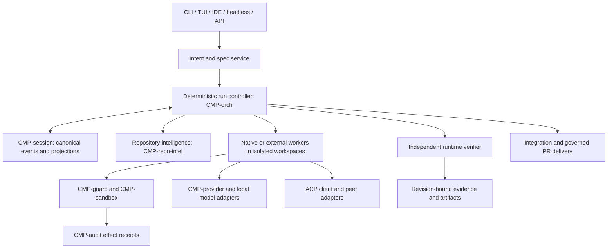

# Long-horizon work

## Purpose

CMP-orch coordinates durable coding work toward an approved outcome. Direct coding remains available without managed goal preparation. This blueprint specifies the target behavior; delivery status is maintained in TODO.md.

## System context and boundaries



**Ownership.** `CMP-orch` owns run/task/attempt decisions and stop policy. `CMP-runner` executes a single bounded turn; its `TurnEndStatus::Completed` means the turn ended, not that the task or run passed. `CMP-session` owns canonical event serialization, append/repair and projections. `CMP-audit` owns effect receipts. `CMP-repo-intel` owns repository intelligence; `CMP-context` owns prompt selection and framing, never task truth. `CMP-provider` owns model transport and usage normalization. `CMP-acp` owns protocol negotiation, never durable task truth. The verifier reads an exact workspace revision and returns typed evidence; it cannot grant tool authority. The runtime verifier is distinct from `ARCH/acceptance/ACCEPTANCE-MATRIX.md`'s release verification process.

## Intent and specification workflow

1. Store `OriginalRequest` bytes, source, timestamp, and digest before interpretation. `/goal set` creates only this inert draft and a `RunGoal`; it performs no model inference, repository scan, tool call, or peer dispatch.
2. On a separate explicit `/goal prepare` action, run one bounded planning attempt under `GoalPreparation`: inspect only the pinned repository revision through read-only discovery, draft requirements with `confirmed | assumption | excluded | proposed_change` status, and produce a specification/task graph/plan proposal. This action may consume its separately reserved planning budget, but cannot write code, start coding workers, or perform external side effects. Ask only consequential questions. An unanswered blocking question leaves the proposal waiting; a reply creates a new preparation/spec digest.
3. Create immutable `SpecVersion` with observable examples, invariants, contracts, acceptance scenarios, negative cases, migration/rollback constraints, and a digest. The user or delegated policy approves consequential user-visible behavior; model output alone never confirms it.
4. Build a task DAG from that version. Each task names inputs, output artifact, affected files or scope, dependencies, acceptance scenarios, verifier method, permission ceiling, retry limit, budget, and owner. Produce a self-contained, human-readable run plan with purpose, repository orientation, milestones, exact commands/expected outcomes, progress, surprises, decisions, and outcome notes.
5. Show the exact spec, success conditions, task graph, repository/base revision, effective policy snapshot and permission boundary, selected model/agent route, total and phase budgets, and verification/recovery reserves. No coding worker, mutating tool, or external peer dispatch occurs while this contract is a draft or a consequential blocking ambiguity remains.
6. `/goal start` opens a review: the controller creates a durable, expiring `GoalApprovalChallenge` that binds the canonical review bundle and exact spec/task-graph/plan/base/route/permission/budget digests to one authenticated operator control session and connection. The UI renders the challenge ID, expiry, and same digest bundle. Only an explicit action in that same trusted control session can confirm it. A raw ACP connection or session identifier is not authentication.
7. Keep the run plan as an inspectable versioned projection, not a second source of task truth. Canonical task/attempt/evidence/decision events remain authoritative; each plan revision names their sequence and spec digest. Plan changes are proposed/recorded, never silently treated as an approved requirement or completion.
8. During implementation, a discovered technical fact may revise the execution plan. A change to confirmed behavior creates a new spec version. The controller marks affected tasks and evidence stale by explicit dependency edges; it never silently rewrites the original request.
9. Evaluate against both the current spec and independently derived scenarios from confirmed intent. `INSUFFICIENT_EVIDENCE` is a first-class result. User acceptance and post-release outcomes are recorded separately from automated verification.

`AGENTS.md`, repository files, tool output, and peer receipts are context with provenance; they cannot approve a requirement, grant a permission, or change a budget. A human edit to a spec is an input to review, not automatically an approved version.

## Data model

Shared identities use [Domain model](../04-DOMAIN-MODEL.md); state vocabulary uses [State machines](../contracts/STATE-MACHINES.md).

| Record | Required fields and constraints |
|---|---|
| `GoalDraftReceipt` | `delivery_id`, `run_id`, `goal_id`, `input_digest`, `base_revision`, `pointer_revision`, `event_seq`. Returned by inert `/goal set`; idempotent for the same delivery/payload. It proves draft persistence only and never proves planning or approval. |
| `GoalPreparation` | `preparation_id`, `delivery_id` (idempotency key), `run_id`, `goal_id`, `input_digest`, `base_revision`, `planner_route`, `planning_budget_id`, `reservation_ids[]`, `state: QUEUED | RUNNING | WAITING_FOR_INPUT | READY_FOR_REVIEW | FAILED | CANCELLED | UNKNOWN`, `spec_digest?`, `task_graph_digest?`, `plan_digest?`, `context_digest?`, `provider_request_id?`, `failure_ref?`, `created_at`, `updated_at`. Preparation is read-only with respect to the workspace, consumes only its bounded planning allowance, and cannot launch coding workers or external side effects. Duplicate deliveries with the same payload return the same receipt; changed payload under a reused ID conflicts. `UNKNOWN` covers a crash after an inference request may have been accepted but before its result/usage receipt is durable; reconcile provider status if supported, otherwise retain conservative usage and require a new explicit preparation delivery. |
| `GoalApprovalChallenge` | `challenge_id`, `review_delivery_id` (idempotency key), `request_digest`, `run_id`, `goal_id`, `review_bundle_digest`, `spec_digest`, `task_graph_digest`, `plan_digest`, `base_revision`, `route_digest`, `policy_digest`, `permission_digest`, `budget_digest`, `surface`, `control_session_id`, `connection_ref`, `state: PENDING | ACCEPTED | DECLINED | CANCELLED | EXPIRED | INVALIDATED | CONSUMED`, `response: ACCEPT | DECLINE | CANCEL?`, `expires_at`, `response_delivery_id?`, `response_digest?`, `created_at`, `updated_at`. Persisted before rendering; binds the exact bundle shown to a particular trusted operator channel/connection. At most one unconsumed challenge may exist per goal; opening a newer review invalidates a still-pending challenge and is rejected while a start intent is already accepted/in progress. Reuse of `review_delivery_id` with a different request digest conflicts. A still-pending challenge is invalidated by material plan/policy/workspace/budget change, extra input, disconnect, expiry, or session change. Once the response is durably `ACCEPT`ed, disconnect does not revoke that already-recorded authorization; the same intent is reconciled, and any later material change blocks activation and requires a new review. |
| `GoalApprovalReceipt` | `receipt_id`, `challenge_id`, `run_id`, `goal_id`, `review_bundle_digest`, `spec_digest`, `task_graph_digest`, `plan_digest`, `base_revision`, `route_digest`, `policy_digest`, `permission_digest`, `budget_digest`, `operator_principal_ref`, `control_session_id`, `authentication_context_digest`, `surface`, `method: TUI_CONFIRM | CLI_CONFIRM | ACP_ELICITATION | ACP_TYPED_RECEIPT`, `client_session_id?`, `connection_ref`, `payload_digest`, `created_at`, `consumed_by_start_delivery_id?`, `expires_at`. One-shot, exact-challenge/digest-bound evidence from a trusted, authenticated operator ingress. ACP approval is enabled only for a configured trusted connector that can present the confirmation to the operator; ACP itself does not attest that a human viewed or clicked UI. The principal is assigned by the authenticated client/control channel, never read from model text, config, shell args, peer messages, or worker claims. |
| `GoalStartIntent` | `delivery_id` (unique idempotency key), `response_digest`, `challenge_id`, `run_id`, `goal_id`, `approval_receipt_id`, the approved review/spec/task-graph/plan/base/route/policy/permission/budget digests, `state: VALIDATING | RESERVED | UNKNOWN | CANCEL_REQUESTED | COMMITTED | REJECTED | CANCELLED`, `reservation_ids[]`, `reason?`, `created_at`, `updated_at`. At most one nonterminal start intent exists per goal. A stale/changed digest is rejected. Recovery reconciles pending reservation(s) against the activation event; dispatch requires a durable `GoalActivated` event and matching committed intent. Same delivery ID/payload returns the recorded result; changed payload conflicts. `CANCEL_REQUESTED` fences activation immediately; `CANCELLED` is terminal only after all reservations are confirmed released. |
| `ActiveGoalPointer` | `control_session_id`, `run_id`, `goal_id`, `revision`, `source_event_seq`, `updated_at`. A projection over `GoalPointerSelected` and `GoalPointerCleared` events; clear carries the expected pointer revision and is rejected on mismatch. Absence means no currently selected goal in that authenticated operator control session. Clearing removes only this pointer. The run-owned `RunGoal`, run/task lifecycle, attempts, budget, and Thread history remain addressable by ID and unchanged. |
| `IntentItem` | `item_id`, `run_id`, `kind`, `text_ref`, `source_ref`, `confirmation_actor`, `impact`, `status`, `replaces_ref`. A model inference cannot be `confirmed`. |
| `ExecutionPlan` | `plan_id`, `run_id`, `plan_revision`, `spec_digest`, `source_event_seq`, `purpose`, `repository_orientation_ref`, `milestones[]`, `exact_steps[]`, `expected_outcomes[]`, `progress_refs[]`, `surprise_refs[]`, `decision_refs[]`, `retrospective_ref?`, `content_digest`, `created_at`, `author`. Versioned human-readable projection; never overrides canonical task/evidence state or spec approval. |
| `RunTrigger` | `trigger_id`, `kind: MANUAL | SCHEDULE | WEBHOOK | CI_EVENT | GIT_EVENT | IDE | API | PARENT_RUN`, `authenticated_origin_ref?`, `event_id?`, `source_revision?`, `received_at`, `payload_digest`, `admission_receipt`. Trigger provenance never bypasses spec review, Guard, or run admission. |
| `RunMaintenance` | `maintenance_id`, `run_id`, `kind: CHECKPOINT_COMPACT | INDEX_REBUILD | ANALYTICS_ROLLUP | NONCRITICAL_CLEANUP`, `source_event_seq`, `source_revision`, `state: PENDING | RUNNING | COMPLETE | FAILED | DEFERRED`, `deadline?`, `artifact_refs[]`, `failure_ref?`, `created_at`, `updated_at`. It is outside the foreground completion transaction and cannot change task/run verification. If no supervised owner remains, optional work is marked `DEFERRED`, not silently awaited. |

## Goal control contracts

Goal control payload contracts:

| Type | Fields / behavior |
|---|---|
| `GoalPreparationRequest` | `delivery_id`, `run_id`, `goal_id`, `input_digest`, `base_revision`, optional user-selected `planner_route_ref`. The controller validates the base/route and computes/reserves the effective planning budget; callers cannot submit a budget ceiling or write capability. |
| `ClarificationInput` | `delivery_id`, `run_id`, `goal_id`, `question_id`, `prior_spec_digest`, `answer_text`. The input is persisted verbatim as a clarification receipt; no inference occurs until another explicit prepare request. |
| `ClarificationReceipt` | `delivery_id`, `run_id`, `input_receipt_id`, `superseded_challenge_ids[]`, `requires_prepare: true`, `event_seq`. This records new user input only; it does not claim a refreshed specification exists. |
| `AgentQuestionState` | The canonical `QuestionRequest`/`QuestionAnswer` schemas in `ARCH/core/TOOLS.md`, plus `requester_thread_id`, waiting tool-call identity, delivery attempt, and owner sequence. `CMP-session` owns the durable request/answer events for the HorizonCode Thread; managed Runs store a `QuestionLinked` reference and enter condition-driven `WAITING` while required input is open. The Run stream does not duplicate answer text. Only the requesting call waits; unrelated dependency-safe Tasks may continue. |
| `GoalReviewRequest` | `delivery_id`, `run_id`, `goal_id`. The controller canonicalizes the request and computes its request digest, selects current versions, revalidates open questions/freshness/limits, persists the challenge and canonical review bundle, then returns both for rendering. Client-supplied digests cannot replace controller-computed digests. Replayed delivery ID with a changed canonical request digest conflicts. |
| `GoalConfirmation` | `delivery_id`, `challenge_id`, `response: ACCEPT | DECLINE | CANCEL`, `review_bundle_digest`. It contains no actor, principal, scope, trust flag, or free-form approval assertion. The receiving control context must match the challenge's authenticated session/connection. `delivery_id` is unique within the run; controller-computed `response_digest` binds all payload fields, so changed-payload replay conflicts. |
| `GoalStartResult` | `ACTIVATED(GoalStartReceipt) | RECONCILING(GoalStartIntent) | DECLINED | CANCELLED`. A `GoalStartReceipt` contains `delivery_id`, `run_id`, `goal_id`, `activation_event_seq`, `reservation_ids[]`, and `created_at`; it is returned only after durable activation commit. `RECONCILING` reports durable accepted-but-not-yet-activated state and MUST NOT render as running; clients query the intent by run/goal and subscribe to events. Failure to reserve returns a typed `BudgetExceeded`/precondition error, invalidates the intent, and dispatches nothing; after a material resource/policy change, the user must open and confirm a fresh review. |
| `CancelTarget` | Tagged union `RUN(run_id) | TASK(task_id) | ATTEMPT(attempt_id)`. IDs are globally unique; the controller resolves each target's owning run/task and rejects missing, ambiguous, foreign, or inconsistent ancestry before recording a cancellation event. The operator context must carry the matching `run:cancel`, `task:cancel`, or `attempt:cancel` scope. |
| `CancelRequest` | `cancel_id`, `delivery_id`, `principal_ref`, `auth_context_digest`, `payload_digest`, `run_id`, `target_kind`, `target_id`, `request_event_seq`, `target_fence_seq?`, `state: REQUESTED | RECONCILING | CANCELLED | ALREADY_TERMINAL`, `terminal_event_seq?`, `reason?`, `created_at`, `updated_at`. Persisted in the event log and rebuildable projection before acknowledgement; unique on `(principal_ref, delivery_id)`, same payload is idempotent and changed payload conflicts. |
| `CancelReceipt` | `delivery_id`, `run_id`, `target_kind: RUN | TASK | ATTEMPT`, `target_id`, `state: REQUESTED | RECONCILING | CANCELLED | ALREADY_TERMINAL`, `event_seq`, `reason?`. `CANCELLED` is returned only when the target is fenced and all in-flight attempts/effects/child processes in that target's scope are terminal or reconciled; unknown state remains `RECONCILING`. |

`open_goal_start_review` creates `GoalApprovalChallenge` and never dispatches. The
single explicit `confirm_goal_start` action performs challenge validation, receipt
creation, reservation, and activation admission. This is a recoverable commit protocol,
not a cross-store atomic transaction. The UI does not ask for a second confirmation
after the receipt is minted. The receipt is durable before activation, consumed by one
`GoalStartIntent`, and never replayed as a new approval. Same confirmation
`delivery_id` and payload returns its prior outcome; same ID with changed payload is
a conflict.

```mermaid
sequenceDiagram
  actor U as Operator
  participant UI as TUI/CLI/Trusted ACP connector
  participant I as Authenticated control ingress
  participant C as Run controller
  participant S as Durable event store
  participant Q as Scheduler
  U->>UI: /goal start <run-id>
  UI->>I: open review request
  I->>C: authenticated scoped context + request
  C->>C: Revalidate current spec/plan/base/route/policy/budgets
  C->>S: Persist GoalApprovalChallenge + review bundle digest
  C-->>UI: Render exact review bundle and expiry
  U->>UI: Explicit accept/decline
  UI->>I: challenge ID + response + bundle digest
  I->>C: authenticated context bound to original connection
  C->>C: Validate challenge, identity, digests, freshness, reserves
  alt Accepted and current
    C->>S: Append accepted confirmation + receipt + GoalStartIntent
    C->>S: Reserve budgets with stable idempotency keys
    C->>C: Recheck freshness and policy
    C->>S: Append GoalActivated commit event with reservation IDs
    S-->>C: Durable activation commit
    C->>Q: Dispatch eligible tasks once
    C-->>UI: GoalStartReceipt
  else Declined, stale, expired, disconnected, or unauthorized
    C->>S: Invalidate/close challenge or reconcile accepted intent; no dispatch
    C-->>UI: Typed non-start result
  end
```

**Goal preparation transaction.** `GoalPreparation` is keyed by the preparation
`delivery_id`. The preparation budget is reserved before repository discovery or
planner inference. Repository reads are pinned to `base_revision`; preparation has no
write capability to the workspace, cannot dispatch a coding worker or peer, and
cannot create external side effects. Persist input/context/output digests and provider
usage before making a proposal `READY_FOR_REVIEW`. If a crash leaves provider outcome
unknown, reconcile by provider request ID when available; otherwise keep the run
inert, conservatively settle or retain the reservation, and require a new explicitly
budgeted preparation attempt. User clarification creates a new input/preparation and
proposal digest; it never edits an approved spec in place.

**Goal activation commit protocol.** `open_goal_start_review` revalidates the active
proposal and persists `GoalApprovalChallenge`—including the canonical review bundle,
its digest, request digest, review delivery ID, authenticated control-session/connection,
and expiry—before the UI displays it. A partial-unique constraint permits only one
pending challenge per goal; opening a new review invalidates the older challenge. On
explicit confirm, the controller checks current policy, identity/scope, connection,
challenge state, expiry, response and review digests, unresolved questions, graph,
base revision, route, budget, and receipt expiry. It appends a durable
accepted-confirmation event with a one-use `GoalApprovalReceipt` and `GoalStartIntent`,
keyed by confirmation delivery ID. It then reserves run plus mandatory
verification/recovery budgets with
stable reservation IDs/idempotency keys. Only after all reservations are durably
confirmed and a versioned compare-and-swap proves `policy_digest` and `budget_digest`
still equal the reviewed snapshots does it append
`GoalActivated{delivery_id, run_id, goal_id, spec_digest, task_graph_digest,
plan_digest, policy_digest, budget_digest, approval_receipt_id, approver,
reservation_ids[]}`. This event is the
commit point: the receipt/challenge are consumed and intent becomes `COMMITTED` in its
rebuildable projection; only then may the scheduler dispatch through an idempotent
outbox keyed to this activation event. The log append, projection update, reservations,
and process dispatch are not one cross-store transaction.

Recovery reuses the same intent and deterministic reservation IDs. Before
`GoalActivated`, it may finish or safely reject/release incomplete reservations but
must not dispatch. After `GoalActivated`, it rebuilds projections and idempotently
emits the existing outbox item; it must not create another task or attempt. A
reservation with uncertain durability remains `UNKNOWN` and blocks activation until
reconciled. A crash after activation but before the UI response returns the original
receipt by delivery ID. A changed payload under a reused ID conflicts. Decline,
cancel, expiry, disconnect, input while pending, stale bundle, or failed preflight
creates no activation and requires a fresh review. If policy or a required budget
changes between confirmation and activation, the controller invalidates the
challenge/intent and performs only idempotent reservation cleanup; it never silently
widens authority or dispatches from the old review. If the accepted receipt expires
before the activation commit event, recovery rejects that intent, reconciles/releases
its reservations, and requires a new review and explicit confirmation.

**Approval and dispatch event chain.** Persist `GoalReviewOpened` (challenge ID,
review-delivery ID, request/bundle digests, control-session reference, expiry) before
rendering. A trusted response appends exactly one `GoalStartConfirmed`,
`GoalStartDeclined`, or `GoalReviewCancelled` event keyed by its delivery ID and
response digest; only `GoalStartConfirmed` contains the receipt reference and creates
`GoalStartIntent=VALIDATING`. The budget ledger then atomically reserves the full
required set against run and parent ceilings using deterministic reservation IDs and
the reviewed budget revision. Link the ledger's durable receipt back with
`GoalStartReservationsConfirmed`; if the process crashes before that event, query by
the same idempotency key before retrying. No ledger result or an uncertain query maps
to `UNKNOWN`, never to “not reserved.” A cleanly rejected reservation set becomes
`GoalStartRejected` only after every partial reservation is confirmed released. Append
`GoalActivated` only after the linked reservations, unexpired receipt, and policy /
budget revision checks pass. Project the corresponding intent states as
`VALIDATING → RESERVED → COMMITTED`, or `UNKNOWN` until reconciliation, or `REJECTED`
after safe cleanup. A `/cancel` received while an accepted start intent is not yet
activated is serialized under the same run writer lock. If it wins, append
`GoalStartCancelRequested`, move to `CANCEL_REQUESTED`, fence activation, and release
reservations idempotently; only after all releases are confirmed append
`GoalStartCancelled` and mark `CANCELLED`. If reservation/release status is unknown,
keep the intent `CANCEL_REQUESTED` and block activation until reconciliation. If
`GoalActivated` won the lock first, route cancellation through the normal run cancel
fence and reconcile its outbox/in-flight work. A disconnect alone never implies
cancellation. This event chain is authoritative; UI state is derived from it.

After `GoalActivated`, derive a `DispatchOutbox` row per claimed eligible task using a
stable key from activation/claim event ID plus task ID and a single allocated attempt
ID. The supervisor acknowledges only that attempt ID and workspace fence. A crash
after process launch but before acknowledgement requires supervisor/process lookup and
workspace reconciliation by the same attempt ID. If the host cannot establish whether
the process is live or changed the workspace, preserve `UNKNOWN` and block relaunch;
an at-least-once queue delivery must never become at-least-once task execution.

The approval receipt must originate from an explicit UI confirmation in an
authenticated operator control session, a CLI confirmation delivered over its
private operator channel, an ACP agent-to-client form elicitation answered by a
configured trusted interactive connector, or the exact one-use ACP typed receipt
from an authenticated operator-bound client described in `ARCH/integrations/PROTOCOLS.md`. ACP is an
optional transport, not proof that a human saw or accepted a prompt; an untrusted or
unauthenticated ACP client can never mint a receipt. If HorizonCode is acting as an
ACP client for a worker, that worker's elicitation remains peer input and cannot
approve the HorizonCode run. A protocol permission response authorizes one governed
effect; it never authorizes goal activation. On any clarification, stale revision, changed route,
permission, budget, or plan, discard the unused receipt and require review again.

Only a request authenticated as `USER_OPERATOR` by its TUI/CLI/ACP control session may
create `GoalApprovalReceipt`. A worker, peer, plugin, or system recovery request is
denied before transition, even if it invokes the same CLI binary or supplies a
well-formed digest bundle. The role is taken from the control session/attempt context,
never from arguments, environment, prompt text, or an ACP agent update. Same-host CLI
access uses the private controller channel; tool children cannot see its socket or
capability. Remote/multi-user ACP must authenticate and map an operator identity
before this surface can mint approval; generic ACP stdio does not establish a
multi-user identity.

## Living execution plan and model handoff

Each non-trivial run has a versioned `ExecutionPlan` artifact rendered as readable
Markdown or an equivalent client view. A PROPOSED candidate is created during preparation; its active digest is selected only after the exact spec/task graph/plan approval. The plan is self-contained for a fresh worker: user outcome and
non-goals; repository commit and orientation; relevant paths and dependencies;
milestones linked to task IDs and acceptance scenarios; exact validation commands and
expected outputs; current progress; discoveries/surprises with evidence; technical
decisions and alternatives; known blockers; and the next safe action. It is concise
enough to reload selectively and does not copy full chat history or the whole repo.

After a meaningful event, the controller (or an authorized plan writer) updates the
plan projection from canonical state. A worker may propose a plan revision, but the
controller validates that every milestone links to current task/spec IDs and does not
change approved behavior, permission, budgets, or task completion. The plan records
its `source_event_seq`, spec digest, content digest, writer, and revision; plan writes
are append-versioned and recoverable. A crash between plan rendering and event commit
rebuilds the projection. If the plan digest/source sequence disagrees with the event
log, re-render or flag corruption; do not trust the stale Markdown. Exact shell
commands in a plan are instructions to request an action, not permission to execute
them. A fresh session reads plan + canonical run snapshot + only task-relevant source
references, then verifies the workspace before acting. It never assumes the plan's
last action succeeded merely because the plan says so.

## Foreground completion and maintenance

`COMPLETED` is committed only after the required task/evidence/audit events and
integration result are durable. The foreground command then returns a completion
receipt promptly. It reports pending non-critical `RunMaintenance` (index rebuild,
analytics rollup, optional checkpoint compaction, cleanup) as `maintenance_pending`;
those items have independent IDs, source event/revision, bounded deadlines, status,
and error receipts. They cannot hold the foreground request silently or change the
verified task result. A supervised controller may drain them after the client exits;
without a live owner they are `DEFERRED`. Durability-critical run, audit, or effect
receipts remain prerequisites to `COMPLETED`; if one is missing, the run stays
nonterminal and the client exposes the wait/recovery state.

## Operator experience and settings

Every UI client uses one typed settings schema with `value`, effective scope (`user | project | session | managed`), source, validation error, policy lock, and whether change applies immediately, next turn, or after restart. Settings include theme/accent and colour depth, contrast, reduced motion, keyboard map, screen-reader output, layout, model/provider and local endpoint, worker agent/adapter, reasoning level, routing preference, compaction auto/threshold/keep-tail, repo-map budget, approval posture, run/task cost and time ceilings, budget currency and optional view currency, notifications, and evidence retention. Project files may narrow authority but never grant it. Switching model or compaction policy creates a new context epoch and records actual capabilities; it does not mutate old evidence.

The run header displays task state, selected model and worker, active workspace/branch, verified criteria count, pending approvals, elapsed time, tokens and cache classes, spend grouped by source currency/basis and remaining budget. A converted view names its rate snapshot. A drill-down shows attempts, input receipts and queue position, raw-versus-filtered tool output links, test and reviewer evidence, unresolved assumptions, external-agent visibility limits, and recovery action. User-controlled colour palettes never encode state without text or glyphs. Cost and progress are not inferred from a spinner or heartbeat. `ARCH/product/UI.md` owns layout and key behavior; `ARCH/core/CONFIG.md` owns effective configuration.

## Related contracts

[Orchestration](ORCHESTRATION.md) owns authenticated controller methods and admission; [Budgets](BUDGETS.md) owns reservation; [Stopping](STOPPING.md) owns user control; [Verification](VERIFICATION.md) owns runtime evidence. [Acceptance matrix](../acceptance/ACCEPTANCE-MATRIX.md) defines observable release scenarios.

## Decision record

`Decision = { decision_id, question, alternatives[], answer, actor, evidence_refs[], affected_ids[], replaces_ref? }`. User authorization is distinct from technical model advice.

## Authoring references

Observable plan-writing practices: [Codex long-horizon experiment](https://developers.openai.com/blog/run-long-horizon-tasks-with-codex) and [Codex ExecPlans](https://github.com/openai/openai-cookbook/blob/main/articles/codex_exec_plans.md). These references do not replace controller state or evidence.
