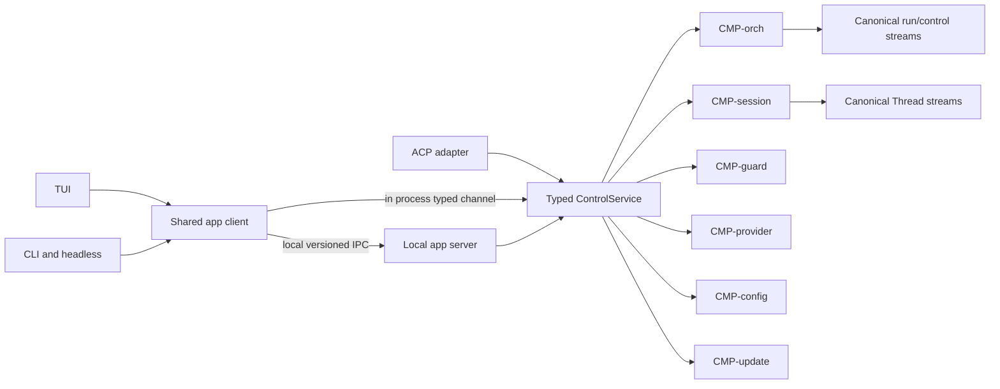

# Control API and local app server

## Requirements and scope

This module satisfies `REQ-HORIZON-011`, `REQ-HORIZON-013`,
`REQ-HORIZON-029..030`, and `REQ-PROTO-005`. Durable Run/Thread records remain in
their canonical owners (`ARCH/core/SESSION-AND-THREADS.md`, `ARCH/execution/ORCHESTRATION.md`, `ARCH/execution/LONG-HORIZON.md`). ACP and MCP remain external
protocol adapters (`ARCH/integrations/PROTOCOLS.md`). The initial local server listens only on a same-host
OS IPC endpoint; it does not expose a TCP listener, remote attach, SSH forwarding
protocol, hosted service, or cross-user control. Those require a separate security
decision and acceptance.

## HLD and component ownership

| Component | Owns | Does not own |
|---|---|---|
| `CMP-control-api` | Versioned request/response/event schemas; capability negotiation; typed dispatcher; caller-independent control client | Run/task decisions, session history, permission policy, provider selection, business state, authorization inferred from request fields |
| `CMP-app-server` | Same-host IPC listener, peer authentication context, bounded request/event lanes, singleton lifecycle, local attach/replay transport | A second scheduler, run/task/session database, permission engine, agent loop, network listener |
| `CMP-app-client` | Typed client facade, request IDs, reconnect/cursor handling, event reduction per aggregate, graceful client detach | Run ownership, retry-budget reset, permission approval, event-history truth |
| Domain owners | Existing component contracts | Alternate APIs or duplicated state created for a particular frontend |

`ControlService` is the shared typed in-process boundary. The TUI and one-shot CLI
may call it in process. Detached work uses the same binary in a restricted hidden
`__supervisor` mode and exposes that service over local IPC. ACP server/client
adapters translate their negotiated protocol methods to the same dispatcher; ACP
session close semantics remain distinct from UI detach. A future remote transport
can be added only as an explicit authenticated adapter, not by binding the local
socket to a network interface.

ARCH37 artifact/draft/queue/branch/settings actions pass this single dispatcher with authenticated scope, operation IDs, CAS, bounded pages and replay cursors. ARCH38 is an outgoing local adapter, not a new unauthenticated listener. Unknown external schemas/methods refuse typed.

## Logical schema

These are wire/logical records; canonical domain records stay with their owners.

| Record | Required fields and constraints |
|---|---|
| `ControlHello` | `{protocol_major, protocol_minor, client_name, client_version, requested_capabilities[], client_frame_limit_hint?, nonce}`. No user identity or server limit is accepted from this payload. The server replies with its version, `server_instance_id`, controller generation, supported capabilities, and its effective limits. Unknown major versions fail with a typed compatibility error; optional features require negotiation. |
| `ControlRequest` | `{request_id, method, schema_version, deadline_budget_ms, delivery_id?, aggregate_ref?, payload}`. The server caps the remaining duration at ingress and converts it to a local monotonic deadline; clients cannot extend a deadline with wall-clock timestamps. Deadline expiry ends the wait, not an already-admitted mutation; cancellation is a separate owner operation. Mutations require `delivery_id` as their stable idempotency key; `operation.status` uses that field as the lookup target. A retry with the same mutation ID/payload returns the prior receipt; changed payload conflicts. Caller principal and scopes are derived from the authenticated connection, never payload fields. |
| `ControlResponse` | `{request_id, outcome: enum(RESULT, TYPED_ERROR), result?, typed_error?, operation_receipt?, event_cursor?}`. A mutation receipt is `{delivery_id, owner_ref, state: ACCEPTED\|RUNNING\|COMMITTED\|REJECTED\|UNKNOWN, result_ref?, owner_event_cursor?}`. `ACCEPTED` means only that the owning component durably recorded the request; it is not evidence that a worker observed it or that a task passed. `UNKNOWN` means owner state has not yet reconciled and forbids retrying under a new delivery ID. |
| `AggregateCursor` | `{aggregate_kind, aggregate_id, committed_seq, committed_digest}`. Cursor scope is explicit; a cursor for one Run or Thread cannot be replayed against another. |
| `SnapshotAndReplay` | Logical result `{aggregate_ref, snapshot_ref|bounded_snapshot, snapshot_seq, snapshot_digest, event_page[], next_cursor, gap?}`. Snapshot bytes, event count, and encoded response bytes have hard ceilings; large snapshots use a verified artifact reference and replay is paginated or streamed with a continuation cursor. Snapshot and replay use that aggregate's canonical sequence. Subscriptions to different aggregates have independent cursors; the server does not invent a total order across Run and Thread streams. |
| `DurableServerEvent` | `{aggregate_ref, seq, event_id, event_type, schema_version, causation_id?, correlation_id?, payload_ref?, payload_digest}`. It is derived from canonical owner events; the app server cannot author a second copy of domain truth. |
| `EphemeralServerEvent` | `{subscription_id, kind, local_delivery_seq, durable_cursor_at_emit?, payload, expires_at?}` for deltas, spinner, and transient progress only. `local_delivery_seq` is monotonic for that subscription but is not durable or replayable. |
| `EphemeralGap` | `{subscription_id, missed_seq_from, missed_seq_to, durable_cursor_at_gap}`. It is emitted through reserved control capacity when transient events are coalesced or discarded. A pending gap marker is extended until delivered and precedes later events on that subscription. The client may request a current aggregate snapshot for present state; the missing transient events themselves are never replayed. This is distinct from a durable-stream cursor gap, which requires `RESNAPSHOT_REQUIRED` and canonical snapshot/replay. |
| `EventSubscription` | `{aggregate_ref, after_cursor?, detail: FULL\|SUMMARY\|METADATA, event_classes[], max_payload_bytes}`. Detail changes only the client projection of eligible high-volume display updates. Canonical durable events remain available by cursor and are never removed because a client requested a summary. A client must explicitly handle `EphemeralGap` and durable resnapshot outcomes. |
| `ServerInstanceRecord` | `{state_root_id, server_instance_id, process_identity, generation, endpoint_ref, protocol_range, started_at, heartbeat_at, state}`. The OS lock and authenticated handshake establish ownership; a PID file or socket path alone never does. |
| `ControlConnection` | `{connection_id, peer_os_identity, authenticated_scopes[], client_info, connected_at, last_seen_at, subscription_ids[], rate_state}`. Privileged scopes are derived by the trusted ingress and expire with the connection; model/worker requests cannot self-assign them. |
| `QuestionResponseRequest` | `{delivery_id, request_id, response: ANSWER | CANCEL, responses[]?}`. Requires an authenticated user-input scope, validates against the canonical `QuestionRequest`, and is idempotent by delivery ID. It cannot mint permission, goal-approval, or task-verification evidence. |

**Wire mapping.** The records above are typed logical contracts. The JSON-RPC 2.0
request envelope is `{jsonrpc:"2.0", id, method, params}`; a successful response
is `{jsonrpc:"2.0", id, result}` and a failure uses the standard `error` object.
The versioned control method is `method`; logical request fields live in `params`,
and the logical result/receipt lives in `result`. Notifications omit `id` and may
not invoke mutations that require an idempotency receipt. JSON-RPC `id` only
correlates the transport request; `delivery_id` is the stable mutation identity.
Unknown major versions and unknown critical fields receive protocol errors. These
mappings need fixtures, so clients do not serialize the logical record names as a
second custom envelope.

The control method registry exposes `question.respond` and read-only
`question.inspect`. They address the owning Thread/Run aggregate and use its cursor;
the server transports the durable owner result and never creates a second question
store. `question.respond` persists an answer or explicit cancellation before asking
the worker adapter to resume the blocked call. A disconnect after commit is recovered
with the same delivery ID; event replay or `question.inspect` returns the owner state.
An agent's `question` tool is not a Control API mutation and cannot answer itself.

Every method descriptor identifies its domain owner, required scope, request/response
schema, mutation/idempotency behavior, deadline, and event subscriptions. The shared
read-only `operation.status(delivery_id)` method requires the same authenticated
principal and operation scope as the original request; it returns only that operation's
owner receipt and canonical event cursor, not an enumeration oracle. It does not infer
completion from a transport response or process state. `UNKNOWN` remains unresolved
until that owner reconciles its canonical stream/effect state. Domain operations call
the owner directly through typed interfaces. The app server may validate envelope
size/version and connection scope but may not decide whether an effect, task, route,
goal, or update is allowed.

## Method descriptors

| Method | Owner / context | Receipt/event boundary |
|---|---|---|
| thread.list | CMP-session; authenticated Thread-list ReadContext | Scoped paged index with integrity and availability per result; no model/provider call |
| thread.open | CMP-session; authenticated Thread-read ReadContext | Opens the transcript at a committed cursor; read-only and does not resume a turn |
| thread.resume | CMP-session ingress + CMP-orch for managed bindings; authenticated `thread:resume` MutationContext | Revalidates the selected Thread's committed head, binding, and pending effects; returns an idempotent resume receipt; never resumes managed descendants |
| run.pause | CMP-orch; authenticated run:pause MutationContext | Persist fence/intent before acknowledgement; reconcile before PAUSED |
| run.resume | CMP-orch; authenticated run:resume MutationContext | Revalidate budget/state/effects and strategy; no counter reset |
| run.stop_now | CMP-orch; authenticated run:stop MutationContext | Persist fence; bounded supported-host termination; UNKNOWN remains explicit |
| goal.start_status / agent.message.list / agent.message.status | CMP-orch; authenticated ReadContext | Bounded authorized read with owner cursor; no mutation nonce or spend |
| workspace.select_view | CMP-config projection preference via ControlService | Layout-only change; no Run/task/permission transition |
| proof.inspect | CMP-verifier projection via ControlService; authorized read | Exact task/revision/verdict and artifact refs; no PASS mutation |

All other advertised UI actions register a versioned method descriptor before they
become available. ARCH/product/COMMANDS-AND-SETTINGS.md's action catalog references these descriptors, not internal
stores. Connection authentication and per-method scopes apply to in-process and IPC
paths equally. A client timeout queries the original delivery ID; a permanently lost
terminal frame cannot substitute for canonical status. Initially AG-UI creates no
TCP/HTTP/SSE listener, including loopback. A future listener requires the separate
origin/authentication/encryption policy even if a local browser is its only client.

## Wire and lifecycle design

### Startup and client selection

1. `horizoncode` resolves the validated state root and install identity. In ordinary
   interactive mode it uses the in-process `ControlService` unless detach/reattach or
   an already-running supervisor requires IPC.
2. When supervised execution is requested, the launcher acquires the per-state-root
   OS singleton lock, starts the same signed binary in hidden `__supervisor` mode if
   needed, and waits for a bounded authenticated readiness handshake. It never
   treats an existing socket or PID file as proof that a valid server owns it.
3. A client negotiates the control protocol and method capabilities. Unsupported
   major versions fail clearly; compatible minor additions are optional and ignored
   only when they are not required by the requested operation.
4. Before accepting mutations, the supervisor validates/replays the bounded
   `SupervisorControlStream`, nonterminal Run streams, Threads referenced by active
   executions, active execution handles, and recovery state. Historical Threads are
   validated on demand, not loaded all at startup. Corrupt, newer-schema, or
   unreconciled state leaves the service in `RECOVERING`/`DEGRADED` and refuses
   affected mutations.

### Request, response, and event delivery

The local IPC encoding is versioned JSON-RPC 2.0 over a framed local byte stream;
the in-process fast path uses the same typed request/event enums without serialization.
Both paths use the same dispatcher and typed result semantics. Frames, nested values,
payload references, subscriptions, and per-connection queues have finite configurable
ceilings (`app_server.max_frame_bytes`, `max_clients`, `max_subscriptions`, lane
capacities, queued bytes, in-flight work, and deadlines). Every setting has a managed
hard maximum; validation rejects values above it. Count and byte limits apply to both
queued and in-flight work, including decoded and fan-out buffers, so a configured
queue cannot hide unbounded work in a downstream executor. The global memory ceiling
is bounded by the validated client, subscription, frame, lane-byte, and in-flight
limits.

The client's frame-limit hint can only reduce what that client accepts; the server's
validated runtime ceiling is authoritative. Requests are split into reserved control,
interactive, and bulk lanes, with bounded per-lane concurrency and fair admission.
Cancel, permission reply, pause/resume, and maintenance fencing cannot queue behind
history search or catalog refresh, nor can bulk work consume every execution slot.
Mutations carry stable `delivery_id`s. On response timeout the client calls
`operation.status` with that same ID before deciding whether retry is safe. A transport
timeout does not mean that the operation did not commit. Control-lane capacity remains
available for status, cancellation, and maintenance reconciliation under bulk load.

Durable events are read from their owning canonical stream and replayed by aggregate
cursor. The client applies events only in sequence for that aggregate; duplicate seq
with a different digest is corruption. A durable-event buffer overflow pauses that
subscription and returns `RESNAPSHOT_REQUIRED` with its last delivered cursor; the
client fetches a canonical snapshot and resumes from its cursor. The app server never
silently skips durable events. Live model-token deltas and spinner events are ephemeral
and do not enter canonical logs one token at a time. Ephemeral buffers are separately
bounded; overflow coalesces/drops transient updates and emits `EphemeralGap` through
reserved control capacity, carrying the latest durable cursor. The client can refresh
current state, but no event replay is promised for the missing deltas. Backpressure
applies to both paths, and the server never grows an unbounded per-client notification
queue.

### Detach, reconnect, and shutdown

- A TUI/CLI disconnect closes only its `ControlConnection`; it does not cancel a Run.
- `/attach` and the local attach endpoint are read/subscribe operations. They return a
  snapshot cursor and replay; they never resume or dispatch work.
- `/quit` detaches. Explicit pause/cancel is a separate authenticated controller
  mutation (`ARCH/product/COMMANDS-AND-SETTINGS.md`).
- On laptop sleep, process suspension, or host loss, persisted state remains canonical;
  UI shows last durable event time and `unknown/stopped` rather than animated progress.
- `CMP-app-server` states are `STOPPED → STARTING → RECOVERING → READY`, with
  `DEGRADED` for read-only/blocked service and `DRAINING` for authenticated shutdown
  or update. Shutdown is refused while work/maintenance state is unresolved unless a
  separate authorized cancellation/recovery policy settles it.
- Idle shutdown is allowed only when no nonterminal Run, active permit, pending
  approval, effect, or maintenance operation exists. Any idle delay must be finite
  and operator-configurable. A lock/heartbeat failure is reconciled; stale PID data
  is never used to kill a process.

### Update integration

The updater calls `CMP-orch` through the same control service and receives a
`MaintenancePermit` only after the `SupervisorControlStream` grant (`DEC-062`). That
grant atomically fences new Runs, direct turns, and worker executions across both
in-process and IPC clients; the app server's `DRAINING` state is not a second admission
authority. It rejects new work according to the owner's fence while retaining a
bounded maintenance/control path for update handoff, operation status, health checks,
and reconciliation. It preserves the update operation receipt and exits only after the
restricted activation helper has a reconciled handoff. Helper launch, health check,
rollback, and restart follow `ARCH/integrations/DISTRIBUTION-AND-UPDATES.md`; the server cannot self-approve its update or
reopen admission from a stale local flag. A concurrent run/direct-turn admission and
permit request are serialized by `SupervisorControlStream`; whichever grant commits
first determines whether maintenance is `Busy` or work admission is fenced.

## Authentication and security

- Initial IPC is same-host only. Unix domain sockets use a protected state directory,
  restrictive mode, no-follow path operations, and peer credentials. Windows uses a
  named pipe with an explicit current-user ACL and impersonation checks. The concrete
  platform mechanisms are acceptance-gated (`ARCH/security/SECURITY-MODEL.md`).
- Authentication is per connection and method scope. A request body, client label,
  ACP `sessionId`, agent message, PID file, or generated token cannot claim operator
  identity. Approval requires the authenticated ingress contract in `ARCH/execution/LONG-HORIZON.md`.
- The local API is not treated as safe from arbitrary same-user malware. Its trusted
  boundary is the logged-in OS user plus the verified app process. Sandboxed workers,
  plugin subprocesses, and external agents receive no controller socket or operator
  capability. They communicate through narrow execution and event adapters.
- The server rejects symlink/junction redirection, stale-generation writes, oversized
  or deeply nested frames, duplicate/changed idempotency keys, unauthorized methods,
  replayed one-shot capabilities, and expired deadlines. Secret values are not
  serialized to clients or logs; references and redacted display values are used.
- No remote listener is exposed in v1. Local IPC authentication is not adequate for
  SSH forwarding or cross-user/server use.

## Failure and recovery behavior

| Failure | Required behavior |
|---|---|
| Competing launcher | One process owns the OS lock; other clients authenticate to the live instance or return a typed startup error. |
| Stale endpoint/PID file | Verify lock ownership and process identity; remove only an owned stale endpoint using no-follow operations; never signal a PID from a stale file. |
| Server crash during mutation | Client queries `operation.status` by the same `delivery_id`; replay owner events and `SupervisorControlStream` before reporting committed/rejected/unknown. A still-unknown operation stays fenced from replay under a new ID. Never duplicate an effect. |
| Client disconnect during a run | Drop the connection and bounded live queue; preserve Run; reconnect from a cursor or snapshot. |
| Slow or malicious client | Per-client and per-lane limits, deadlines, rate limits, explicit gap/disconnect; no global queue starvation. |
| Cursor gap or incompatible event | Return `RESNAPSHOT_REQUIRED` or typed unsupported-schema result; do not skip silently. |
| Client/server major-version mismatch | Refuse incompatible writes; provide supported version range and upgrade path. |
| Controller state corrupt/newer schema | Read-only/`RECOVERING`; preserve original bytes; no new run/work/update activation until owner recovery completes. |
| Supervisor unavailable on unsupported platform | Run attached-only mode if its contract is satisfied; report detach unavailable instead of pretending the process is supervised. |
| Update helper or health check fails | Keep admission fenced in the canonical supervisor stream while reconciling; verified rollback or typed `UNKNOWN`; no duplicate server instance. `DRAINING` cannot locally clear the fence. |
| Host sleeps, reboots, or loses power | Recover from canonical logs and checkpoints; never infer completion from missed heartbeat or wall-clock expiry. |

## Configuration and user-visible behavior

`/settings runtime` exposes whether detached supervision is available, whether it is
enabled for new runs, connected-server status, last recovery result, and the effective
bounded idle policy. It cannot enable a network listener, raise IPC limits beyond
managed ceilings, weaken OS authentication, or disable event-gap reporting. Colors,
sound, notification channels, and layout remain owned by `CMP-tui`; the server sends
typed state/events and never renders UI.

The TUI shows `Connected`, `Reconnecting`, `Recovering`, `Last seen`, and
`Attach unavailable` as distinct states. A disconnected client does not show a live
spinner for stale worker activity. Update notices remain on the interactive TUI path;
headless clients get explicit structured operation results only. No new public shell
command is required for the hidden supervisor process.

## Acceptance evidence

Acceptance must prove: in-process/IPC method
parity; protocol negotiation and incompatible-major refusal; singleton startup and
stale-endpoint safety on each supported OS; user-only peer authentication; worker
socket isolation; mutation idempotency through crash at each persistence boundary;
`operation.status` across committed, rejected, and unresolved outcomes; disconnect/
reconnect without run cancellation; snapshot/replay and distinct durable/ephemeral gap
recovery per aggregate/subscription; bounded byte/count queues and executor capacity
under a slow-client flood with prompt cancel/permission/status latency; no
cross-aggregate cursor confusion; run/direct-turn/update admission races across both
transports; safe update handoff/rollback; and a clear attached-only fallback on
unsupported platforms. See `research docs/tests.md`, `ARCH/acceptance/ACCEPTANCE-MATRIX.md`, and TODO `AX-367`.

## Optional external UI gateway

An AG-UI adapter, it is an authenticated client of the same
`ControlService`, not a second dispatcher or Run owner. The current app server is
same-host authenticated IPC; `REQ-HORIZON-030` still excludes unauthenticated or
remote listeners. A separate decision must define remote identity, encryption,
credential custody, authorization scopes, revocation, rate limits, origin handling,
and exposure defaults before any network bind. The gateway applies the same method
scopes and idempotency rules as local clients. Event projections preserve per-aggregate
cursors; a gap, expired cursor, or unknown schema returns `RESNAPSHOT_REQUIRED` before
enabling mutations. UI event fields cannot mint operator scopes or approvals.

## Interaction service method contracts

| Service methods | Required request/result semantics |
|---|---|
| artifacts.list/search/stat/read_preview | Authenticated owner scope, bounded page/cursor and exact ArtifactRef; return coverage/availability and verified decoder output |
| artifacts.attach/copy/export/open | Exact ref + operation ID; attach CAS draft, copy local capability, export/open Guard effect receipts |
| artifacts.add_feedback/resolve_feedback | Exact version and anchor, expected owner revision, durable owner event; resolution cannot approve edits |
| drafts.get/save/stage_part/remove_part/commit | Thread scope + draft revision/part ID/operation ID; exact-byte staging, CAS and durable input admission |
| inputs.list/replace/cancel | Controller-owned delivery ID and expected queue revision; claimed conflict, supersession and cancellation receipt |
| threads.recap/branch/fork/open | Committed visible cursor/scope, explicit workspace binding, create/open receipt; no permission/effect inheritance |
| settings.preview/apply/reset | Expected config revision, scope, effective policy; atomic persistence and apply-boundary reporting |
| skills.inspect_cost/set_visibility | Qualified source/digest, tokenizer/measurement scope; future generation only |
| extensions.probe/search/prepare/execute/observe/cancel | ARCH38 normalized refs, externally bound plan/channel and horizon operation/effect IDs |

Names are versioned typed in-process methods; JSON-RPC wire names require versioned
schema publication and golden fixtures before exposure. One finite action descriptor
maps each button/command to these services; no UI-owned alternate persistence. Every
method carries cancellation/deadline, max bytes/items, stable error code and certainty.
