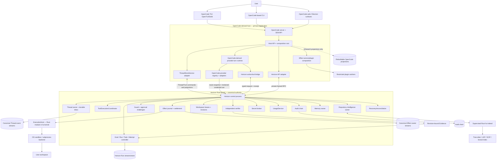

# 1. System, process, and ownership topology

## 1.1 Product shape

OpenCode is the primary application base, not an optional sidecar. Its TypeScript/Bun
host owns UI composition, provider transport, model streaming, and interactive loop
coordination. The production turn path is Core V2 (`packages/core`) with
`packages/llm` as its provider protocol implementation; the legacy
`packages/opencode` loop is a migration/compatibility source, not a second production
runner. A supervised Rust Horizon kernel is the authority for canonical Thread
state, managed execution, security decisions, and durable outcomes. The host calls the
kernel through typed services/private IPC; it does not own a second conversation truth.



This diagram is an ownership map, not permission for arbitrary cross-process access.
The private RPC is the host-to-kernel authority seam. The OpenCode-derived public API
remains the client surface; the kernel does not expose a second public listener. The
OpenCode SQL Session tables may remain as UI/search projections, test implementations,
or migration input, but not as production canonical Thread state.

## 1.2 Processes

| Process | Language/base | Lifetime | Authority |
|---|---|---|---|
| `hzcode` host | Bun/TypeScript, derived from OpenCode | Interactive foreground or supervised app server | UI/API, composition, OpenCode-derived provider-turn runtime and presentation projections; canonical Thread/Run/effect decisions go through kernel services |
| `hz-kernel` | Rust companion in the same product repository | Supervised while local work exists | Canonical Thread and Run streams, ToolBatch state transitions, ToolExecutionCoordinator, Guard, EffectService, Rust ExecutionHost, UsageService, budgets, workspace fences, audit, artifacts, memory, secret broker, verification admission and recovery |
| `hz-indexd` | Rust worker | Supervised/restartable | Derived repository intelligence only; cannot mutate canonical Thread/Run/security state |
| Restricted workers | Host-native process, WASM, or compatibility worker | Per capability lease / operation | Only explicitly granted RPC/capability scope; no kernel-store access or ambient operator authority |
| MCP / external-agent processes | Server/agent-specific | Explicitly staged and launched | Separate trust boundary; local outer containment is not a claim that internal tools are Guard-mediated |

The kernel is not a provider host or model loop. The host remains the application and
executes Core V2 provider turns using `packages/llm`. Product routes and clients must
converge on that one runtime; legacy session-loop code is not wired as a competing
fallback. It submits durable Thread/Turn transitions, complete tool batches, and effect
requests to kernel-owned service definitions. The Rust `ToolExecutionCoordinator`
executes an admitted batch and returns bounded observations/results; only ThreadService
commits ToolBatch lifecycle transitions. `ExecutionHost` is a Rust module inside
`hz-kernel`; the TypeScript host never executes effect-capable operations or creates
their child processes. Native managed workers instantiate this same host Thread runtime
with a pinned profile, task package, workspace and authority ceiling; they do not start a
second agent engine.

For supervised pairing, use inherited private pipes where possible. Independently
attached local clients use an OS-local transport (Unix-domain socket or Windows named
pipe) with peer/process validation. No public kernel TCP listener. Closing a TUI is not
Run cancellation; continuation is claimed only while a supervised kernel owner exists.
On restart, the kernel validates logs, acquires a new owner epoch, reconciles workers,
effects, fences and reservations, and resumes only provably safe work.

## 1.3 Component ownership

| Responsibility | Owner | OpenCode contribution |
|---|---|---|
| Conversation identity, messages, prompt admission, Turn records and Thread projections | Rust kernel Thread service | Owns canonical event stream; host implements OpenCode-compatible `ThreadStoreService` adapter. OpenCode Session DB is projection/test/migration only |
| ToolBatch lifecycle and ordered result links | Rust ThreadService | ThreadService owns every ToolBatch transition in the Thread stream; Rust ToolExecutionCoordinator returns observations/results but cannot commit ToolBatch state |
| Model turn, provider request, streaming and loop coordination | OpenCode Core V2 runner in host | Core V2 owns the production turn loop and `packages/llm` provider calls; kernel records durable boundaries and unknown outcomes, not a second loop |
| Provider/model catalog, protocol adapters, auth UX and stream normalization | OpenCode `packages/llm` plus kernel secret/route bridge | Retain/adapt as primary host implementation; immutable route snapshots and secret custody policy belong to kernel authority |
| Model-visible tool definitions and presentation | OpenCode-derived registry/UI with Horizon service/action schemas | Retain schemas and UI, but effects dispatch only through kernel-authorized executors |
| Plugin/service composition | Host resolver/runtime executes; sealed kernel CompositionService owns manifests, approvals, locks and durable generation lifecycle | Host service definitions/providers/consumers are composable; canonical kernel services are sealed in production |
| Goal, SpecVersion, Run, Task DAG, Attempt, WorkerExecution and completion | Rust RunController | One canonical Run owner; Threads link to managed objects but never equal them |
| Budget policies, hierarchical reservations and accounting settlements | Rust BudgetService | Consumes UsageService observations by ID; analytics and UI totals are derived projections |
| Permission decision, approval challenge, effect intent/settlement, sandbox selection | Rust Guard/effect owner and selected execution backend | OpenCode permission UI is retained as presentation; legacy process-local permission decisions cannot bypass Guard |
| Local process/operation execution | Rust ExecutionHost module in `hz-kernel` | One-use lease validation, process supervision, OS backend selection and bounded observations; `hzcode` is never the effect executor |
| Usage observations | Rust UsageService | Append-only provider/worker observations with reported/derived/estimated provenance; BudgetService consumes observations but does not own them |
| Mutable workspace binding, revision, lease and integration | Horizon controller/workspace adapter | OpenCode worktree features may be reused as mechanics only after their revision/fencing contract is validated |
| Verification evidence | Independent verifier, accepted by Run controller | OpenCode's checks can supply observations, not independent PASS by themselves |
| MCP, skills, ACP, LSP, formatter integration | OpenCode modules plus kernel-mediated capability/ExecutionHost adapters | Retain the surface; each family keeps its trust and lifecycle contract. Third-party executable plugin code is isolated |
| Client commands, settings, themes, navigation and render projections | OpenCode TUI/CLI/web/desktop | Extend existing application surfaces; no local UI state becomes Run truth |

## 1.4 API and dependency boundaries

- TUI, web, Electron, CLI, SDK and ACP-facing endpoints continue to use the OpenCode
  application API/client composition. Horizon adds a versioned route namespace and
  maps it through a typed adapter to the controller.
- OpenCode calls the Rust controller over a private, bounded, versioned framed channel
  using MessagePack and an OS-local transport (inherited pipe for supervised pairing;
  Unix socket / Windows named pipe for local attachment). It is not reachable from a
  model, plugin, MCP server, or arbitrary local client.
- Horizon mutations carry a stable `delivery_id`; the controller derives principal
  and scope from the authenticated application ingress. Request fields cannot claim
  operator identity or broaden authority.
- The application owns provider transport. Kernel policy pins the route snapshot and
  mediates secret use; raw credential delivery is declared as visible to the recipient
  process when unavoidable. No egress/isolation guarantee is claimed without an
  enforced, tested host mechanism.
- UI and SDK packages consume generated/validated Horizon API types. Generated
  artifacts are regenerated from their owning contract; no hand-maintained second
  wire schema is allowed.

## 1.5 State placement

Use one configured user state root with owner-separated canonical stores and derived
host projections:

```text
state/
  threads/        # canonical Thread event streams, owned by hz-kernel
  runs/           # canonical Goal/Run event streams, owned by hz-kernel
  usage/          # append-only canonical usage observations, owned by UsageService
  supervisor/     # kernel owner epochs, dispatch/recovery state
  opencode/       # configuration and rebuildable UI/search projections only
  audit/          # independently owned append-only audit records
  artifacts/      # bounded immutable content-addressed bytes
  memory/         # kernel-owned advisory records
  projections/    # rebuildable SQLite read models
  secrets/        # OS credential-store references / protected broker state
```

These are logical namespaces, not a decision to share a database. Canonical event
streams are append-only and projections are rebuildable. Each owner writes only its
own data. Cross-store operations use IDs, digests, outboxes and reconciliation; no
assumed multi-store atomic commit. Migration must preserve existing OpenCode sessions
as imported Thread history with provenance, and must not auto-import untrusted
workspace configuration as policy.

## 1.6 Service/plugin composition

Host consumers depend on typed service definitions, not concrete provider modules.
Use OpenCode's existing Effect `Context.Tag`, `Layer`, `Scope` vocabulary with a
Horizon plugin manifest, resolver, registry generation and `HzPluginRuntime`; do not
add a second composition framework. A definition records stable ID/version/schema
digest, cardinality, replaceability (`sealed`, startup replaceable, hot swappable),
authority (`canonical`, derived, advisory, presentation), and required capabilities.
Design each definition against its current consumers as a complete Service Definition /
Service Provider / Consumer seam. Keep consumer-specific tool schemas, UI and transport
behavior with their owners. Require a real current consumer before exposing a public
service operation; otherwise use a private capability closure.

Production canonical authority services—Thread, RunController, Supervisor, Guard,
Effects, Audit, Workspace, Verification, Artifacts, Secrets and kernel transport—are
sealed system providers. Test doubles may replace them in tests. The plugin architecture
organizes services; it does not grant arbitrary runtime replaceability.

Plugins are classed by execution/trust boundary: signed first-party system, presentation
only, WASM with explicit imports, restricted external process, OpenCode-compat worker,
MCP server, inert skill content, declarative workflow, or Attempt-scoped agent adapter.
Downloaded JavaScript does not execute in the privileged host with unrestricted Bun
APIs. Activation returns a disposable registration scope. Disable/upgrade drains pinned
users before unregistration; emergency quarantine revokes capability and routes active
operations into explicit failure/recovery.

Composition is resolved before activation. Dependency cycles, duplicate singleton
providers, invalid capability requests, and incompatible API/schema versions fail
closed with a diagnostic graph. In-flight Turns/Attempts pin plugin/service generation,
profile revision, toolset digest and composition lock. New generation receives new work;
old generation drains before disposal.

## Pinned implementation references

- [OpenCode repository at the selected base revision](https://github.com/anomalyco/opencode/tree/b1fe25ab5ecc9f9bc911a8a2e6a51565cc764322)
- [TUI package manifest](https://github.com/anomalyco/opencode/blob/b1fe25ab5ecc9f9bc911a8a2e6a51565cc764322/packages/tui/package.json)
- [LLM package manifest](https://github.com/anomalyco/opencode/blob/b1fe25ab5ecc9f9bc911a8a2e6a51565cc764322/packages/llm/package.json)
- [Core V2 runner](https://github.com/anomalyco/opencode/blob/b1fe25ab5ecc9f9bc911a8a2e6a51565cc764322/packages/core/src/session/runner/llm.ts)
