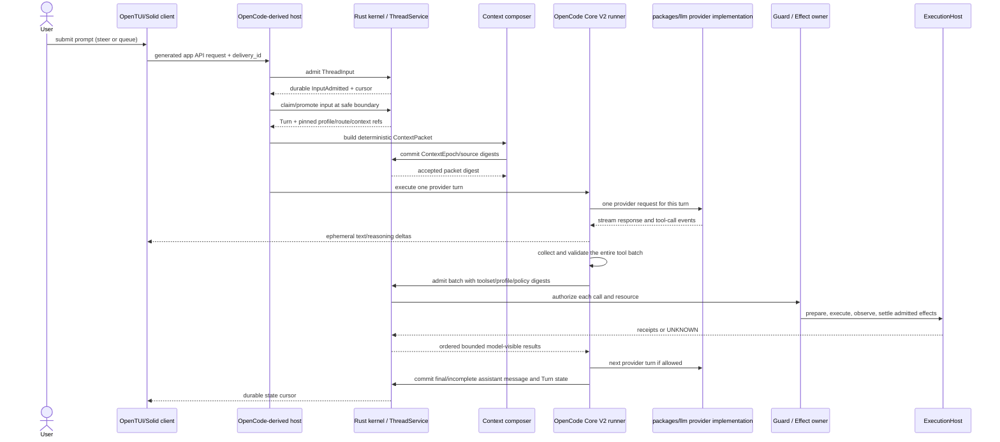
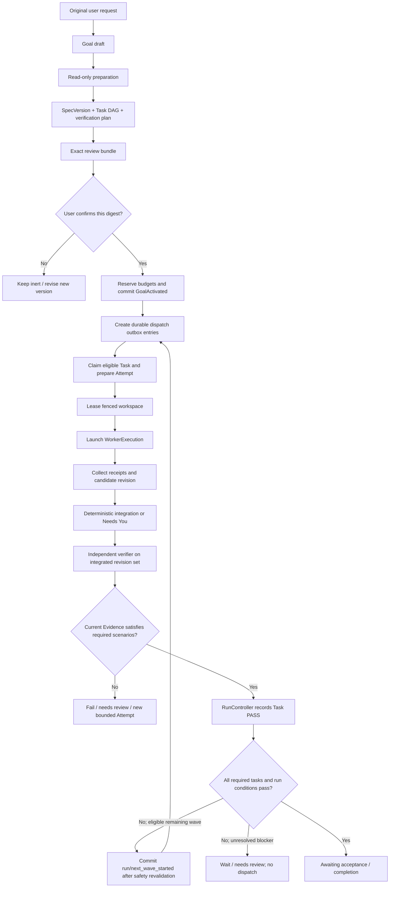

# 3. End-to-end flows

These flows define the adopted v1 contract across the OpenCode-derived host and Rust
kernel. Stream chunks and UI render state are not durable business facts. All durable
mutations are owner-authenticated, schema-validated, idempotent and ordered within the
owning stream.

## 3.1 Startup and composition

1. `hzcode` validates its configured state root and acquires/supervises `hz-kernel`.
2. Host and kernel exchange a `KernelHelloV1` containing protocol versions, build
   digests, instance nonce and capability features. Incompatible mandatory versions
   stop startup; optional features are explicitly unavailable.
3. Kernel validates event-log heads, rebuilds projections if needed, acquires a new
   supervisor owner epoch, reconciles outstanding launches/effects/workspace leases,
   and only then advertises service readiness.
4. Host loads the composition lock, verifies plugin bytes/provenance and schema/API
   compatibility, resolves dependency graph/cardinality, and activates pinned service
   generations in topological order.
5. Required sealed system-service failure stops startup or fences the affected
   capability. Optional presentation failure degrades that surface with a visible
   diagnostic; it never creates fake authority.
6. TUI/web/desktop/SDK clients connect through the OpenCode-derived public API. They
   obtain a snapshot cursor and then subscribe to durable projections/events.

No worker is dispatched merely because the UI or host process booted. A missing kernel
means canonical writes and effectful operations are unavailable, not silently hosted
in an in-memory fallback.

## 3.2 Direct interactive Thread

Direct mode stays lightweight: no Goal/Run/Task DAG is created for ordinary pair
coding. It still uses the same durable Thread owner and effect guard as managed work.



`steer` inputs become eligible at the next safe provider-turn boundary. `queue` inputs
remain FIFO until the current continuation would otherwise become idle, promoting one
at a time. Durable admission precedes advisory wake; the model-visible message is only
created at promotion. On a host disconnect, the kernel preserves admitted input and
reports the actual execution state.

Context is checked against the pinned route/token budget before provider dispatch. A
local overflow runs the bounded ContextService pressure policy or fails before sending.
An explicit terminal pre-content `PROMPT_TOO_LONG` rejection preserves its failed
ProviderAttempt, then may use the same bounded recovery and a new request digest/attempt
ID on the same pinned route. Unknown acceptance or partial content is never resent.
For a direct Turn, capture the owner-built checkpoint immediately before its first
mutating ToolBatch/effect; `/rewind turn|files` previews exact owner-scoped restoration
and never rolls back external effects or Thread history.

### Whole-response tool admission is a required adaptation

While streaming, the host may render text deltas and collect tool-call fragments, but
must not execute any tool call. After the provider signals a complete response, it:

1. assembles every call and validates every argument against the pinned tool schema;
2. checks call count, aggregate bytes, deadlines, duplicate IDs and allowed toolset;
3. rejects the batch with zero unstarted effects if any structural check fails;
4. sends the complete admitted batch to the kernel before execution;
5. lets the kernel authorize and schedule calls by declared resource conflicts;
6. holds downstream calls behind a `question`/approval barrier and serializes
   conflicting writes or shell operations.

If a stream terminates before a complete response, no collected call is dispatched.
The current pinned Core runner dispatches non-hosted `tool-call` events during stream
consumption; adopted v1 requires changing that seam. `providerExecuted` calls are
not allowed in guarded v1 Turns: they execute outside the kernel before local Guard can
authorize them. Provide a local mediated equivalent or report the provider capability
unavailable. This is a compatibility reduction, not an existing OpenCode guarantee.

## 3.3 Effectful tool call

```text
model call
  → host normalizes schema and resource hints
  → kernel derives principal and canonical action
  → resource resolver pins exact workspace/resource revision
  → BudgetService commits hard reservation (direct Thread/Turn or managed owner)
  → Guard returns ALLOW | ASK | DENY
  → ASK creates durable exact approval challenge; no dispatch until resolved
  → kernel commits EffectIntent PREPARED with reservation and Guard receipt
  → kernel issues one-use capability lease bound to that intent
  → ExecutionHost prepares and kernel commits its lease-bound receipt
  → ExecutionHost launches with fence, capability set and bounded limits
  → host observation/output is captured to bounded artifacts
  → effect owner records SUCCESS | FAILURE | UNKNOWN
  → audit chain records security-relevant linked facts
  → result is returned to the pinned Thread/Turn as untrusted tool content
```

The effect request carries `delivery_id`, Thread/Turn/Run/Task/Attempt references,
tool-call identity, canonical action, argument digest, resource digest, expected
workspace revision. The initial submission does not supply authority: the kernel
issues the capability lease after PREPARED and attaches it only to executor dispatch.
Identity and authority are derived at the
ingress; the model cannot assert an approval, policy, principal, workspace fence or
secret scope. An approval is bound to displayed-content, policy and resource-state
digests and expires. Timeout after possible dispatch produces `UNKNOWN` until target
state is reconciled.

## 3.4 Managed Run



Preparation is read-only and produces an immutable proposed `SpecVersion`, DAG,
resource scopes, budgets and verification plan. User confirmation names the exact
digest. No worker starts before that durable activation point. Each Task has bounded
attempt count, limits, read/write scopes, dependency IDs, profile revision, route
snapshot and verification criteria.

## 3.5 Dispatch, worker, integration, verification

- `AttemptDispatchPlanned` and its outbox entry commit before process launch.
- Dispatcher claims one stable outbox ID, prepares execution, records launch identity,
  then observes the process. A crash after possible launch triggers reconciliation by
  exact process/workspace identity; never spawn a duplicate blindly.
- Native worker uses the same OpenCode-derived Thread runtime bound to a child Thread,
  immutable profile revision, TaskPackage, ContextPacket, workspace fence, permission
  ceiling and reserved budget. External ACP/CLI workers use capability handshakes and
  explicit limits; hidden internal tool coverage is reported as unknown.
- Candidate changes are not merged in finish order. Integration follows the stable DAG
  topological order and Task ID; conflict becomes `NEEDS_YOU`, not an assumed safe
  model merge.
- Verifier is read-only with respect to the subject under verification. Evidence binds
  approved SpecVersion, every integrated repository revision, workspace manifest,
  toolchain/environment, policy and scenario versions. Kernel accepts `Task PASS` only
  when evidence is current and complete.
- Run completion requires all mandatory Tasks to have current PASS, required workspace
  integrations and effects settled, required audit receipts, the active spec matching
  evidence, and no unresolved blocker.

Each next wave explicitly returns Run VERIFYING to EXECUTING through RunController;
Task PASS is not replaced by worker finish. A known terminal Attempt failure with no
retry commits `task/execution_failed`; unknown effects/launches keep work nonterminal.
Direct native delegation instead uses `DirectWorkerBindingV1`/`DirectTaskPackageV1`
and ThreadService's DirectDelegation record, not this managed Task/Attempt flow.

## 3.6 Subagent selection

1. honor explicit user profile selection;
2. honor a Task-pinned profile assignment;
3. evaluate profiles in `automatic` mode with deterministic category/path/language and
   capability matching;
4. dispatch only a unique eligible winner after runtime, model, reasoning, loadout,
   required lifecycle-hook availability/compatibility, turn/tool/token/wall-time limits,
   authority, workspace conflict, concurrency and budget checks;
5. otherwise use enabled `builtin.general` or ask/remain local.

Manual-only profiles never auto-launch. Model cost, subscription credit, and latency do
not select a profile or silently downgrade model/reasoning. Parent/profile/Task/policy
authority is intersected; a child can narrow but not widen. Every invocation pins the
profile revision (including its limits), loadout/runtime/effective-authority/context
digests, resolved lifecycle-hook-set digest and budget reservation.

## 3.7 Plugin install, activation and update

```text
discover → inspect provenance/license → stage exact bytes → validate manifest,
digest and signatures → review capabilities → configure → probe → enable → activate
```

A failed stage remains disabled. Composition rejects dependency cycles and duplicate
single-cardinality service providers before activation. `READY → DRAINING → DISABLED`
is required for normal disable/update; already pinned operations continue on the old
generation. Emergency quarantine revokes capabilities and explicitly fails/reconciles
affected operations. No plugin command callback receives arbitrary shell authority;
all UI entry points resolve to one typed ActionDescriptor.

## 3.8 Legacy Session import and cutover

1. Take a stable, read-only snapshot of the legacy Session store and record its source
   identity and digest.
2. Import each Session once, allocate a kernel `ThreadId`, and persist the unique
   `(source_store_id, legacy_session_id) → thread_id` alias before exposing the Thread.
3. Import ordered messages, tool history, fork links, attachments and compaction
   metadata with source provenance. Missing parent or attachment data is represented as
   unavailable; the importer does not invent it.
4. Initialize in-flight provider requests as `UNKNOWN_ACCEPTANCE` and pending legacy tool
   effects to `UNKNOWN`; do not replay either. Historical results remain untrusted
   conversation content and do not imply Guard mediation.
5. Verify per-Thread counts/digests and the source-to-Thread alias set, then switch
   application reads/writes to `ThreadStoreService` and leave the old store read-only.
6. Keep the source snapshot for rollback and retention. Removing it requires a separate
   accepted migration record and must not remove canonical Thread history.

An interrupted import resumes by the stored alias and digest; a conflicting source
digest refuses automatic continuation. Rollback changes the application cutover, not
the imported event history, and never makes both stores writable.

The importer uses §§11–12's historical initialization payloads and linked owner
receipts, not fabricated historical Guard grants/budget reservations. Initial import
admission establishes identities; final completion checks every required receipt before
exposure/cutover. Uncertain imported operations cannot dispatch from import replay.

## Pinned implementation references

- [Core V2 runner and streaming tool-call handling](https://github.com/anomalyco/opencode/blob/b1fe25ab5ecc9f9bc911a8a2e6a51565cc764322/packages/core/src/session/runner/llm.ts#L241-L281)
- [Legacy session LLM runtime selection](https://github.com/anomalyco/opencode/blob/b1fe25ab5ecc9f9bc911a8a2e6a51565cc764322/packages/opencode/src/session/llm.ts#L224-L279)
